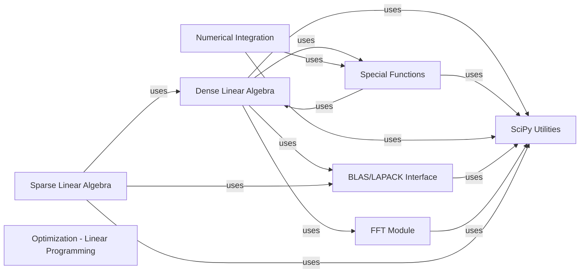

## Component Details

The 'Core Mathematical Operations' subsystem of SciPy provides fundamental mathematical capabilities, including highly optimized linear algebra routines for dense and sparse matrices, a vast collection of mathematical special functions, and efficient Fast Fourier Transforms for signal analysis. It serves as the bedrock for numerical computing within the SciPy ecosystem, offering a wide array of tools for scientific and engineering applications.

### Dense Linear Algebra
Provides fundamental capabilities for dense matrices, including solving linear systems, various matrix decompositions (SVD, LU, Cholesky, QR, Schur, QZ), matrix functions (exponential, logarithm, square root), generation of special matrices, and solvers for matrix equations (Sylvester, Lyapunov, Riccati).

**Related Classes/Methods**:

- <a href="https://github.com/scipy/scipy/blob/master/scipy/linalg/_basic.py#L77-L349" target="_blank" rel="noopener noreferrer">`scipy.linalg._basic.solve` (77:349)</a>
- <a href="https://github.com/scipy/scipy/blob/master/scipy/linalg/_basic.py#L420-L508" target="_blank" rel="noopener noreferrer">`scipy.linalg._basic.solve_triangular` (420:508)</a>
- <a href="https://github.com/scipy/scipy/blob/master/scipy/linalg/_basic.py#L1120-L1191" target="_blank" rel="noopener noreferrer">`scipy.linalg._basic.inv` (1120:1191)</a>
- <a href="https://github.com/scipy/scipy/blob/master/scipy/linalg/_basic.py#L1196-L1321" target="_blank" rel="noopener noreferrer">`scipy.linalg._basic.det` (1196:1321)</a>
- <a href="https://github.com/scipy/scipy/blob/master/scipy/linalg/_basic.py#L1326-L1526" target="_blank" rel="noopener noreferrer">`scipy.linalg._basic.lstsq` (1326:1526)</a>
- <a href="https://github.com/scipy/scipy/blob/master/scipy/linalg/_basic.py#L1533-L1653" target="_blank" rel="noopener noreferrer">`scipy.linalg._basic.pinv` (1533:1653)</a>
- <a href="https://github.com/scipy/scipy/blob/master/scipy/linalg/_basic.py#L1657-L1747" target="_blank" rel="noopener noreferrer">`scipy.linalg._basic.pinvh` (1657:1747)</a>
- <a href="https://github.com/scipy/scipy/blob/master/scipy/linalg/_basic.py#L1751-L1902" target="_blank" rel="noopener noreferrer">`scipy.linalg._basic.matrix_balance` (1751:1902)</a>
- <a href="https://github.com/scipy/scipy/blob/master/scipy/linalg/_basic.py#L799-L876" target="_blank" rel="noopener noreferrer">`scipy.linalg._basic.solve_toeplitz` (799:876)</a>
- <a href="https://github.com/scipy/scipy/blob/master/scipy/linalg/_basic.py#L914-L1115" target="_blank" rel="noopener noreferrer">`scipy.linalg._basic.solve_circulant` (914:1115)</a>
- <a href="https://github.com/scipy/scipy/blob/master/scipy/linalg/_basic.py#L532-L604" target="_blank" rel="noopener noreferrer">`scipy.linalg._basic.solve_banded` (532:604)</a>
- <a href="https://github.com/scipy/scipy/blob/master/scipy/linalg/_basic.py#L659-L796" target="_blank" rel="noopener noreferrer">`scipy.linalg._basic.solveh_banded` (659:796)</a>
- <a href="https://github.com/scipy/scipy/blob/master/scipy/linalg/_basic.py#L1987-L2146" target="_blank" rel="noopener noreferrer">`scipy.linalg._basic.matmul_toeplitz` (1987:2146)</a>
- <a href="https://github.com/scipy/scipy/blob/master/scipy/linalg/_decomp_svd.py#L17-L179" target="_blank" rel="noopener noreferrer">`scipy.linalg._decomp_svd.svd` (17:179)</a>
- <a href="https://github.com/scipy/scipy/blob/master/scipy/linalg/_decomp_svd.py#L183-L256" target="_blank" rel="noopener noreferrer">`scipy.linalg._decomp_svd.svdvals` (183:256)</a>
- <a href="https://github.com/scipy/scipy/blob/master/scipy/linalg/_decomp_svd.py#L260-L307" target="_blank" rel="noopener noreferrer">`scipy.linalg._decomp_svd.diagsvd` (260:307)</a>
- <a href="https://github.com/scipy/scipy/blob/master/scipy/linalg/_decomp_svd.py#L313-L358" target="_blank" rel="noopener noreferrer">`scipy.linalg._decomp_svd.orth` (313:358)</a>
- <a href="https://github.com/scipy/scipy/blob/master/scipy/linalg/_decomp_svd.py#L362-L437" target="_blank" rel="noopener noreferrer">`scipy.linalg._decomp_svd.null_space` (362:437)</a>
- <a href="https://github.com/scipy/scipy/blob/master/scipy/linalg/_decomp_svd.py#L441-L545" target="_blank" rel="noopener noreferrer">`scipy.linalg._decomp_svd.subspace_angles` (441:545)</a>
- <a href="https://github.com/scipy/scipy/blob/master/scipy/linalg/_decomp_lu.py#L23-L133" target="_blank" rel="noopener noreferrer">`scipy.linalg._decomp_lu.lu_factor` (23:133)</a>
- <a href="https://github.com/scipy/scipy/blob/master/scipy/linalg/_decomp_lu.py#L136-L186" target="_blank" rel="noopener noreferrer">`scipy.linalg._decomp_lu.lu_solve` (136:186)</a>
- <a href="https://github.com/scipy/scipy/blob/master/scipy/linalg/_decomp_lu.py#L213-L401" target="_blank" rel="noopener noreferrer">`scipy.linalg._decomp_lu.lu` (213:401)</a>
- <a href="https://github.com/scipy/scipy/blob/master/scipy/linalg/_decomp_cholesky.py#L51-L108" target="_blank" rel="noopener noreferrer">`scipy.linalg._decomp_cholesky.cholesky` (51:108)</a>
- <a href="https://github.com/scipy/scipy/blob/master/scipy/linalg/_decomp_cholesky.py#L112-L185" target="_blank" rel="noopener noreferrer">`scipy.linalg._decomp_cholesky.cho_factor` (112:185)</a>
- <a href="https://github.com/scipy/scipy/blob/master/scipy/linalg/_decomp_cholesky.py#L188-L225" target="_blank" rel="noopener noreferrer">`scipy.linalg._decomp_cholesky.cho_solve` (188:225)</a>
- <a href="https://github.com/scipy/scipy/blob/master/scipy/linalg/_decomp_cholesky.py#L258-L334" target="_blank" rel="noopener noreferrer">`scipy.linalg._decomp_cholesky.cholesky_banded` (258:334)</a>
- <a href="https://github.com/scipy/scipy/blob/master/scipy/linalg/_decomp_cholesky.py#L337-L385" target="_blank" rel="noopener noreferrer">`scipy.linalg._decomp_cholesky.cho_solve_banded` (337:385)</a>
- <a href="https://github.com/scipy/scipy/blob/master/scipy/linalg/_decomp_qr.py#L28-L216" target="_blank" rel="noopener noreferrer">`scipy.linalg._decomp_qr.qr` (28:216)</a>
- <a href="https://github.com/scipy/scipy/blob/master/scipy/linalg/_decomp_qr.py#L220-L369" target="_blank" rel="noopener noreferrer">`scipy.linalg._decomp_qr.qr_multiply` (220:369)</a>
- <a href="https://github.com/scipy/scipy/blob/master/scipy/linalg/_decomp_qr.py#L373-L494" target="_blank" rel="noopener noreferrer">`scipy.linalg._decomp_qr.rq` (373:494)</a>
- <a href="https://github.com/scipy/scipy/blob/master/scipy/linalg/_decomp_schur.py#L18-L217" target="_blank" rel="noopener noreferrer">`scipy.linalg._decomp_schur.schur` (18:217)</a>
- <a href="https://github.com/scipy/scipy/blob/master/scipy/linalg/_decomp_schur.py#L253-L336" target="_blank" rel="noopener noreferrer">`scipy.linalg._decomp_schur.rsf2csf` (253:336)</a>
- <a href="https://github.com/scipy/scipy/blob/master/scipy/linalg/_decomp_qz.py#L147-L319" target="_blank" rel="noopener noreferrer">`scipy.linalg._decomp_qz.qz` (147:319)</a>
- <a href="https://github.com/scipy/scipy/blob/master/scipy/linalg/_decomp_qz.py#L323-L452" target="_blank" rel="noopener noreferrer">`scipy.linalg._decomp_qz.ordqz` (323:452)</a>
- <a href="https://github.com/scipy/scipy/blob/master/scipy/linalg/_decomp_ldl.py#L16-L158" target="_blank" rel="noopener noreferrer">`scipy.linalg._decomp_ldl.ldl` (16:158)</a>
- <a href="https://github.com/scipy/scipy/blob/master/scipy/linalg/_decomp_polar.py#L10-L113" target="_blank" rel="noopener noreferrer">`scipy.linalg._decomp_polar.polar` (10:113)</a>
- <a href="https://github.com/scipy/scipy/blob/master/scipy/linalg/_decomp_cossin.py#L11-L142" target="_blank" rel="noopener noreferrer">`scipy.linalg._decomp_cossin.cossin` (11:142)</a>
- <a href="https://github.com/scipy/scipy/blob/master/scipy/linalg/_decomp.py#L115-L281" target="_blank" rel="noopener noreferrer">`scipy.linalg._decomp.eig` (115:281)</a>
- <a href="https://github.com/scipy/scipy/blob/master/scipy/linalg/_decomp.py#L285-L620" target="_blank" rel="noopener noreferrer">`scipy.linalg._decomp.eigh` (285:620)</a>
- <a href="https://github.com/scipy/scipy/blob/master/scipy/linalg/_decomp.py#L662-L838" target="_blank" rel="noopener noreferrer">`scipy.linalg._decomp.eig_banded` (662:838)</a>
- <a href="https://github.com/scipy/scipy/blob/master/scipy/linalg/_decomp.py#L842-L914" target="_blank" rel="noopener noreferrer">`scipy.linalg._decomp.eigvals` (842:914)</a>
- <a href="https://github.com/scipy/scipy/blob/master/scipy/linalg/_decomp.py#L918-L1033" target="_blank" rel="noopener noreferrer">`scipy.linalg._decomp.eigvalsh` (918:1033)</a>
- <a href="https://github.com/scipy/scipy/blob/master/scipy/linalg/_decomp.py#L1037-L1127" target="_blank" rel="noopener noreferrer">`scipy.linalg._decomp.eigvals_banded` (1037:1127)</a>
- <a href="https://github.com/scipy/scipy/blob/master/scipy/linalg/_decomp.py#L1131-L1209" target="_blank" rel="noopener noreferrer">`scipy.linalg._decomp.eigvalsh_tridiagonal` (1131:1209)</a>
- <a href="https://github.com/scipy/scipy/blob/master/scipy/linalg/_decomp.py#L1213-L1394" target="_blank" rel="noopener noreferrer">`scipy.linalg._decomp.eigh_tridiagonal` (1213:1394)</a>
- <a href="https://github.com/scipy/scipy/blob/master/scipy/linalg/_decomp.py#L1406-L1495" target="_blank" rel="noopener noreferrer">`scipy.linalg._decomp.hessenberg` (1406:1495)</a>
- `scipy.linalg._decomp_svd` (full file reference)
- <a href="https://github.com/scipy/scipy/blob/master/scipy/linalg/_matfuncs.py#L410-L553" target="_blank" rel="noopener noreferrer">`scipy.linalg._matfuncs.sqrtm` (410:553)</a>
- <a href="https://github.com/scipy/scipy/blob/master/scipy/linalg/_matfuncs.py#L233-L397" target="_blank" rel="noopener noreferrer">`scipy.linalg._matfuncs.expm` (233:397)</a>
- <a href="https://github.com/scipy/scipy/blob/master/scipy/linalg/_matfuncs.py#L557-L594" target="_blank" rel="noopener noreferrer">`scipy.linalg._matfuncs.cosm` (557:594)</a>
- <a href="https://github.com/scipy/scipy/blob/master/scipy/linalg/_matfuncs.py#L598-L635" target="_blank" rel="noopener noreferrer">`scipy.linalg._matfuncs.sinm` (598:635)</a>
- <a href="https://github.com/scipy/scipy/blob/master/scipy/linalg/_matfuncs.py#L639-L675" target="_blank" rel="noopener noreferrer">`scipy.linalg._matfuncs.tanm` (639:675)</a>
- <a href="https://github.com/scipy/scipy/blob/master/scipy/linalg/_matfuncs.py#L679-L715" target="_blank" rel="noopener noreferrer">`scipy.linalg._matfuncs.coshm` (679:715)</a>
- <a href="https://github.com/scipy/scipy/blob/master/scipy/linalg/_matfuncs.py#L719-L755" target="_blank" rel="noopener noreferrer">`scipy.linalg._matfuncs.sinhm` (719:755)</a>
- <a href="https://github.com/scipy/scipy/blob/master/scipy/linalg/_matfuncs.py#L759-L795" target="_blank" rel="noopener noreferrer">`scipy.linalg._matfuncs.tanhm` (759:795)</a>
- <a href="https://github.com/scipy/scipy/blob/master/scipy/linalg/_matfuncs.py#L799-L890" target="_blank" rel="noopener noreferrer">`scipy.linalg._matfuncs.funm` (799:890)</a>
- <a href="https://github.com/scipy/scipy/blob/master/scipy/linalg/_matfuncs.py#L894-L983" target="_blank" rel="noopener noreferrer">`scipy.linalg._matfuncs.signm` (894:983)</a>
- <a href="https://github.com/scipy/scipy/blob/master/scipy/linalg/_matfuncs.py#L102-L145" target="_blank" rel="noopener noreferrer">`scipy.linalg._matfuncs.fractional_matrix_power` (102:145)</a>
- <a href="https://github.com/scipy/scipy/blob/master/scipy/linalg/_special_matrices.py#L342-L423" target="_blank" rel="noopener noreferrer">`scipy.linalg._special_matrices.block_diag` (342:423)</a>
- <a href="https://github.com/scipy/scipy/blob/master/scipy/linalg/_special_matrices.py#L95-L153" target="_blank" rel="noopener noreferrer">`scipy.linalg._special_matrices.circulant` (95:153)</a>
- <a href="https://github.com/scipy/scipy/blob/master/scipy/linalg/_special_matrices.py#L426-L488" target="_blank" rel="noopener noreferrer">`scipy.linalg._special_matrices.companion` (426:488)</a>
- <a href="https://github.com/scipy/scipy/blob/master/scipy/linalg/_special_matrices.py#L847-L915" target="_blank" rel="noopener noreferrer">`scipy.linalg._special_matrices.dft` (847:915)</a>
- <a href="https://github.com/scipy/scipy/blob/master/scipy/linalg/_special_matrices.py#L216-L270" target="_blank" rel="noopener noreferrer">`scipy.linalg._special_matrices.hadamard` (216:270)</a>
- <a href="https://github.com/scipy/scipy/blob/master/scipy/linalg/_special_matrices.py#L156-L213" target="_blank" rel="noopener noreferrer">`scipy.linalg._special_matrices.hankel` (156:213)</a>
- <a href="https://github.com/scipy/scipy/blob/master/scipy/linalg/_special_matrices.py#L491-L533" target="_blank" rel="noopener noreferrer">`scipy.linalg._special_matrices.helmert` (491:533)</a>
- <a href="https://github.com/scipy/scipy/blob/master/scipy/linalg/_special_matrices.py#L536-L571" target="_blank" rel="noopener noreferrer">`scipy.linalg._special_matrices.hilbert` (536:571)</a>
- <a href="https://github.com/scipy/scipy/blob/master/scipy/linalg/_special_matrices.py#L574-L648" target="_blank" rel="noopener noreferrer">`scipy.linalg._special_matrices.invhilbert` (574:648)</a>
- <a href="https://github.com/scipy/scipy/blob/master/scipy/linalg/_special_matrices.py#L274-L339" target="_blank" rel="noopener noreferrer">`scipy.linalg._special_matrices.leslie` (274:339)</a>
- <a href="https://github.com/scipy/scipy/blob/master/scipy/linalg/_special_matrices.py#L651-L734" target="_blank" rel="noopener noreferrer">`scipy.linalg._special_matrices.pascal` (651:734)</a>
- <a href="https://github.com/scipy/scipy/blob/master/scipy/linalg/_special_matrices.py#L737-L844" target="_blank" rel="noopener noreferrer">`scipy.linalg._special_matrices.invpascal` (737:844)</a>
- <a href="https://github.com/scipy/scipy/blob/master/scipy/linalg/_special_matrices.py#L20-L92" target="_blank" rel="noopener noreferrer">`scipy.linalg._special_matrices.toeplitz` (20:92)</a>
- <a href="https://github.com/scipy/scipy/blob/master/scipy/linalg/_special_matrices.py#L1082-L1268" target="_blank" rel="noopener noreferrer">`scipy.linalg._special_matrices.convolution_matrix` (1082:1268)</a>
- <a href="https://github.com/scipy/scipy/blob/master/scipy/linalg/_solvers.py#L32-L113" target="_blank" rel="noopener noreferrer">`scipy.linalg._solvers.solve_sylvester` (32:113)</a>
- <a href="https://github.com/scipy/scipy/blob/master/scipy/linalg/_solvers.py#L117-L213" target="_blank" rel="noopener noreferrer">`scipy.linalg._solvers.solve_continuous_lyapunov` (117:213)</a>
- <a href="https://github.com/scipy/scipy/blob/master/scipy/linalg/_solvers.py#L251-L339" target="_blank" rel="noopener noreferrer">`scipy.linalg._solvers.solve_discrete_lyapunov` (251:339)</a>
- <a href="https://github.com/scipy/scipy/blob/master/scipy/linalg/_solvers.py#L343-L545" target="_blank" rel="noopener noreferrer">`scipy.linalg._solvers.solve_continuous_are` (343:545)</a>
- <a href="https://github.com/scipy/scipy/blob/master/scipy/linalg/_solvers.py#L549-L755" target="_blank" rel="noopener noreferrer">`scipy.linalg._solvers.solve_discrete_are` (549:755)</a>

### Sparse Linear Algebra
Manages the creation, manipulation, and operations of sparse matrices in various formats, including construction utilities, iterative solvers for linear systems and eigenvalue problems, and graph theory operations.

**Related Classes/Methods**:

- <a href="https://github.com/scipy/scipy/blob/master/scipy/sparse/_coo.py#L1463-L1581" target="_blank" rel="noopener noreferrer">`scipy.sparse._coo.coo_matrix` (1463:1581)</a>
- <a href="https://github.com/scipy/scipy/blob/master/scipy/sparse/_coo.py#L347-L379" target="_blank" rel="noopener noreferrer">`scipy.sparse._coo._coo_base.tocsr` (347:379)</a>
- <a href="https://github.com/scipy/scipy/blob/master/scipy/sparse/_coo.py#L527-L536" target="_blank" rel="noopener noreferrer">`scipy.sparse._coo._coo_base.sum_duplicates` (527:536)</a>
- <a href="https://github.com/scipy/scipy/blob/master/scipy/sparse/_csr.py#L437-L557" target="_blank" rel="noopener noreferrer">`scipy.sparse._csr.csr_matrix` (437:557)</a>
- <a href="https://github.com/scipy/scipy/blob/master/scipy/sparse/_dia.py#L601-L674" target="_blank" rel="noopener noreferrer">`scipy.sparse._dia.dia_matrix` (601:674)</a>
- <a href="https://github.com/scipy/scipy/blob/master/scipy/sparse/_base.py#L452-L482" target="_blank" rel="noopener noreferrer">`scipy.sparse._base._spbase.asformat` (452:482)</a>
- `scipy.sparse._base` (full file reference)
- `scipy.sparse._csr` (full file reference)
- <a href="https://github.com/scipy/scipy/blob/master/scipy/sparse/_construct.py#L453-L500" target="_blank" rel="noopener noreferrer">`scipy.sparse._construct.eye` (453:500)</a>
- <a href="https://github.com/scipy/scipy/blob/master/scipy/sparse/_construct.py#L503-L602" target="_blank" rel="noopener noreferrer">`scipy.sparse._construct.kron` (503:602)</a>
- <a href="https://github.com/scipy/scipy/blob/master/scipy/sparse/_construct.py#L1058-L1139" target="_blank" rel="noopener noreferrer">`scipy.sparse._construct.block_diag` (1058:1139)</a>
- <a href="https://github.com/scipy/scipy/blob/master/scipy/sparse/_construct.py#L1401-L1454" target="_blank" rel="noopener noreferrer">`scipy.sparse._construct.rand` (1401:1454)</a>
- <a href="https://github.com/scipy/scipy/blob/master/scipy/sparse/_construct.py#L1295-L1397" target="_blank" rel="noopener noreferrer">`scipy.sparse._construct.random` (1295:1397)</a>
- <a href="https://github.com/scipy/scipy/blob/master/scipy/sparse/_construct.py#L27-L90" target="_blank" rel="noopener noreferrer">`scipy.sparse._construct.spdiags` (27:90)</a>
- <a href="https://github.com/scipy/scipy/blob/master/scipy/sparse/_construct.py#L229-L319" target="_blank" rel="noopener noreferrer">`scipy.sparse._construct.diags` (229:319)</a>
- <a href="https://github.com/scipy/scipy/blob/master/scipy/sparse/_construct.py#L605-L655" target="_blank" rel="noopener noreferrer">`scipy.sparse._construct.kronsum` (605:655)</a>
- <a href="https://github.com/scipy/scipy/blob/master/scipy/sparse/_construct.py#L757-L801" target="_blank" rel="noopener noreferrer">`scipy.sparse._construct.hstack` (757:801)</a>
- <a href="https://github.com/scipy/scipy/blob/master/scipy/sparse/linalg/_expm_multiply.py#L27-L34" target="_blank" rel="noopener noreferrer">`scipy.sparse.linalg._expm_multiply._exact_1_norm` (27:34)</a>
- <a href="https://github.com/scipy/scipy/blob/master/scipy/sparse/linalg/_matfuncs.py#L254-L292" target="_blank" rel="noopener noreferrer">`scipy.sparse.linalg._matfuncs._onenormest_matrix_power` (254:292)</a>
- <a href="https://github.com/scipy/scipy/blob/master/scipy/sparse/linalg/_eigen/lobpcg/lobpcg.py#L170-L1110" target="_blank" rel="noopener noreferrer">`scipy.sparse.linalg._eigen.lobpcg.lobpcg` (170:1110)</a>
- <a href="https://github.com/scipy/scipy/blob/master/scipy/sparse/linalg/_interface.py#L55-L590" target="_blank" rel="noopener noreferrer">`scipy.sparse.linalg._interface.LinearOperator` (55:590)</a>
- <a href="https://github.com/scipy/scipy/blob/master/scipy/sparse/linalg/_eigen/arpack/arpack.py#L1362-L1706" target="_blank" rel="noopener noreferrer">`scipy.sparse.linalg._eigen.arpack.arpack.eigsh` (1362:1706)</a>
- <a href="https://github.com/scipy/scipy/blob/master/scipy/sparse/linalg/_eigen/_svds.py#L100-L540" target="_blank" rel="noopener noreferrer">`scipy.sparse.linalg._eigen._svds.svds` (100:540)</a>
- <a href="https://github.com/scipy/scipy/blob/master/scipy/sparse/linalg/_dsolve/linsolve.py#L134-L326" target="_blank" rel="noopener noreferrer">`scipy.sparse.linalg._dsolve.linsolve.spsolve` (134:326)</a>
- <a href="https://github.com/scipy/scipy/blob/master/scipy/sparse/linalg/_dsolve/linsolve.py#L609-L744" target="_blank" rel="noopener noreferrer">`scipy.sparse.linalg._dsolve.linsolve.spsolve_triangular` (609:744)</a>
- <a href="https://github.com/scipy/scipy/blob/master/scipy/sparse/linalg/_isolve/lgmres.py#L15-L230" target="_blank" rel="noopener noreferrer">`scipy.sparse.linalg._isolve.lgmres.lgmres` (15:230)</a>
- <a href="https://github.com/scipy/scipy/blob/master/scipy/sparse/linalg/_matfuncs.py#L546-L591" target="_blank" rel="noopener noreferrer">`scipy.sparse.linalg._matfuncs.expm` (546:591)</a>
- <a href="https://github.com/scipy/scipy/blob/master/scipy/sparse/linalg/_expm_multiply.py#L109-L211" target="_blank" rel="noopener noreferrer">`scipy.sparse.linalg._expm_multiply.expm_multiply` (109:211)</a>
- <a href="https://github.com/scipy/scipy/blob/master/scipy/sparse/linalg/_onenormest.py#L11-L118" target="_blank" rel="noopener noreferrer">`scipy.sparse.linalg._onenormest.onenormest` (11:118)</a>
- <a href="https://github.com/scipy/scipy/blob/master/scipy/sparse/csgraph/_laplacian.py#L13-L373" target="_blank" rel="noopener noreferrer">`scipy.sparse.csgraph._laplacian.laplacian` (13:373)</a>
- `scipy.sparse.csgraph._matching.maximum_bipartite_matching` (full file reference)

### BLAS/LAPACK Interface
Acts as an interface to the underlying highly optimized Basic Linear Algebra Subprograms (BLAS) and Linear Algebra Package (LAPACK) routines, providing efficient low-level linear algebra operations.

**Related Classes/Methods**:

- <a href="https://github.com/scipy/scipy/blob/master/scipy/linalg/blas.py#L259-L323" target="_blank" rel="noopener noreferrer">`scipy.linalg.blas.find_best_blas_type` (259:323)</a>
- <a href="https://github.com/scipy/scipy/blob/master/scipy/linalg/blas.py#L412-L484" target="_blank" rel="noopener noreferrer">`scipy.linalg.blas.get_blas_funcs` (412:484)</a>
- <a href="https://github.com/scipy/scipy/blob/master/scipy/linalg/lapack.py#L928-L1018" target="_blank" rel="noopener noreferrer">`scipy.linalg.lapack.get_lapack_funcs` (928:1018)</a>
- <a href="https://github.com/scipy/scipy/blob/master/scipy/linalg/lapack.py#L1025-L1056" target="_blank" rel="noopener noreferrer">`scipy.linalg.lapack._compute_lwork` (1025:1056)</a>
- `scipy.linalg.blas` (full file reference)
- `scipy.linalg.lapack` (full file reference)

### Special Functions
Encompasses a broad collection of mathematical special functions, including Airy functions, combinatorial functions, Bessel functions, orthogonal polynomials, numerically stable log-sum-exp and softmax, and spherical Bessel functions.

**Related Classes/Methods**:

- <a href="https://github.com/scipy/scipy/blob/master/scipy/special/_basic.py#L2106-L2154" target="_blank" rel="noopener noreferrer">`scipy.special._basic.ai_zeros` (2106:2154)</a>
- <a href="https://github.com/scipy/scipy/blob/master/scipy/special/_basic.py#L2157-L2205" target="_blank" rel="noopener noreferrer">`scipy.special._basic.bi_zeros` (2157:2205)</a>
- <a href="https://github.com/scipy/scipy/blob/master/scipy/special/_basic.py#L2682-L2747" target="_blank" rel="noopener noreferrer">`scipy.special._basic.comb` (2682:2747)</a>
- <a href="https://github.com/scipy/scipy/blob/master/scipy/special/_basic.py#L3124-L3178" target="_blank" rel="noopener noreferrer">`scipy.special._basic.factorial` (3124:3178)</a>
- <a href="https://github.com/scipy/scipy/blob/master/scipy/special/_basic.py#L3181-L3234" target="_blank" rel="noopener noreferrer">`scipy.special._basic.factorial2` (3181:3234)</a>
- <a href="https://github.com/scipy/scipy/blob/master/scipy/special/_basic.py#L3237-L3318" target="_blank" rel="noopener noreferrer">`scipy.special._basic.factorialk` (3237:3318)</a>
- <a href="https://github.com/scipy/scipy/blob/master/scipy/special/_basic.py#L3457-L3534" target="_blank" rel="noopener noreferrer">`scipy.special._basic.zeta` (3457:3534)</a>
- <a href="https://github.com/scipy/scipy/blob/master/scipy/special/_basic.py#L332-L392" target="_blank" rel="noopener noreferrer">`scipy.special._basic.jn_zeros` (332:392)</a>
- <a href="https://github.com/scipy/scipy/blob/master/scipy/special/_basic.py#L395-L455" target="_blank" rel="noopener noreferrer">`scipy.special._basic.jnp_zeros` (395:455)</a>
- <a href="https://github.com/scipy/scipy/blob/master/scipy/special/_basic.py#L458-L513" target="_blank" rel="noopener noreferrer">`scipy.special._basic.yn_zeros` (458:513)</a>
- <a href="https://github.com/scipy/scipy/blob/master/scipy/special/_basic.py#L516-L580" target="_blank" rel="noopener noreferrer">`scipy.special._basic.ynp_zeros` (516:580)</a>
- <a href="https://github.com/scipy/scipy/blob/master/scipy/special/_basic.py#L828-L903" target="_blank" rel="noopener noreferrer">`scipy.special._basic.jvp` (828:903)</a>
- <a href="https://github.com/scipy/scipy/blob/master/scipy/special/_basic.py#L906-L985" target="_blank" rel="noopener noreferrer">`scipy.special._basic.yvp` (906:985)</a>
- <a href="https://github.com/scipy/scipy/blob/master/scipy/special/_basic.py#L988-L1066" target="_blank" rel="noopener noreferrer">`scipy.special._basic.kvp` (988:1066)</a>
- <a href="https://github.com/scipy/scipy/blob/master/scipy/special/_basic.py#L1069-L1147" target="_blank" rel="noopener noreferrer">`scipy.special._basic.ivp` (1069:1147)</a>
- <a href="https://github.com/scipy/scipy/blob/master/scipy/special/_basic.py#L1150-L1216" target="_blank" rel="noopener noreferrer">`scipy.special._basic.h1vp` (1150:1216)</a>
- <a href="https://github.com/scipy/scipy/blob/master/scipy/special/_basic.py#L1219-L1285" target="_blank" rel="noopener noreferrer">`scipy.special._basic.h2vp` (1219:1285)</a>
- <a href="https://github.com/scipy/scipy/blob/master/scipy/special/_basic.py#L1288-L1341" target="_blank" rel="noopener noreferrer">`scipy.special._basic.riccati_jn` (1288:1341)</a>
- <a href="https://github.com/scipy/scipy/blob/master/scipy/special/_basic.py#L1344-L1398" target="_blank" rel="noopener noreferrer">`scipy.special._basic.riccati_yn` (1344:1398)</a>
- <a href="https://github.com/scipy/scipy/blob/master/scipy/special/_basic.py#L1550-L1590" target="_blank" rel="noopener noreferrer">`scipy.special._basic.polygamma` (1550:1590)</a>
- <a href="https://github.com/scipy/scipy/blob/master/scipy/special/_basic.py#L1713-L1789" target="_blank" rel="noopener noreferrer">`scipy.special._basic.lpmn` (1713:1789)</a>
- <a href="https://github.com/scipy/scipy/blob/master/scipy/special/_basic.py#L1793-L1875" target="_blank" rel="noopener noreferrer">`scipy.special._basic.clpmn` (1793:1875)</a>
- <a href="https://github.com/scipy/scipy/blob/master/scipy/special/_basic.py#L2045-L2064" target="_blank" rel="noopener noreferrer">`scipy.special._basic.lpn` (2045:2064)</a>
- <a href="https://github.com/scipy/scipy/blob/master/scipy/special/_basic.py#L2067-L2103" target="_blank" rel="noopener noreferrer">`scipy.special._basic.lqn` (2067:2103)</a>
- `scipy.special._basic` (full file reference)
- `scipy.special._ufuncs` (full file reference)
- <a href="https://github.com/scipy/scipy/blob/master/scipy/special/_orthogonal.py#L209-L292" target="_blank" rel="noopener noreferrer">`scipy.special._orthogonal.roots_jacobi` (209:292)</a>
- <a href="https://github.com/scipy/scipy/blob/master/scipy/special/_orthogonal.py#L295-L386" target="_blank" rel="noopener noreferrer">`scipy.special._orthogonal.jacobi` (295:386)</a>
- <a href="https://github.com/scipy/scipy/blob/master/scipy/special/_orthogonal.py#L391-L444" target="_blank" rel="noopener noreferrer">`scipy.special._orthogonal.roots_sh_jacobi` (391:444)</a>
- <a href="https://github.com/scipy/scipy/blob/master/scipy/special/_orthogonal.py#L447-L499" target="_blank" rel="noopener noreferrer">`scipy.special._orthogonal.sh_jacobi` (447:499)</a>
- <a href="https://github.com/scipy/scipy/blob/master/scipy/special/_orthogonal.py#L504-L569" target="_blank" rel="noopener noreferrer">`scipy.special._orthogonal.roots_genlaguerre` (504:569)</a>
- <a href="https://github.com/scipy/scipy/blob/master/scipy/special/_orthogonal.py#L572-L671" target="_blank" rel="noopener noreferrer">`scipy.special._orthogonal.genlaguerre` (572:671)</a>
- <a href="https://github.com/scipy/scipy/blob/master/scipy/special/_orthogonal.py#L676-L714" target="_blank" rel="noopener noreferrer">`scipy.special._orthogonal.roots_laguerre` (676:714)</a>
- <a href="https://github.com/scipy/scipy/blob/master/scipy/special/_orthogonal.py#L717-L808" target="_blank" rel="noopener noreferrer">`scipy.special._orthogonal.laguerre` (717:808)</a>
- <a href="https://github.com/scipy/scipy/blob/master/scipy/special/_orthogonal.py#L813-L894" target="_blank" rel="noopener noreferrer">`scipy.special._orthogonal.roots_hermite` (813:894)</a>
- <a href="https://github.com/scipy/scipy/blob/master/scipy/special/_orthogonal.py#L1274-L1339" target="_blank" rel="noopener noreferrer">`scipy.special._orthogonal.hermite` (1274:1339)</a>
- <a href="https://github.com/scipy/scipy/blob/master/scipy/special/_orthogonal.py#L1344-L1417" target="_blank" rel="noopener noreferrer">`scipy.special._orthogonal.roots_hermitenorm` (1344:1417)</a>
- <a href="https://github.com/scipy/scipy/blob/master/scipy/special/_orthogonal.py#L1420-L1467" target="_blank" rel="noopener noreferrer">`scipy.special._orthogonal.hermitenorm` (1420:1467)</a>
- <a href="https://github.com/scipy/scipy/blob/master/scipy/special/_orthogonal.py#L1474-L1551" target="_blank" rel="noopener noreferrer">`scipy.special._orthogonal.roots_gegenbauer` (1474:1551)</a>
- <a href="https://github.com/scipy/scipy/blob/master/scipy/special/_orthogonal.py#L1554-L1630" target="_blank" rel="noopener noreferrer">`scipy.special._orthogonal.gegenbauer` (1554:1630)</a>
- <a href="https://github.com/scipy/scipy/blob/master/scipy/special/_orthogonal.py#L1687-L1791" target="_blank" rel="noopener noreferrer">`scipy.special._orthogonal.chebyt` (1687:1791)</a>
- <a href="https://github.com/scipy/scipy/blob/master/scipy/special/_orthogonal.py#L1847-L1941" target="_blank" rel="noopener noreferrer">`scipy.special._orthogonal.chebyu` (1847:1941)</a>
- <a href="https://github.com/scipy/scipy/blob/master/scipy/special/_orthogonal.py#L1946-L1991" target="_blank" rel="noopener noreferrer">`scipy.special._orthogonal.roots_chebyc` (1946:1991)</a>
- <a href="https://github.com/scipy/scipy/blob/master/scipy/special/_orthogonal.py#L1994-L2046" target="_blank" rel="noopener noreferrer">`scipy.special._orthogonal.chebyc` (1994:2046)</a>
- <a href="https://github.com/scipy/scipy/blob/master/scipy/special/_orthogonal.py#L2051-L2096" target="_blank" rel="noopener noreferrer">`scipy.special._orthogonal.roots_chebys` (2051:2096)</a>
- <a href="https://github.com/scipy/scipy/blob/master/scipy/special/_orthogonal.py#L2099-L2152" target="_blank" rel="noopener noreferrer">`scipy.special._orthogonal.chebys` (2099:2152)</a>
- <a href="https://github.com/scipy/scipy/blob/master/scipy/special/_orthogonal.py#L2157-L2196" target="_blank" rel="noopener noreferrer">`scipy.special._orthogonal.roots_sh_chebyt` (2157:2196)</a>
- <a href="https://github.com/scipy/scipy/blob/master/scipy/special/_orthogonal.py#L2199-L2232" target="_blank" rel="noopener noreferrer">`scipy.special._orthogonal.sh_chebyt` (2199:2232)</a>
- <a href="https://github.com/scipy/scipy/blob/master/scipy/special/_orthogonal.py#L2236-L2281" target="_blank" rel="noopener noreferrer">`scipy.special._orthogonal.roots_sh_chebyu` (2236:2281)</a>
- <a href="https://github.com/scipy/scipy/blob/master/scipy/special/_orthogonal.py#L2284-L2314" target="_blank" rel="noopener noreferrer">`scipy.special._orthogonal.sh_chebyu` (2284:2314)</a>
- <a href="https://github.com/scipy/scipy/blob/master/scipy/special/_orthogonal.py#L2319-L2440" target="_blank" rel="noopener noreferrer">`scipy.special._orthogonal.roots_legendre` (2319:2440)</a>
- <a href="https://github.com/scipy/scipy/blob/master/scipy/special/_orthogonal.py#L2443-L2496" target="_blank" rel="noopener noreferrer">`scipy.special._orthogonal.legendre` (2443:2496)</a>
- <a href="https://github.com/scipy/scipy/blob/master/scipy/special/_orthogonal.py#L2501-L2544" target="_blank" rel="noopener noreferrer">`scipy.special._orthogonal.roots_sh_legendre` (2501:2544)</a>
- <a href="https://github.com/scipy/scipy/blob/master/scipy/special/_orthogonal.py#L2547-L2585" target="_blank" rel="noopener noreferrer">`scipy.special._orthogonal.sh_legendre` (2547:2585)</a>
- <a href="https://github.com/scipy/scipy/blob/master/scipy/special/_logsumexp.py#L16-L158" target="_blank" rel="noopener noreferrer">`scipy.special._logsumexp.logsumexp` (16:158)</a>
- <a href="https://github.com/scipy/scipy/blob/master/scipy/special/_logsumexp.py#L258-L353" target="_blank" rel="noopener noreferrer">`scipy.special._logsumexp.softmax` (258:353)</a>
- <a href="https://github.com/scipy/scipy/blob/master/scipy/special/_logsumexp.py#L357-L426" target="_blank" rel="noopener noreferrer">`scipy.special._logsumexp.log_softmax` (357:426)</a>
- <a href="https://github.com/scipy/scipy/blob/master/scipy/special/_logsumexp.py#L205-L254" target="_blank" rel="noopener noreferrer">`scipy.special._logsumexp` (205:254)</a>
- <a href="https://github.com/scipy/scipy/blob/master/scipy/special/_spherical_bessel.py#L39-L125" target="_blank" rel="noopener noreferrer">`scipy.special._spherical_bessel.spherical_jn` (39:125)</a>
- <a href="https://github.com/scipy/scipy/blob/master/scipy/special/_spherical_bessel.py#L129-L214" target="_blank" rel="noopener noreferrer">`scipy.special._spherical_bessel.spherical_yn` (129:214)</a>
- <a href="https://github.com/scipy/scipy/blob/master/scipy/special/_spherical_bessel.py#L218-L302" target="_blank" rel="noopener noreferrer">`scipy.special._spherical_bessel.spherical_in` (218:302)</a>
- <a href="https://github.com/scipy/scipy/blob/master/scipy/special/_spherical_bessel.py#L313-L397" target="_blank" rel="noopener noreferrer">`scipy.special._spherical_bessel.spherical_kn` (313:397)</a>
- `scipy.special._specfun` (full file reference)

### FFT Module
Provides a comprehensive suite of Fast Fourier Transform (FFT) functionalities, including 1D, 2D, and N-dimensional transforms for both real and complex input signals.

**Related Classes/Methods**:

- <a href="https://github.com/scipy/scipy/blob/master/scipy/fft/_basic.py#L24-L165" target="_blank" rel="noopener noreferrer">`scipy.fft._basic.fft` (24:165)</a>
- <a href="https://github.com/scipy/scipy/blob/master/scipy/fft/_basic.py#L169-L271" target="_blank" rel="noopener noreferrer">`scipy.fft._basic.ifft` (169:271)</a>
- <a href="https://github.com/scipy/scipy/blob/master/scipy/fft/_basic.py#L275-L365" target="_blank" rel="noopener noreferrer">`scipy.fft._basic.rfft` (275:365)</a>
- <a href="https://github.com/scipy/scipy/blob/master/scipy/fft/_basic.py#L369-L466" target="_blank" rel="noopener noreferrer">`scipy.fft._basic.irfft` (369:466)</a>
- <a href="https://github.com/scipy/scipy/blob/master/scipy/fft/_basic.py#L470-L549" target="_blank" rel="noopener noreferrer">`scipy.fft._basic.hfft` (470:549)</a>
- <a href="https://github.com/scipy/scipy/blob/master/scipy/fft/_basic.py#L553-L616" target="_blank" rel="noopener noreferrer">`scipy.fft._basic.ihfft` (553:616)</a>
- <a href="https://github.com/scipy/scipy/blob/master/scipy/fft/_basic.py#L620-L721" target="_blank" rel="noopener noreferrer">`scipy.fft._basic.fftn` (620:721)</a>
- <a href="https://github.com/scipy/scipy/blob/master/scipy/fft/_basic.py#L725-L825" target="_blank" rel="noopener noreferrer">`scipy.fft._basic.ifftn` (725:825)</a>
- <a href="https://github.com/scipy/scipy/blob/master/scipy/fft/_basic.py#L1024-L1120" target="_blank" rel="noopener noreferrer">`scipy.fft._basic.rfftn` (1024:1120)</a>
- <a href="https://github.com/scipy/scipy/blob/master/scipy/fft/_basic.py#L1185-L1288" target="_blank" rel="noopener noreferrer">`scipy.fft._basic.irfftn` (1185:1288)</a>
- <a href="https://github.com/scipy/scipy/blob/master/scipy/fft/_basic.py#L1342-L1451" target="_blank" rel="noopener noreferrer">`scipy.fft._basic.hfftn` (1342:1451)</a>
- <a href="https://github.com/scipy/scipy/blob/master/scipy/fft/_basic.py#L1512-L1602" target="_blank" rel="noopener noreferrer">`scipy.fft._basic.ihfftn` (1512:1602)</a>
- <a href="https://github.com/scipy/scipy/blob/master/scipy/fft/_basic.py#L829-L924" target="_blank" rel="noopener noreferrer">`scipy.fft._basic.fft2` (829:924)</a>
- <a href="https://github.com/scipy/scipy/blob/master/scipy/fft/_basic.py#L928-L1020" target="_blank" rel="noopener noreferrer">`scipy.fft._basic.ifft2` (928:1020)</a>
- <a href="https://github.com/scipy/scipy/blob/master/scipy/fft/_basic.py#L1124-L1181" target="_blank" rel="noopener noreferrer">`scipy.fft._basic.rfft2` (1124:1181)</a>
- <a href="https://github.com/scipy/scipy/blob/master/scipy/fft/_basic.py#L1606-L1650" target="_blank" rel="noopener noreferrer">`scipy.fft._basic.ihfft2` (1606:1650)</a>
- <a href="https://github.com/scipy/scipy/blob/master/scipy/fft/_backend.py#L51-L92" target="_blank" rel="noopener noreferrer">`scipy.fft._backend.set_global_backend` (51:92)</a>
- <a href="https://github.com/scipy/scipy/blob/master/scipy/fft/_helper.py#L13-L69" target="_blank" rel="noopener noreferrer">`scipy.fft._helper.next_fast_len` (13:69)</a>
- `scipy.fft._basic` (full file reference)
- `scipy.fft._helper` (full file reference)
- `scipy.fft._backend` (full file reference)

### Numerical Integration
Offers routines for numerical integration of one-dimensional and multi-dimensional functions, including adaptive quadrature, fixed-order quadrature, and cumulative integration methods.

**Related Classes/Methods**:

- <a href="https://github.com/scipy/scipy/blob/master/scipy/integrate/_quadpack_py.py#L20-L586" target="_blank" rel="noopener noreferrer">`scipy.integrate._quadpack_py.quad` (20:586)</a>
- <a href="https://github.com/scipy/scipy/blob/master/scipy/integrate/_quadpack_py.py#L679-L809" target="_blank" rel="noopener noreferrer">`scipy.integrate._quadpack_py.dblquad` (679:809)</a>
- <a href="https://github.com/scipy/scipy/blob/master/scipy/integrate/_quadpack_py.py#L812-L957" target="_blank" rel="noopener noreferrer">`scipy.integrate._quadpack_py.tplquad` (812:957)</a>
- <a href="https://github.com/scipy/scipy/blob/master/scipy/integrate/_quadpack_py.py#L960-L1210" target="_blank" rel="noopener noreferrer">`scipy.integrate._quadpack_py.nquad` (960:1210)</a>
- <a href="https://github.com/scipy/scipy/blob/master/scipy/integrate/_quadrature.py#L178-L242" target="_blank" rel="noopener noreferrer">`scipy.integrate._quadrature.fixed_quad` (178:242)</a>
- <a href="https://github.com/scipy/scipy/blob/master/scipy/integrate/_quadrature.py#L612-L793" target="_blank" rel="noopener noreferrer">`scipy.integrate._quadrature.cumulative_simpson` (612:793)</a>
- <a href="https://github.com/scipy/scipy/blob/master/scipy/integrate/_quad_vec.py#L106-L449" target="_blank" rel="noopener noreferrer">`scipy.integrate._quad_vec.quad_vec` (106:449)</a>
- <a href="https://github.com/scipy/scipy/blob/master/scipy/integrate/_cubature.py#L59-L474" target="_blank" rel="noopener noreferrer">`scipy.integrate._cubature.cubature` (59:474)</a>
- <a href="https://github.com/scipy/scipy/blob/master/scipy/integrate/_lebedev.py#L36-L4712" target="_blank" rel="noopener noreferrer">`scipy.integrate._lebedev.get_lebedev_sphere` (36:4712)</a>

### Optimization - Linear Programming
Provides algorithms for solving linear programming problems, which involve optimizing a linear objective function subject to linear equality and inequality constraints.

**Related Classes/Methods**:

- <a href="https://github.com/scipy/scipy/blob/master/scipy/optimize/_linprog.py#L178-L733" target="_blank" rel="noopener noreferrer">`scipy.optimize._linprog.linprog` (178:733)</a>

### SciPy Utilities
Contains general utility functions used across various SciPy submodules for array manipulation, validation, batch processing, API management, and deprecation handling.

**Related Classes/Methods**:

- <a href="https://github.com/scipy/scipy/blob/master/scipy/_lib/_util.py#L402-L454" target="_blank" rel="noopener noreferrer">`scipy._lib._util._asarray_validated` (402:454)</a>
- <a href="https://github.com/scipy/scipy/blob/master/scipy/_lib/_util.py#L1164-L1263" target="_blank" rel="noopener noreferrer">`scipy._lib._util._apply_over_batch` (1164:1263)</a>
- `scipy._lib._util._datacopied` (full file reference)
- <a href="https://github.com/scipy/scipy/blob/master/scipy/_lib/_util.py#L1003-L1009" target="_blank" rel="noopener noreferrer">`scipy._lib._util._rng_spawn` (1003:1009)</a>
- <a href="https://github.com/scipy/scipy/blob/master/scipy/_lib/_util.py#L558-L567" target="_blank" rel="noopener noreferrer">`scipy._lib._util._FunctionWrapper` (558:567)</a>
- <a href="https://github.com/scipy/scipy/blob/master/scipy/_lib/_util.py#L596-L667" target="_blank" rel="noopener noreferrer">`scipy._lib._util.MapWrapper` (596:667)</a>
- <a href="https://github.com/scipy/scipy/blob/master/scipy/_lib/deprecation.py#L15-L78" target="_blank" rel="noopener noreferrer">`scipy._lib.deprecation._sub_module_deprecation` (15:78)</a>
- <a href="https://github.com/scipy/scipy/blob/master/scipy/_lib/deprecation.py#L81-L98" target="_blank" rel="noopener noreferrer">`scipy._lib.deprecation._deprecated` (81:98)</a>
- <a href="https://github.com/scipy/scipy/blob/master/scipy/_lib/_array_api_override.py#L87-L122" target="_blank" rel="noopener noreferrer">`scipy._lib._array_api_override.array_namespace` (87:122)</a>
- <a href="https://github.com/scipy/scipy/blob/master/scipy/_lib/_array_api.py#L144-L157" target="_blank" rel="noopener noreferrer">`scipy._lib._array_api.default_xp` (144:157)</a>
- <a href="https://github.com/scipy/scipy/blob/master/scipy/_lib/_array_api.py#L675-L740" target="_blank" rel="noopener noreferrer">`scipy._lib._array_api.xp_capabilities` (675:740)</a>
- <a href="https://github.com/scipy/scipy/blob/master/scipy/_lib/_array_api.py#L449-L508" target="_blank" rel="noopener noreferrer">`scipy._lib._array_api.xp_promote` (449:508)</a>
- <a href="https://github.com/scipy/scipy/blob/master/scipy/_lib/_array_api.py#L511-L522" target="_blank" rel="noopener noreferrer">`scipy._lib._array_api.xp_float_to_complex` (511:522)</a>
- <a href="https://github.com/scipy/scipy/blob/master/scipy/_lib/_array_api.py#L113-L138" target="_blank" rel="noopener noreferrer">`scipy._lib._array_api.xp_copy` (113:138)</a>

### [FAQ](https://github.com/CodeBoarding/GeneratedOnBoardings/tree/main?tab=readme-ov-file#faq)