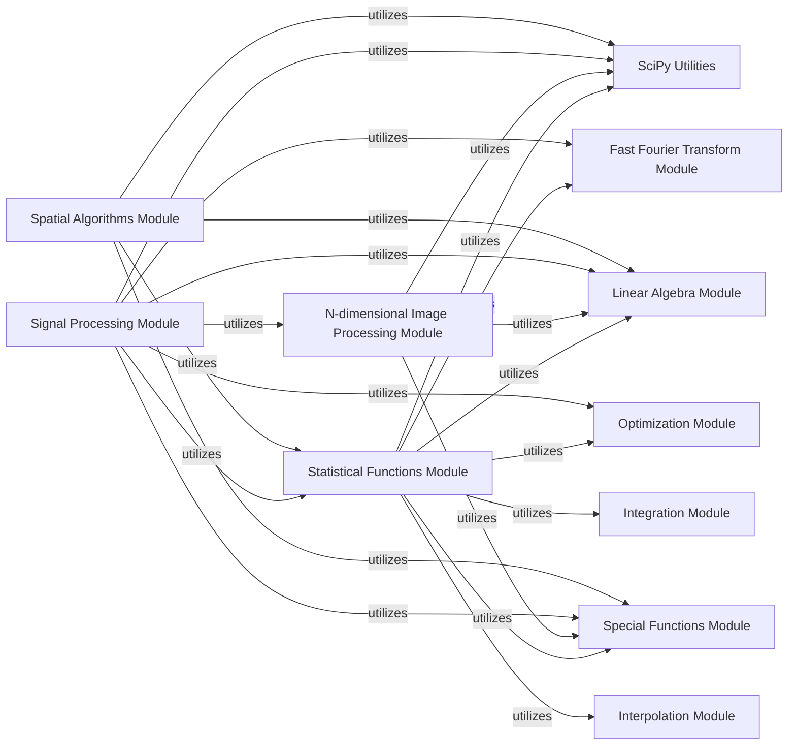

## Component Details

The Data Processing & Analysis component in SciPy provides a comprehensive suite of tools for various scientific computing tasks. It includes modules for statistical analysis, N-dimensional image processing, general signal processing, and spatial data structures and algorithms. These modules interact to offer a robust framework for data manipulation, analysis, and interpretation across diverse scientific and engineering domains.

### Statistical Functions Module
This module contains a comprehensive suite of statistical functions, including probability distributions, hypothesis tests, correlation, and regression, for data analysis and statistical modeling.

**Related Classes/Methods**:

- `scipy.stats` (full file reference)
- `scipy.stats._axis_nan_policy` (full file reference)
- `scipy.stats._binomtest` (full file reference)
- `scipy.stats._continuous_distns` (full file reference)
- `scipy.stats._correlation` (full file reference)
- `scipy.stats._covariance` (full file reference)
- `scipy.stats._discrete_distns` (full file reference)
- `scipy.stats._distn_infrastructure` (full file reference)
- `scipy.stats._entropy` (full file reference)
- `scipy.stats._hypotests` (full file reference)
- `scipy.stats._kde` (full file reference)
- `scipy.stats._mannwhitneyu` (full file reference)
- `scipy.stats._morestats` (full file reference)
- `scipy.stats._multicomp` (full file reference)
- `scipy.stats._multivariate` (full file reference)
- `scipy.stats._qmc` (full file reference)
- `scipy.stats._quantile` (full file reference)
- `scipy.stats._resampling` (full file reference)
- `scipy.stats._stats_py` (full file reference)
- `scipy.stats._survival` (full file reference)
- `scipy.stats._variation` (full file reference)
- `scipy.stats.distributions` (full file reference)

### N-dimensional Image Processing Module
This module provides functions for N-dimensional image processing, including filtering, Fourier transforms, interpolation, measurements, and morphological operations, suitable for various scientific imaging tasks.

**Related Classes/Methods**:

- `scipy.ndimage` (full file reference)
- `scipy.ndimage._filters` (full file reference)
- `scipy.ndimage._fourier` (full file reference)
- `scipy.ndimage._interpolation` (full file reference)
- `scipy.ndimage._measurements` (full file reference)
- `scipy.ndimage._morphology` (full file reference)
- `scipy.ndimage._support_alternative_backends` (full file reference)

### Signal Processing Module
This component offers tools for signal processing, including filtering, spectral analysis, convolution, and waveform generation, essential for analyzing time-series data.

**Related Classes/Methods**:

- `scipy.signal` (full file reference)
- `scipy.signal._czt` (full file reference)
- `scipy.signal._filter_design` (full file reference)
- `scipy.signal._fir_filter_design` (full file reference)
- `scipy.signal._ltisys` (full file reference)
- `scipy.signal._peak_finding` (full file reference)
- `scipy.signal._savitzky_golay` (full file reference)
- `scipy.signal._short_time_fft` (full file reference)
- `scipy.signal._signaltools` (full file reference)
- `scipy.signal._spectral_py` (full file reference)
- `scipy.signal._spline_filters` (full file reference)
- `scipy.signal._upfirdn` (full file reference)
- `scipy.signal._waveforms` (full file reference)
- `scipy.signal.windows` (full file reference)

### Spatial Algorithms Module
This component offers algorithms and data structures for spatial data, including k-d trees, distance calculations, and Voronoi diagrams, useful for computational geometry and spatial analysis.

**Related Classes/Methods**:

- `scipy.spatial` (full file reference)
- <a href="https://github.com/scipy/scipy/blob/master/scipy/spatial/_geometric_slerp.py#L13-L30" target="_blank" rel="noopener noreferrer">`scipy.spatial._geometric_slerp` (13:30)</a>
- `scipy.spatial._kdtree` (full file reference)
- `scipy.spatial._plotutils` (full file reference)
- `scipy.spatial._procrustes` (full file reference)
- `scipy.spatial._spherical_voronoi` (full file reference)
- `scipy.spatial.distance` (full file reference)
- `scipy.spatial.transform` (full file reference)

### SciPy Utilities
This component encompasses core utility functions and internal libraries used across various SciPy modules, providing fundamental building blocks like array API compatibility, testing utilities, and common helper functions.

**Related Classes/Methods**:

- `scipy._lib` (full file reference)
- `scipy._lib._ccallback` (full file reference)
- `scipy._lib._pep440` (full file reference)
- `scipy._lib._testutils` (full file reference)
- `scipy._lib._array_api` (full file reference)
- `scipy._lib._util` (full file reference)
- `scipy._lib.deprecation` (full file reference)
- `scipy._lib._sparse` (full file reference)
- `scipy._lib._disjoint_set` (full file reference)
- `scipy._lib._threadsafety` (full file reference)
- `scipy._lib.uarray` (full file reference)
- `scipy._lib._elementwise_iterative_method` (full file reference)

### Fast Fourier Transform Module
The FFT Module provides efficient algorithms for computing Discrete Fourier Transforms (DFTs) and related operations, crucial for signal processing and spectral analysis.

**Related Classes/Methods**:

- `scipy.fft` (full file reference)
- `scipy.fft._backend` (full file reference)
- `scipy.fft._basic` (full file reference)
- `scipy.fft._fftlog` (full file reference)
- `scipy.fft._helper` (full file reference)
- `scipy.fft._pocketfft.helper` (full file reference)
- `scipy.fft._realtransforms` (full file reference)

### Integration Module
This component handles numerical integration and solves ordinary differential equations (ODEs), offering various methods for approximating integrals and solving initial value problems.

**Related Classes/Methods**:

- `scipy.integrate` (full file reference)
- `scipy.integrate._bvp` (full file reference)
- `scipy.integrate._cubature` (full file reference)
- `scipy.integrate._ivp` (full file reference)
- `scipy.integrate._lebedev` (full file reference)
- `scipy.integrate._ode` (full file reference)
- `scipy.integrate._quad_vec` (full file reference)
- `scipy.integrate._quadrature` (full file reference)
- `scipy.integrate._tanhsinh` (full file reference)

### Interpolation Module
The Interpolation Module provides tools for estimating values between known data points, supporting various interpolation techniques like B-splines, radial basis functions, and polynomial interpolation.

**Related Classes/Methods**:

- `scipy.interpolate` (full file reference)
- `scipy.interpolate._bary_rational` (full file reference)
- `scipy.interpolate._bsplines` (full file reference)
- `scipy.interpolate._cubic` (full file reference)
- `scipy.interpolate._fitpack_py` (full file reference)
- `scipy.interpolate._interpolate` (full file reference)
- `scipy.interpolate._ndbspline` (full file reference)
- `scipy.interpolate._ndgriddata` (full file reference)
- `scipy.interpolate._pade` (full file reference)
- `scipy.interpolate._polyint` (full file reference)
- `scipy.interpolate._rbf` (full file reference)
- `scipy.interpolate._rbfinterp` (full file reference)
- `scipy.interpolate._rgi` (full file reference)

### Linear Algebra Module
The Linear Algebra Module offers a comprehensive set of routines for linear algebra operations, including matrix decompositions, solving linear systems, and eigenvalue problems, often leveraging highly optimized BLAS and LAPACK libraries.

**Related Classes/Methods**:

- `scipy.linalg` (full file reference)
- `scipy.linalg._basic` (full file reference)
- `scipy.linalg._cythonized_array_utils` (full file reference)
- `scipy.linalg._decomp` (full file reference)
- `scipy.linalg._decomp_cholesky` (full file reference)
- `scipy.linalg._decomp_cossin` (full file reference)
- `scipy.linalg._decomp_ldl` (full file reference)
- `scipy.linalg._decomp_lu` (full file reference)
- `scipy.linalg._decomp_polar` (full file reference)
- `scipy.linalg._decomp_qr` (full file reference)
- `scipy.linalg._decomp_qz` (full file reference)
- `scipy.linalg._decomp_schur` (full file reference)
- `scipy.linalg._decomp_svd` (full file reference)
- `scipy.linalg._matfuncs` (full file reference)
- `scipy.linalg._misc` (full file reference)
- `scipy.linalg._procrustes` (full file reference)
- `scipy.linalg._sketches` (full file reference)
- `scipy.linalg._solvers` (full file reference)
- `scipy.linalg._special_matrices` (full file reference)
- `scipy.linalg.lapack` (full file reference)

### Optimization Module
The Optimization Module provides a wide range of algorithms for finding minima or roots of functions, including local and global optimization, least squares, and linear programming.

**Related Classes/Methods**:

- `scipy.optimize` (full file reference)
- `scipy.optimize._basinhopping` (full file reference)
- `scipy.optimize._cobyla_py` (full file reference)
- `scipy.optimize._differentialevolution` (full file reference)
- `scipy.optimize._direct_py` (full file reference)
- `scipy.optimize._dual_annealing` (full file reference)
- `scipy.optimize._hessian_update_strategy` (full file reference)
- `scipy.optimize._isotonic` (full file reference)
- `scipy.optimize._lbfgsb_py` (full file reference)
- `scipy.optimize._linprog` (full file reference)
- `scipy.optimize._lsq` (full file reference)
- `scipy.optimize._milp` (full file reference)
- `scipy.optimize._minimize` (full file reference)
- `scipy.optimize._minpack_py` (full file reference)
- `scipy.optimize._nnls` (full file reference)
- `scipy.optimize._nonlin` (full file reference)
- `scipy.optimize._optimize` (full file reference)
- `scipy.optimize._qap` (full file reference)
- `scipy.optimize._root` (full file reference)
- `scipy.optimize._root_scalar` (full file reference)
- `scipy.optimize._shgo` (full file reference)
- `scipy.optimize._slsqp_py` (full file reference)
- `scipy.optimize._tnc` (full file reference)
- `scipy.optimize._zeros_py` (full file reference)

### Special Functions Module
The Special Functions Module provides a vast collection of mathematical functions beyond elementary ones, such as Bessel functions, Gamma functions, and error functions, widely used in scientific and engineering applications.

**Related Classes/Methods**:

- `scipy.special` (full file reference)
- `scipy.special._basic` (full file reference)
- `scipy.special._ellip_harm` (full file reference)
- `scipy.special._lambertw` (full file reference)
- <a href="https://github.com/scipy/scipy/blob/master/scipy/special/_logsumexp.py#L205-L254" target="_blank" rel="noopener noreferrer">`scipy.special._logsumexp` (205:254)</a>
- `scipy.special._multiufuncs` (full file reference)
- `scipy.special._orthogonal` (full file reference)
- `scipy.special._sf_error` (full file reference)
- `scipy.special._spfun_stats` (full file reference)
- `scipy.special._spherical_bessel` (full file reference)
- `scipy.special._support_alternative_backends` (full file reference)
- `scipy.special._ufuncs` (full file reference)

### [FAQ](https://github.com/CodeBoarding/GeneratedOnBoardings/tree/main?tab=readme-ov-file#faq)