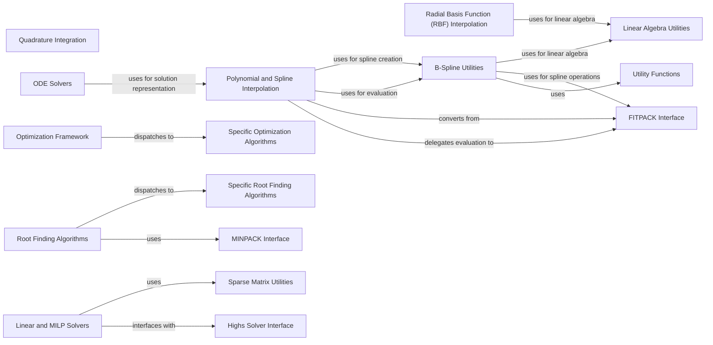

## Component Details

This overview details the 'Numerical Methods & Optimization' subsystem within SciPy, which provides a comprehensive suite of algorithms for numerical integration, solving differential equations, interpolation, and various optimization techniques. The core functionality is delivered through specialized components for quadrature, ODE solving, interpolation (polynomial, spline, and RBF), and optimization (general framework, linear/MILP, and root finding). These components interact with lower-level utilities for linear algebra, sparse matrices, and interfaces to external FORTRAN libraries like MINPACK and FITPACK, ensuring efficient and robust numerical computations.

### Quadrature Integration
This component offers methods for numerical integration (quadrature) of functions over a given interval or region. It includes functions for single, double, and triple integrals, along with internal helper functions.

**Related Classes/Methods**:

- <a href="https://github.com/scipy/scipy/blob/master/scipy/integrate/_quadpack_py.py#L20-L586" target="_blank" rel="noopener noreferrer">`scipy.integrate._quadpack_py.quad` (20:586)</a>
- <a href="https://github.com/scipy/scipy/blob/master/scipy/integrate/_quadpack_py.py#L960-L1210" target="_blank" rel="noopener noreferrer">`scipy.integrate._quadpack_py.nquad` (960:1210)</a>
- <a href="https://github.com/scipy/scipy/blob/master/scipy/integrate/_quadpack_py.py#L679-L809" target="_blank" rel="noopener noreferrer">`scipy.integrate._quadpack_py.dblquad` (679:809)</a>
- <a href="https://github.com/scipy/scipy/blob/master/scipy/integrate/_quadpack_py.py#L812-L957" target="_blank" rel="noopener noreferrer">`scipy.integrate._quadpack_py.tplquad` (812:957)</a>
- <a href="https://github.com/scipy/scipy/blob/master/scipy/integrate/_quadpack_py.py#L589-L621" target="_blank" rel="noopener noreferrer">`scipy.integrate._quadpack_py._quad` (589:621)</a>
- <a href="https://github.com/scipy/scipy/blob/master/scipy/integrate/_quadpack_py.py#L624-L676" target="_blank" rel="noopener noreferrer">`scipy.integrate._quadpack_py._quad_weight` (624:676)</a>
- <a href="https://github.com/scipy/scipy/blob/master/scipy/integrate/_quadpack_py.py#L1213-L1223" target="_blank" rel="noopener noreferrer">`scipy.integrate._quadpack_py._RangeFunc` (1213:1223)</a>
- <a href="https://github.com/scipy/scipy/blob/master/scipy/integrate/_quadpack_py.py#L1226-L1232" target="_blank" rel="noopener noreferrer">`scipy.integrate._quadpack_py._OptFunc` (1226:1232)</a>
- <a href="https://github.com/scipy/scipy/blob/master/scipy/integrate/_quadpack_py.py#L1246-L1283" target="_blank" rel="noopener noreferrer">`scipy.integrate._quadpack_py._NQuad.integrate` (1246:1283)</a>
- <a href="https://github.com/scipy/scipy/blob/master/scipy/integrate/_quadpack_py.py#L1235-L1283" target="_blank" rel="noopener noreferrer">`scipy.integrate._quadpack_py._NQuad` (1235:1283)</a>

### ODE Solvers
This component provides functionalities for solving ordinary differential equations, including initial value problems (IVP) and boundary value problems (BVP). It encompasses both older FORTRAN-based integrators and newer, more object-oriented approaches, along with internal helper functions for ODE solving.

**Related Classes/Methods**:

- <a href="https://github.com/scipy/scipy/blob/master/scipy/integrate/_odepack_py.py#L34-L273" target="_blank" rel="noopener noreferrer">`scipy.integrate._odepack_py.odeint` (34:273)</a>
- <a href="https://github.com/scipy/scipy/blob/master/scipy/integrate/_bvp.py#L711-L1160" target="_blank" rel="noopener noreferrer">`scipy.integrate._bvp.solve_bvp` (711:1160)</a>
- <a href="https://github.com/scipy/scipy/blob/master/scipy/integrate/_ode.py#L110-L578" target="_blank" rel="noopener noreferrer">`scipy.integrate._ode.ode` (110:578)</a>
- <a href="https://github.com/scipy/scipy/blob/master/scipy/integrate/_ode.py#L600-L753" target="_blank" rel="noopener noreferrer">`scipy.integrate._ode.complex_ode` (600:753)</a>
- <a href="https://github.com/scipy/scipy/blob/master/scipy/integrate/_ode.py#L1250-L1391" target="_blank" rel="noopener noreferrer">`scipy.integrate._ode.lsoda` (1250:1391)</a>
- <a href="https://github.com/scipy/scipy/blob/master/scipy/integrate/_ivp/lsoda.py#L7-L208" target="_blank" rel="noopener noreferrer">`scipy.integrate._ivp.lsoda.LSODA` (7:208)</a>
- <a href="https://github.com/scipy/scipy/blob/master/scipy/integrate/_ivp/ivp.py#L159-L755" target="_blank" rel="noopener noreferrer">`scipy.integrate._ivp.ivp.solve_ivp` (159:755)</a>
- <a href="https://github.com/scipy/scipy/blob/master/scipy/integrate/_ivp/common.py#L26-L41" target="_blank" rel="noopener noreferrer">`scipy.integrate._ivp.common.warn_extraneous` (26:41)</a>
- <a href="https://github.com/scipy/scipy/blob/master/scipy/integrate/_ivp/base.py#L131-L166" target="_blank" rel="noopener noreferrer">`scipy.integrate._ivp.base.OdeSolver.__init__` (131:166)</a>
- <a href="https://github.com/scipy/scipy/blob/master/scipy/integrate/_ivp/common.py#L10-L16" target="_blank" rel="noopener noreferrer">`scipy.integrate._ivp.common.validate_first_step` (10:16)</a>
- <a href="https://github.com/scipy/scipy/blob/master/scipy/integrate/_ivp/common.py#L44-L60" target="_blank" rel="noopener noreferrer">`scipy.integrate._ivp.common.validate_tol` (44:60)</a>
- <a href="https://github.com/scipy/scipy/blob/master/scipy/integrate/_ivp/ivp.py#L28-L48" target="_blank" rel="noopener noreferrer">`scipy.integrate._ivp.ivp.prepare_events` (28:48)</a>
- <a href="https://github.com/scipy/scipy/blob/master/scipy/integrate/_ivp/ivp.py#L133-L156" target="_blank" rel="noopener noreferrer">`scipy.integrate._ivp.ivp.find_active_events` (133:156)</a>
- <a href="https://github.com/scipy/scipy/blob/master/scipy/integrate/_ivp/ivp.py#L79-L130" target="_blank" rel="noopener noreferrer">`scipy.integrate._ivp.ivp.handle_events` (79:130)</a>
- <a href="https://github.com/scipy/scipy/blob/master/scipy/integrate/_ivp/common.py#L137-L257" target="_blank" rel="noopener noreferrer">`scipy.integrate._ivp.common.OdeSolution` (137:257)</a>
- <a href="https://github.com/scipy/scipy/blob/master/scipy/integrate/_ivp/ivp.py#L24-L25" target="_blank" rel="noopener noreferrer">`scipy.integrate._ivp.ivp.OdeResult` (24:25)</a>
- <a href="https://github.com/scipy/scipy/blob/master/scipy/integrate/_ode.py#L760-L764" target="_blank" rel="noopener noreferrer">`scipy.integrate._ode.find_integrator` (760:764)</a>
- <a href="https://github.com/scipy/scipy/blob/master/scipy/integrate/_ode.py#L798-L800" target="_blank" rel="noopener noreferrer">`scipy.integrate._ode.IntegratorBase.check_handle` (798:800)</a>
- <a href="https://github.com/scipy/scipy/blob/master/scipy/integrate/_ode.py#L791-L796" target="_blank" rel="noopener noreferrer">`scipy.integrate._ode.IntegratorBase.acquire_new_handle` (791:796)</a>
- <a href="https://github.com/scipy/scipy/blob/master/scipy/integrate/_ode.py#L829-L840" target="_blank" rel="noopener noreferrer">`scipy.integrate._ode._banded_jac_wrapper` (829:840)</a>
- <a href="https://github.com/scipy/scipy/blob/master/scipy/integrate/_bvp.py#L117-L140" target="_blank" rel="noopener noreferrer">`scipy.integrate._bvp.compute_jac_indices` (117:140)</a>
- <a href="https://github.com/scipy/scipy/blob/master/scipy/integrate/_bvp.py#L276-L314" target="_blank" rel="noopener noreferrer">`scipy.integrate._bvp.collocation_fun` (276:314)</a>
- <a href="https://github.com/scipy/scipy/blob/master/scipy/integrate/_bvp.py#L15-L55" target="_blank" rel="noopener noreferrer">`scipy.integrate._bvp.estimate_fun_jac` (15:55)</a>
- <a href="https://github.com/scipy/scipy/blob/master/scipy/integrate/_bvp.py#L58-L114" target="_blank" rel="noopener noreferrer">`scipy.integrate._bvp.estimate_bc_jac` (58:114)</a>
- <a href="https://github.com/scipy/scipy/blob/master/scipy/integrate/_bvp.py#L158-L273" target="_blank" rel="noopener noreferrer">`scipy.integrate._bvp.construct_global_jac` (158:273)</a>
- <a href="https://github.com/scipy/scipy/blob/master/scipy/integrate/_bvp.py#L638-L708" target="_blank" rel="noopener noreferrer">`scipy.integrate._bvp.wrap_functions` (638:708)</a>
- <a href="https://github.com/scipy/scipy/blob/master/scipy/integrate/_bvp.py#L504-L506" target="_blank" rel="noopener noreferrer">`scipy.integrate._bvp.print_iteration_header` (504:506)</a>
- <a href="https://github.com/scipy/scipy/blob/master/scipy/integrate/_bvp.py#L347-L501" target="_blank" rel="noopener noreferrer">`scipy.integrate._bvp.solve_newton` (347:501)</a>
- <a href="https://github.com/scipy/scipy/blob/master/scipy/integrate/_bvp.py#L578-L600" target="_blank" rel="noopener noreferrer">`scipy.integrate._bvp.create_spline` (578:600)</a>
- <a href="https://github.com/scipy/scipy/blob/master/scipy/integrate/_bvp.py#L527-L575" target="_blank" rel="noopener noreferrer">`scipy.integrate._bvp.estimate_rms_residuals` (527:575)</a>
- <a href="https://github.com/scipy/scipy/blob/master/scipy/integrate/_bvp.py#L509-L512" target="_blank" rel="noopener noreferrer">`scipy.integrate._bvp.print_iteration_progress` (509:512)</a>
- <a href="https://github.com/scipy/scipy/blob/master/scipy/integrate/_bvp.py#L603-L635" target="_blank" rel="noopener noreferrer">`scipy.integrate._bvp.modify_mesh` (603:635)</a>
- <a href="https://github.com/scipy/scipy/blob/master/scipy/integrate/_bvp.py#L515-L516" target="_blank" rel="noopener noreferrer">`scipy.integrate._bvp.BVPResult` (515:516)</a>

### Optimization Framework
This component provides a unified interface for various optimization algorithms, including unconstrained and constrained minimization, and scalar minimization. It includes helper functions for managing optimization parameters and results.

**Related Classes/Methods**:

- <a href="https://github.com/scipy/scipy/blob/master/scipy/optimize/_minimize.py#L54-L829" target="_blank" rel="noopener noreferrer">`scipy.optimize._minimize.minimize` (54:829)</a>
- <a href="https://github.com/scipy/scipy/blob/master/scipy/optimize/_minimize.py#L832-L1040" target="_blank" rel="noopener noreferrer">`scipy.optimize._minimize.minimize_scalar` (832:1040)</a>
- <a href="https://github.com/scipy/scipy/blob/master/scipy/optimize/_optimize.py#L61-L85" target="_blank" rel="noopener noreferrer">`scipy.optimize._optimize.MemoizeJac` (61:85)</a>
- <a href="https://github.com/scipy/scipy/blob/master/scipy/optimize/_minimize.py#L1135-L1158" target="_blank" rel="noopener noreferrer">`scipy.optimize._minimize.standardize_constraints` (1135:1158)</a>
- <a href="https://github.com/scipy/scipy/blob/master/scipy/optimize/_minimize.py#L1122-L1132" target="_blank" rel="noopener noreferrer">`scipy.optimize._minimize.standardize_bounds` (1122:1132)</a>
- <a href="https://github.com/scipy/scipy/blob/master/scipy/optimize/_minimize.py#L1106-L1120" target="_blank" rel="noopener noreferrer">`scipy.optimize._minimize._validate_bounds` (1106:1120)</a>
- <a href="https://github.com/scipy/scipy/blob/master/scipy/optimize/_minimize.py#L1161-L1200" target="_blank" rel="noopener noreferrer">`scipy.optimize._minimize._optimize_result_for_equal_bounds` (1161:1200)</a>
- <a href="https://github.com/scipy/scipy/blob/master/scipy/optimize/_minimize.py#L1043-L1047" target="_blank" rel="noopener noreferrer">`scipy.optimize._minimize._remove_from_bounds` (1043:1047)</a>
- <a href="https://github.com/scipy/scipy/blob/master/scipy/optimize/_minimize.py#L1066-L1092" target="_blank" rel="noopener noreferrer">`scipy.optimize._minimize._Remove_From_Func` (1066:1092)</a>
- <a href="https://github.com/scipy/scipy/blob/master/scipy/optimize/_minimize.py#L1050-L1063" target="_blank" rel="noopener noreferrer">`scipy.optimize._minimize._Patch_Callback_Equal_Variables` (1050:1063)</a>
- <a href="https://github.com/scipy/scipy/blob/master/scipy/optimize/_optimize.py#L88-L109" target="_blank" rel="noopener noreferrer">`scipy.optimize._optimize._wrap_callback` (88:109)</a>
- <a href="https://github.com/scipy/scipy/blob/master/scipy/optimize/_minimize.py#L1095-L1103" target="_blank" rel="noopener noreferrer">`scipy.optimize._minimize._add_to_array` (1095:1103)</a>
- <a href="https://github.com/scipy/scipy/blob/master/scipy/optimize/_constraints.py#L309-L407" target="_blank" rel="noopener noreferrer">`scipy.optimize._constraints.PreparedConstraint` (309:407)</a>
- <a href="https://github.com/scipy/scipy/blob/master/scipy/optimize/_optimize.py#L112-L154" target="_blank" rel="noopener noreferrer">`scipy.optimize._optimize.OptimizeResult` (112:154)</a>
- <a href="https://github.com/scipy/scipy/blob/master/scipy/optimize/_optimize.py#L3117-L3148" target="_blank" rel="noopener noreferrer">`scipy.optimize._optimize._recover_from_bracket_error` (3117:3148)</a>
- <a href="https://github.com/scipy/scipy/blob/master/scipy/optimize/_optimize.py#L2289-L2436" target="_blank" rel="noopener noreferrer">`scipy.optimize._optimize._minimize_scalar_bounded` (2289:2436)</a>
- <a href="https://github.com/scipy/scipy/blob/master/scipy/optimize/_optimize.py#L176-L182" target="_blank" rel="noopener noreferrer">`scipy.optimize._optimize._check_unknown_options` (176:182)</a>

### Linear and MILP Solvers
This component focuses on solving linear programming (LP) and mixed-integer linear programming (MILP) problems. It includes interfaces to external solvers and internal utility functions for data conversion.

**Related Classes/Methods**:

- <a href="https://github.com/scipy/scipy/blob/master/scipy/optimize/_linprog.py#L178-L733" target="_blank" rel="noopener noreferrer">`scipy.optimize._linprog.linprog` (178:733)</a>
- <a href="https://github.com/scipy/scipy/blob/master/scipy/optimize/_milp.py#L154-L394" target="_blank" rel="noopener noreferrer">`scipy.optimize._milp.milp` (154:394)</a>
- <a href="https://github.com/scipy/scipy/blob/master/scipy/optimize/_linprog_highs.py#L89-L422" target="_blank" rel="noopener noreferrer">`scipy.optimize._linprog_highs._linprog_highs` (89:422)</a>
- <a href="https://github.com/scipy/scipy/blob/master/scipy/optimize/_linprog_highs.py#L72-L86" target="_blank" rel="noopener noreferrer">`scipy.optimize._linprog_highs._convert_to_highs_enum` (72:86)</a>
- <a href="https://github.com/scipy/scipy/blob/master/scipy/optimize/_linprog_highs.py#L64-L69" target="_blank" rel="noopener noreferrer">`scipy.optimize._linprog_highs._replace_inf` (64:69)</a>
- <a href="https://github.com/scipy/scipy/blob/master/scipy/optimize/_linprog_highs.py#L34-L61" target="_blank" rel="noopener noreferrer">`scipy.optimize._linprog_highs._highs_to_scipy_status_message` (34:61)</a>

### Root Finding Algorithms
This component provides algorithms for finding the roots (zeros) of scalar and multi-dimensional equations. It includes a general interface and specific implementations.

**Related Classes/Methods**:

- <a href="https://github.com/scipy/scipy/blob/master/scipy/optimize/_zeros_py.py#L109-L394" target="_blank" rel="noopener noreferrer">`scipy.optimize._zeros_py.newton` (109:394)</a>
- <a href="https://github.com/scipy/scipy/blob/master/scipy/optimize/_root.py#L25-L270" target="_blank" rel="noopener noreferrer">`scipy.optimize._root.root` (25:270)</a>
- <a href="https://github.com/scipy/scipy/blob/master/scipy/optimize/_root.py#L279-L334" target="_blank" rel="noopener noreferrer">`scipy.optimize._root._root_leastsq` (279:334)</a>
- <a href="https://github.com/scipy/scipy/blob/master/scipy/optimize/_root.py#L273-L276" target="_blank" rel="noopener noreferrer">`scipy.optimize._root._warn_jac_unused` (273:276)</a>

### Polynomial and Spline Interpolation
This component offers various methods for interpolating data using polynomials and splines. It includes functionalities for piecewise polynomials (PPoly), 1D interpolation, and different types of splines (univariate, bivariate), along with internal helper functions.

**Related Classes/Methods**:

- <a href="https://github.com/scipy/scipy/blob/master/scipy/interpolate/_interpolate.py#L816-L1276" target="_blank" rel="noopener noreferrer">`scipy.interpolate._interpolate.PPoly` (816:1276)</a>
- <a href="https://github.com/scipy/scipy/blob/master/scipy/interpolate/_interpolate.py#L173-L589" target="_blank" rel="noopener noreferrer">`scipy.interpolate._interpolate.interp1d` (173:589)</a>
- <a href="https://github.com/scipy/scipy/blob/master/scipy/interpolate/_fitpack2.py#L73-L655" target="_blank" rel="noopener noreferrer">`scipy.interpolate._fitpack2.UnivariateSpline` (73:655)</a>
- <a href="https://github.com/scipy/scipy/blob/master/scipy/interpolate/_fitpack2.py#L1355-L1451" target="_blank" rel="noopener noreferrer">`scipy.interpolate._fitpack2.SmoothBivariateSpline` (1355:1451)</a>
- <a href="https://github.com/scipy/scipy/blob/master/scipy/interpolate/_fitpack2.py#L1454-L1551" target="_blank" rel="noopener noreferrer">`scipy.interpolate._fitpack2.LSQBivariateSpline` (1454:1551)</a>
- <a href="https://github.com/scipy/scipy/blob/master/scipy/interpolate/_fitpack2.py#L658-L762" target="_blank" rel="noopener noreferrer">`scipy.interpolate._fitpack2.InterpolatedUnivariateSpline` (658:762)</a>
- <a href="https://github.com/scipy/scipy/blob/master/scipy/interpolate/_fitpack2.py#L780-L923" target="_blank" rel="noopener noreferrer">`scipy.interpolate._fitpack2.LSQUnivariateSpline` (780:923)</a>
- <a href="https://github.com/scipy/scipy/blob/master/scipy/interpolate/_polyint.py#L53-L58" target="_blank" rel="noopener noreferrer">`scipy.interpolate._polyint._Interpolator1D.__init__` (53:58)</a>
- <a href="https://github.com/scipy/scipy/blob/master/scipy/interpolate/_polyint.py#L108-L114" target="_blank" rel="noopener noreferrer">`scipy.interpolate._polyint._Interpolator1D._reshape_yi` (108:114)</a>
- <a href="https://github.com/scipy/scipy/blob/master/scipy/interpolate/_interpolate.py#L167-L170" target="_blank" rel="noopener noreferrer">`scipy.interpolate._interpolate._do_extrapolate` (167:170)</a>
- <a href="https://github.com/scipy/scipy/blob/master/scipy/interpolate/_interpolate.py#L465-L469" target="_blank" rel="noopener noreferrer">`scipy.interpolate._interpolate.interp1d._check_and_update_bounds_error_for_extrapolation` (465:469)</a>
- <a href="https://github.com/scipy/scipy/blob/master/scipy/interpolate/_interpolate.py#L151-L164" target="_blank" rel="noopener noreferrer">`scipy.interpolate._interpolate._check_broadcast_up_to` (151:164)</a>
- <a href="https://github.com/scipy/scipy/blob/master/scipy/interpolate/_interpolate.py#L649-L665" target="_blank" rel="noopener noreferrer">`scipy.interpolate._interpolate._PPolyBase.construct_fast` (649:665)</a>
- <a href="https://github.com/scipy/scipy/blob/master/scipy/interpolate/_interpolate.py#L667-L675" target="_blank" rel="noopener noreferrer">`scipy.interpolate._interpolate._PPolyBase._ensure_c_contiguous` (667:675)</a>
- <a href="https://github.com/scipy/scipy/blob/master/scipy/interpolate/_interpolate.py#L1059-L1130" target="_blank" rel="noopener noreferrer">`scipy.interpolate._interpolate.PPoly.solve` (1059:1130)</a>

### Radial Basis Function (RBF) Interpolation
This component provides interpolation capabilities using Radial Basis Functions, suitable for scattered data interpolation.

**Related Classes/Methods**:

- <a href="https://github.com/scipy/scipy/blob/master/scipy/interpolate/_rbf.py#L55-L290" target="_blank" rel="noopener noreferrer">`scipy.interpolate._rbf.Rbf` (55:290)</a>
- <a href="https://github.com/scipy/scipy/blob/master/scipy/interpolate/_rbfinterp.py#L134-L550" target="_blank" rel="noopener noreferrer">`scipy.interpolate._rbfinterp.RBFInterpolator` (134:550)</a>

### B-Spline Utilities
This component provides fundamental functionalities for working with B-splines, including their construction, evaluation, and internal helper functions.

**Related Classes/Methods**:

- <a href="https://github.com/scipy/scipy/blob/master/scipy/interpolate/_bsplines.py#L69-L936" target="_blank" rel="noopener noreferrer">`scipy.interpolate._bsplines.BSpline` (69:936)</a>
- <a href="https://github.com/scipy/scipy/blob/master/scipy/interpolate/_bsplines.py#L1369-L1643" target="_blank" rel="noopener noreferrer">`scipy.interpolate._bsplines.make_interp_spline` (1369:1643)</a>
- <a href="https://github.com/scipy/scipy/blob/master/scipy/interpolate/_bsplines.py#L29-L39" target="_blank" rel="noopener noreferrer">`scipy.interpolate._bsplines._as_float_array` (29:39)</a>
- <a href="https://github.com/scipy/scipy/blob/master/scipy/interpolate/_bsplines.py#L21-L26" target="_blank" rel="noopener noreferrer">`scipy.interpolate._bsplines._get_dtype` (21:26)</a>
- <a href="https://github.com/scipy/scipy/blob/master/scipy/interpolate/_bsplines.py#L1150-L1167" target="_blank" rel="noopener noreferrer">`scipy.interpolate._bsplines._periodic_knots` (1150:1167)</a>
- <a href="https://github.com/scipy/scipy/blob/master/scipy/interpolate/_bsplines.py#L1013-L1032" target="_blank" rel="noopener noreferrer">`scipy.interpolate._bsplines._not_a_knot` (1013:1032)</a>
- <a href="https://github.com/scipy/scipy/blob/master/scipy/interpolate/_bsplines.py#L1035-L1037" target="_blank" rel="noopener noreferrer">`scipy.interpolate._bsplines._augknt` (1035:1037)</a>
- <a href="https://github.com/scipy/scipy/blob/master/scipy/interpolate/_bsplines.py#L1276-L1366" target="_blank" rel="noopener noreferrer">`scipy.interpolate._bsplines._make_periodic_spline` (1276:1366)</a>
- <a href="https://github.com/scipy/scipy/blob/master/scipy/interpolate/_bsplines.py#L1040-L1048" target="_blank" rel="noopener noreferrer">`scipy.interpolate._bsplines._convert_string_aliases` (1040:1048)</a>
- <a href="https://github.com/scipy/scipy/blob/master/scipy/interpolate/_bsplines.py#L1051-L1061" target="_blank" rel="noopener noreferrer">`scipy.interpolate._bsplines._process_deriv_spec` (1051:1061)</a>
- <a href="https://github.com/scipy/scipy/blob/master/scipy/interpolate/_bsplines.py#L1233-L1273" target="_blank" rel="noopener noreferrer">`scipy.interpolate._bsplines._handle_lhs_derivatives` (1233:1273)</a>

### Specific Optimization Algorithms
This component groups various specific optimization algorithms that are called by the Optimization Framework.

**Related Classes/Methods**:

- <a href="https://github.com/scipy/scipy/blob/master/scipy/optimize/_optimize.py#L700-L967" target="_blank" rel="noopener noreferrer">`scipy.optimize._optimize._minimize_neldermead` (700:967)</a>
- <a href="https://github.com/scipy/scipy/blob/master/scipy/optimize/_optimize.py#L3413-L3652" target="_blank" rel="noopener noreferrer">`scipy.optimize._optimize._minimize_powell` (3413:3652)</a>
- <a href="https://github.com/scipy/scipy/blob/master/scipy/optimize/_optimize.py#L1719-L1878" target="_blank" rel="noopener noreferrer">`scipy.optimize._optimize._minimize_cg` (1719:1878)</a>
- <a href="https://github.com/scipy/scipy/blob/master/scipy/optimize/_optimize.py#L1345-L1526" target="_blank" rel="noopener noreferrer">`scipy.optimize._optimize._minimize_bfgs` (1345:1526)</a>
- <a href="https://github.com/scipy/scipy/blob/master/scipy/optimize/_optimize.py#L2001-L2192" target="_blank" rel="noopener noreferrer">`scipy.optimize._optimize._minimize_newtoncg` (2001:2192)</a>
- <a href="https://github.com/scipy/scipy/blob/master/scipy/optimize/_lbfgsb_py.py#L290-L495" target="_blank" rel="noopener noreferrer">`scipy.optimize._lbfgsb_py._minimize_lbfgsb` (290:495)</a>
- <a href="https://github.com/scipy/scipy/blob/master/scipy/optimize/_tnc.py#L285-L438" target="_blank" rel="noopener noreferrer">`scipy.optimize._tnc._minimize_tnc` (285:438)</a>
- <a href="https://github.com/scipy/scipy/blob/master/scipy/optimize/_cobyla_py.py#L187-L297" target="_blank" rel="noopener noreferrer">`scipy.optimize._cobyla_py._minimize_cobyla` (187:297)</a>
- <a href="https://github.com/scipy/scipy/blob/master/scipy/optimize/_cobyqa_py.py#L10-L72" target="_blank" rel="noopener noreferrer">`scipy.optimize._cobyqa_py._minimize_cobyqa` (10:72)</a>
- <a href="https://github.com/scipy/scipy/blob/master/scipy/optimize/_slsqp_py.py#L215-L557" target="_blank" rel="noopener noreferrer">`scipy.optimize._slsqp_py._minimize_slsqp` (215:557)</a>
- <a href="https://github.com/scipy/scipy/blob/master/scipy/optimize/_trustregion_constr/minimize_trustregion_constr.py#L117-L584" target="_blank" rel="noopener noreferrer">`scipy.optimize._trustregion_constr.minimize_trustregion_constr._minimize_trustregion_constr` (117:584)</a>
- <a href="https://github.com/scipy/scipy/blob/master/scipy/optimize/_trustregion_dogleg.py#L9-L35" target="_blank" rel="noopener noreferrer">`scipy.optimize._trustregion_dogleg._minimize_dogleg` (9:35)</a>
- <a href="https://github.com/scipy/scipy/blob/master/scipy/optimize/_trustregion_ncg.py#L11-L39" target="_blank" rel="noopener noreferrer">`scipy.optimize._trustregion_ncg._minimize_trust_ncg` (11:39)</a>
- <a href="https://github.com/scipy/scipy/blob/master/scipy/optimize/_trustregion_krylov.py#L6-L65" target="_blank" rel="noopener noreferrer">`scipy.optimize._trustregion_krylov._minimize_trust_krylov` (6:65)</a>
- <a href="https://github.com/scipy/scipy/blob/master/scipy/optimize/_trustregion_exact.py#L13-L40" target="_blank" rel="noopener noreferrer">`scipy.optimize._trustregion_exact._minimize_trustregion_exact` (13:40)</a>

### Specific Root Finding Algorithms
This component groups various specific root finding algorithms that are called by the Root Finding component.

**Related Classes/Methods**:

- <a href="https://github.com/scipy/scipy/blob/master/scipy/optimize/_spectral.py#L15-L165" target="_blank" rel="noopener noreferrer">`scipy.optimize._spectral._root_df_sane` (15:165)</a>
- <a href="https://github.com/scipy/scipy/blob/master/scipy/optimize/_root.py#L337-L382" target="_blank" rel="noopener noreferrer">`scipy.optimize._root._root_nonlin_solve` (337:382)</a>

### MINPACK Interface
This component provides a Python interface to the FORTRAN MINPACK library, which is used for solving systems of nonlinear equations and least squares problems.

**Related Classes/Methods**:

- <a href="https://github.com/scipy/scipy/blob/master/scipy/optimize/_minpack_py.py#L194-L285" target="_blank" rel="noopener noreferrer">`scipy.optimize._minpack_py._root_hybr` (194:285)</a>
- <a href="https://github.com/scipy/scipy/blob/master/scipy/optimize/_minpack_py.py#L292-L507" target="_blank" rel="noopener noreferrer">`scipy.optimize._minpack_py.leastsq` (292:507)</a>

### FITPACK Interface
This component provides a Python interface to the FORTRAN FITPACK library, which is used for spline fitting and evaluation.

**Related Classes/Methods**:

- <a href="https://github.com/scipy/scipy/blob/master/scipy/interpolate/_fitpack_py.py#L308-L395" target="_blank" rel="noopener noreferrer">`scipy.interpolate._fitpack_py.splev` (308:395)</a>
- <a href="https://github.com/scipy/scipy/blob/master/scipy/interpolate/_fitpack_impl.py#L305-L337" target="_blank" rel="noopener noreferrer">`scipy.interpolate._fitpack_impl.splev` (305:337)</a>
- <a href="https://github.com/scipy/scipy/blob/master/scipy/interpolate/_fitpack_impl.py#L340-L356" target="_blank" rel="noopener noreferrer">`scipy.interpolate._fitpack_impl.splint` (340:356)</a>
- <a href="https://github.com/scipy/scipy/blob/master/scipy/interpolate/_fitpack_impl.py#L388-L408" target="_blank" rel="noopener noreferrer">`scipy.interpolate._fitpack_impl.spalde` (388:408)</a>
- <a href="https://github.com/scipy/scipy/blob/master/scipy/interpolate/_fitpack_impl.py#L359-L385" target="_blank" rel="noopener noreferrer">`scipy.interpolate._fitpack_impl.sproot` (359:385)</a>
- <a href="https://github.com/scipy/scipy/blob/master/scipy/interpolate/_fitpack_impl.py#L748-L783" target="_blank" rel="noopener noreferrer">`scipy.interpolate._fitpack_impl.splder` (748:783)</a>
- <a href="https://github.com/scipy/scipy/blob/master/scipy/interpolate/_fitpack_impl.py#L786-L811" target="_blank" rel="noopener noreferrer">`scipy.interpolate._fitpack_impl.splantider` (786:811)</a>

### Highs Solver Interface
This component provides an interface to the Highs linear optimization solver.

**Related Classes/Methods**:

- <a href="https://github.com/scipy/scipy/blob/master/scipy/optimize/_highspy/_highs_wrapper.py#L9-L303" target="_blank" rel="noopener noreferrer">`scipy.optimize._highspy._highs_wrapper._highs_wrapper` (9:303)</a>

### Linear Algebra Utilities
This component provides core linear algebra routines, often used by other SciPy components for tasks like solving linear systems or factorizations.

**Related Classes/Methods**:

- <a href="https://github.com/scipy/scipy/blob/master/scipy/linalg/_decomp_lu.py#L23-L133" target="_blank" rel="noopener noreferrer">`scipy.linalg._decomp_lu.lu_factor` (23:133)</a>
- <a href="https://github.com/scipy/scipy/blob/master/scipy/linalg/_decomp_lu.py#L136-L186" target="_blank" rel="noopener noreferrer">`scipy.linalg._decomp_lu.lu_solve` (136:186)</a>
- <a href="https://github.com/scipy/scipy/blob/master/scipy/linalg/_basic.py#L77-L349" target="_blank" rel="noopener noreferrer">`scipy.linalg._basic.solve` (77:349)</a>
- <a href="https://github.com/scipy/scipy/blob/master/scipy/linalg/lapack.py#L928-L1018" target="_blank" rel="noopener noreferrer">`scipy.linalg.lapack.get_lapack_funcs` (928:1018)</a>

### Sparse Matrix Utilities
This component provides utilities for working with sparse matrices, including creation and manipulation.

**Related Classes/Methods**:

- <a href="https://github.com/scipy/scipy/blob/master/scipy/_lib/_sparse.py#L10-L41" target="_blank" rel="noopener noreferrer">`scipy._lib._sparse.issparse` (10:41)</a>
- <a href="https://github.com/scipy/scipy/blob/master/scipy/sparse/_construct.py#L804-L849" target="_blank" rel="noopener noreferrer">`scipy.sparse._construct.vstack` (804:849)</a>
- <a href="https://github.com/scipy/scipy/blob/master/scipy/sparse/_csc.py#L179-L271" target="_blank" rel="noopener noreferrer">`scipy.sparse._csc.csc_array` (179:271)</a>

### Utility Functions
This component contains general utility functions used across different SciPy modules.

**Related Classes/Methods**:

- <a href="https://github.com/scipy/scipy/blob/master/scipy/_lib/_util.py#L1024-L1032" target="_blank" rel="noopener noreferrer">`scipy._lib._util.normalize_axis_index` (1024:1032)</a>

### [FAQ](https://github.com/CodeBoarding/GeneratedOnBoardings/tree/main?tab=readme-ov-file#faq)