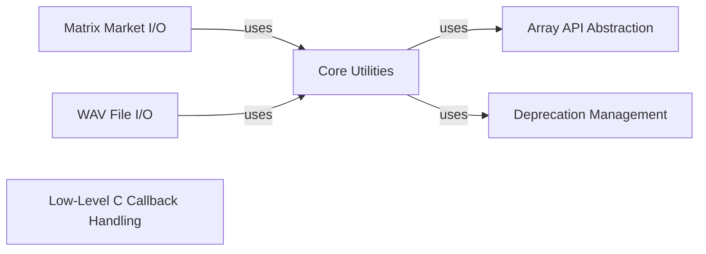

## Component Details

The `System Utilities & I/O` subsystem in SciPy provides foundational internal utility functions for array API compatibility, deprecation handling, and low-level C callbacks. Additionally, it offers robust capabilities for reading and writing data in various file formats, ensuring seamless data exchange and manipulation within the scientific computing ecosystem.

### Array API Abstraction
Provides a standardized interface for array operations, ensuring compatibility across various array backends like NumPy, CuPy, JAX, PyTorch, and Dask. It handles array creation, type promotion, device management, and testing utilities for array comparisons.

**Related Classes/Methods**:

- <a href="https://github.com/scipy/scipy/blob/master/scipy/_lib/_array_api_override.py#L87-L122" target="_blank" rel="noopener noreferrer">`scipy._lib._array_api_override.array_namespace` (87:122)</a>
- <a href="https://github.com/scipy/scipy/blob/master/scipy/_lib/_array_api.py#L144-L157" target="_blank" rel="noopener noreferrer">`scipy._lib._array_api.default_xp` (144:157)</a>
- <a href="https://github.com/scipy/scipy/blob/master/scipy/_lib/_array_api.py#L675-L740" target="_blank" rel="noopener noreferrer">`scipy._lib._array_api.xp_capabilities` (675:740)</a>
- <a href="https://github.com/scipy/scipy/blob/master/scipy/_lib/_array_api.py#L332-L351" target="_blank" rel="noopener noreferrer">`scipy._lib._array_api.scipy_namespace_for` (332:351)</a>
- <a href="https://github.com/scipy/scipy/blob/master/scipy/_lib/_array_api.py#L551-L553" target="_blank" rel="noopener noreferrer">`scipy._lib._array_api.is_marray` (551:553)</a>
- <a href="https://github.com/scipy/scipy/blob/master/scipy/_lib/_array_api.py#L449-L508" target="_blank" rel="noopener noreferrer">`scipy._lib._array_api.xp_promote` (449:508)</a>
- <a href="https://github.com/scipy/scipy/blob/master/scipy/_lib/_array_api.py#L511-L522" target="_blank" rel="noopener noreferrer">`scipy._lib._array_api.xp_float_to_complex` (511:522)</a>
- <a href="https://github.com/scipy/scipy/blob/master/scipy/_lib/_array_api.py#L381-L386" target="_blank" rel="noopener noreferrer">`scipy._lib._array_api.xp_ravel` (381:386)</a>
- <a href="https://github.com/scipy/scipy/blob/master/scipy/_lib/_array_api.py#L113-L138" target="_blank" rel="noopener noreferrer">`scipy._lib._array_api.xp_copy` (113:138)</a>
- <a href="https://github.com/scipy/scipy/blob/master/scipy/_lib/_array_api.py#L66-L110" target="_blank" rel="noopener noreferrer">`scipy._lib._array_api._asarray` (66:110)</a>
- <a href="https://github.com/scipy/scipy/blob/master/scipy/_lib/_array_api.py#L399-L446" target="_blank" rel="noopener noreferrer">`scipy._lib._array_api.xp_result_type` (399:446)</a>
- <a href="https://github.com/scipy/scipy/blob/master/scipy/_lib/_array_api.py#L60-L64" target="_blank" rel="noopener noreferrer">`scipy._lib._array_api._check_finite` (60:64)</a>
- <a href="https://github.com/scipy/scipy/blob/master/scipy/_lib/_array_api.py#L171-L208" target="_blank" rel="noopener noreferrer">`scipy._lib._array_api._strict_check` (171:208)</a>
- <a href="https://github.com/scipy/scipy/blob/master/scipy/_lib/_array_api.py#L211-L226" target="_blank" rel="noopener noreferrer">`scipy._lib._array_api._assert_matching_namespace` (211:226)</a>
- <a href="https://github.com/scipy/scipy/blob/master/scipy/_lib/_array_api.py#L229-L248" target="_blank" rel="noopener noreferrer">`scipy._lib._array_api.xp_assert_equal` (229:248)</a>
- <a href="https://github.com/scipy/scipy/blob/master/scipy/_lib/_array_api.py#L251-L280" target="_blank" rel="noopener noreferrer">`scipy._lib._array_api.xp_assert_close` (251:280)</a>
- <a href="https://github.com/scipy/scipy/blob/master/scipy/_lib/_array_api.py#L283-L303" target="_blank" rel="noopener noreferrer">`scipy._lib._array_api.xp_assert_less` (283:303)</a>
- <a href="https://github.com/scipy/scipy/blob/master/scipy/_lib/_array_api.py#L306-L312" target="_blank" rel="noopener noreferrer">`scipy._lib._array_api.assert_array_almost_equal` (306:312)</a>
- <a href="https://github.com/scipy/scipy/blob/master/scipy/_lib/_array_api.py#L315-L321" target="_blank" rel="noopener noreferrer">`scipy._lib._array_api.assert_almost_equal` (315:321)</a>
- <a href="https://github.com/scipy/scipy/blob/master/scipy/_lib/_array_api.py#L355-L378" target="_blank" rel="noopener noreferrer">`scipy._lib._array_api.xp_vector_norm` (355:378)</a>
- <a href="https://github.com/scipy/scipy/blob/master/scipy/_lib/_array_api.py#L389-L395" target="_blank" rel="noopener noreferrer">`scipy._lib._array_api.xp_swapaxes` (389:395)</a>
- <a href="https://github.com/scipy/scipy/blob/master/scipy/_lib/_array_api.py#L525-L533" target="_blank" rel="noopener noreferrer">`scipy._lib._array_api.xp_default_dtype` (525:533)</a>
- <a href="https://github.com/scipy/scipy/blob/master/scipy/_lib/_array_api.py#L537-L548" target="_blank" rel="noopener noreferrer">`scipy._lib._array_api.xp_result_device` (537:548)</a>
- <a href="https://github.com/scipy/scipy/blob/master/scipy/_lib/_array_api.py#L556-L565" target="_blank" rel="noopener noreferrer">`scipy._lib._array_api._length_nonmasked` (556:565)</a>
- <a href="https://github.com/scipy/scipy/blob/master/scipy/_lib/_array_api.py#L568-L572" target="_blank" rel="noopener noreferrer">`scipy._lib._array_api._share_masks` (568:572)</a>
- <a href="https://github.com/scipy/scipy/blob/master/scipy/_lib/_array_api.py#L578-L597" target="_blank" rel="noopener noreferrer">`scipy._lib._array_api._XPSphinxCapability` (578:597)</a>
- <a href="https://github.com/scipy/scipy/blob/master/scipy/_lib/_array_api.py#L600-L648" target="_blank" rel="noopener noreferrer">`scipy._lib._array_api._make_sphinx_capabilities` (600:648)</a>
- <a href="https://github.com/scipy/scipy/blob/master/scipy/_lib/_array_api.py#L651-L672" target="_blank" rel="noopener noreferrer">`scipy._lib._array_api._make_capabilities_note` (651:672)</a>
- <a href="https://github.com/scipy/scipy/blob/master/scipy/_lib/_array_api.py#L773-L794" target="_blank" rel="noopener noreferrer">`scipy._lib._array_api.make_xp_test_case` (773:794)</a>
- <a href="https://github.com/scipy/scipy/blob/master/scipy/_lib/_array_api.py#L743-L770" target="_blank" rel="noopener noreferrer">`scipy._lib._array_api._make_xp_pytest_marks` (743:770)</a>
- <a href="https://github.com/scipy/scipy/blob/master/scipy/_lib/_array_api.py#L797-L844" target="_blank" rel="noopener noreferrer">`scipy._lib._array_api.make_xp_pytest_param` (797:844)</a>
- <a href="https://github.com/scipy/scipy/blob/master/scipy/_lib/_array_api_override.py#L31-L84" target="_blank" rel="noopener noreferrer">`scipy._lib._array_api_override._compliance_scipy` (31:84)</a>
- <a href="https://github.com/scipy/scipy/blob/master/scipy/_lib/_array_api_no_0d.py#L35-L56" target="_blank" rel="noopener noreferrer">`scipy._lib._array_api_no_0d._check_scalar` (35:56)</a>
- <a href="https://github.com/scipy/scipy/blob/master/scipy/_lib/_array_api_no_0d.py#L59-L67" target="_blank" rel="noopener noreferrer">`scipy._lib._array_api_no_0d.xp_assert_equal` (59:67)</a>
- <a href="https://github.com/scipy/scipy/blob/master/scipy/_lib/_array_api_no_0d.py#L70-L76" target="_blank" rel="noopener noreferrer">`scipy._lib._array_api_no_0d.xp_assert_close` (70:76)</a>
- <a href="https://github.com/scipy/scipy/blob/master/scipy/_lib/_array_api_no_0d.py#L79-L85" target="_blank" rel="noopener noreferrer">`scipy._lib._array_api_no_0d.xp_assert_less` (79:85)</a>
- <a href="https://github.com/scipy/scipy/blob/master/scipy/_lib/_array_api_no_0d.py#L88-L94" target="_blank" rel="noopener noreferrer">`scipy._lib._array_api_no_0d.assert_array_almost_equal` (88:94)</a>
- <a href="https://github.com/scipy/scipy/blob/master/scipy/_lib/_array_api_no_0d.py#L97-L103" target="_blank" rel="noopener noreferrer">`scipy._lib._array_api_no_0d.assert_almost_equal` (97:103)</a>

### Core Utilities
Contains a collection of fundamental, general-purpose utility functions used throughout SciPy. This includes array validation, random state management, function wrapping, result formatting, and basic array manipulations.

**Related Classes/Methods**:

- <a href="https://github.com/scipy/scipy/blob/master/scipy/_lib/_util.py#L402-L454" target="_blank" rel="noopener noreferrer">`scipy._lib._util._asarray_validated` (402:454)</a>
- <a href="https://github.com/scipy/scipy/blob/master/scipy/_lib/_util.py#L1164-L1263" target="_blank" rel="noopener noreferrer">`scipy._lib._util._apply_over_batch` (1164:1263)</a>
- <a href="https://github.com/scipy/scipy/blob/master/scipy/_lib/_util.py#L372-L399" target="_blank" rel="noopener noreferrer">`scipy._lib._util.check_random_state` (372:399)</a>
- <a href="https://github.com/scipy/scipy/blob/master/scipy/_lib/_util.py#L693-L754" target="_blank" rel="noopener noreferrer">`scipy._lib._util.rng_integers` (693:754)</a>
- <a href="https://github.com/scipy/scipy/blob/master/scipy/_lib/_util.py#L187-L368" target="_blank" rel="noopener noreferrer">`scipy._lib._util._transition_to_rng` (187:368)</a>
- <a href="https://github.com/scipy/scipy/blob/master/scipy/_lib/_util.py#L596-L667" target="_blank" rel="noopener noreferrer">`scipy._lib._util.MapWrapper` (596:667)</a>
- <a href="https://github.com/scipy/scipy/blob/master/scipy/_lib/_util.py#L1061-L1103" target="_blank" rel="noopener noreferrer">`scipy._lib._util._RichResult` (1061:1103)</a>
- <a href="https://github.com/scipy/scipy/blob/master/scipy/_lib/_util.py#L503-L555" target="_blank" rel="noopener noreferrer">`scipy._lib._util.getfullargspec_no_self` (503:555)</a>
- <a href="https://github.com/scipy/scipy/blob/master/scipy/_lib/_util.py#L670-L690" target="_blank" rel="noopener noreferrer">`scipy._lib._util._workers_wrapper` (670:690)</a>
- <a href="https://github.com/scipy/scipy/blob/master/scipy/_lib/_util.py#L885-L945" target="_blank" rel="noopener noreferrer">`scipy._lib._util._contains_nan` (885:945)</a>
- <a href="https://github.com/scipy/scipy/blob/master/scipy/_lib/_util.py#L1012-L1021" target="_blank" rel="noopener noreferrer">`scipy._lib._util._get_nan` (1012:1021)</a>
- <a href="https://github.com/scipy/scipy/blob/master/scipy/_lib/_util.py#L1128-L1153" target="_blank" rel="noopener noreferrer">`scipy._lib._util._dict_formatter` (1128:1153)</a>
- <a href="https://github.com/scipy/scipy/blob/master/scipy/_lib/_util.py#L1106-L1112" target="_blank" rel="noopener noreferrer">`scipy._lib._util._indenter` (1106:1112)</a>
- <a href="https://github.com/scipy/scipy/blob/master/scipy/_lib/_util.py#L558-L567" target="_blank" rel="noopener noreferrer">`scipy._lib._util._FunctionWrapper` (558:567)</a>
- <a href="https://github.com/scipy/scipy/blob/master/scipy/_lib/_util.py#L1035-L1058" target="_blank" rel="noopener noreferrer">`scipy._lib._util._call_callback_maybe_halt` (1035:1058)</a>

### Deprecation Management
Manages and enforces deprecation policies within SciPy, providing mechanisms to warn users about deprecated functions, arguments, and modules, and to facilitate the transition to newer APIs.

**Related Classes/Methods**:

- <a href="https://github.com/scipy/scipy/blob/master/scipy/_lib/deprecation.py#L15-L78" target="_blank" rel="noopener noreferrer">`scipy._lib.deprecation._sub_module_deprecation` (15:78)</a>
- <a href="https://github.com/scipy/scipy/blob/master/scipy/_lib/deprecation.py#L184-L274" target="_blank" rel="noopener noreferrer">`scipy._lib.deprecation._deprecate_positional_args` (184:274)</a>

### Matrix Market I/O
Handles the reading and writing of data in the Matrix Market file format, supporting both dense and sparse matrix representations, and various data types (real, complex, integer, pattern) and symmetries.

**Related Classes/Methods**:

- <a href="https://github.com/scipy/scipy/blob/master/scipy/io/_mmio.py#L31-L79" target="_blank" rel="noopener noreferrer">`scipy.io._mmio.mminfo` (31:79)</a>
- <a href="https://github.com/scipy/scipy/blob/master/scipy/io/_mmio.py#L84-L131" target="_blank" rel="noopener noreferrer">`scipy.io._mmio.mmread` (84:131)</a>
- <a href="https://github.com/scipy/scipy/blob/master/scipy/io/_mmio.py#L136-L244" target="_blank" rel="noopener noreferrer">`scipy.io._mmio.mmwrite` (136:244)</a>
- <a href="https://github.com/scipy/scipy/blob/master/scipy/io/_mmio.py#L344-L419" target="_blank" rel="noopener noreferrer">`scipy.io._mmio.MMFile:info` (344:419)</a>
- <a href="https://github.com/scipy/scipy/blob/master/scipy/io/_mmio.py#L486-L547" target="_blank" rel="noopener noreferrer">`scipy.io._mmio.MMFile:_get_symmetry` (486:547)</a>
- <a href="https://github.com/scipy/scipy/blob/master/scipy/io/_mmio.py#L560-L561" target="_blank" rel="noopener noreferrer">`scipy.io._mmio.MMFile:__init__` (560:561)</a>
- <a href="https://github.com/scipy/scipy/blob/master/scipy/io/_mmio.py#L564-L593" target="_blank" rel="noopener noreferrer">`scipy.io._mmio.MMFile:read` (564:593)</a>
- <a href="https://github.com/scipy/scipy/blob/master/scipy/io/_mmio.py#L597-L629" target="_blank" rel="noopener noreferrer">`scipy.io._mmio.MMFile:write` (597:629)</a>
- <a href="https://github.com/scipy/scipy/blob/master/scipy/io/_mmio.py#L650-L654" target="_blank" rel="noopener noreferrer">`scipy.io._mmio.MMFile:_parse_header` (650:654)</a>
- <a href="https://github.com/scipy/scipy/blob/master/scipy/io/_mmio.py#L793-L944" target="_blank" rel="noopener noreferrer">`scipy.io._mmio.MMFile:_write` (793:944)</a>
- <a href="https://github.com/scipy/scipy/blob/master/scipy/io/_mmio.py#L423-L482" target="_blank" rel="noopener noreferrer">`scipy.io._mmio.MMFile._open` (423:482)</a>
- <a href="https://github.com/scipy/scipy/blob/master/scipy/io/_mmio.py#L657-L790" target="_blank" rel="noopener noreferrer">`scipy.io._mmio.MMFile._parse_body` (657:790)</a>
- <a href="https://github.com/scipy/scipy/blob/master/scipy/io/_mmio.py#L632-L647" target="_blank" rel="noopener noreferrer">`scipy.io._mmio.MMFile._init_attrs` (632:647)</a>
- `scipy.io._mmio.MMFile._get_symmetry.symm_iterator` (full file reference)
- <a href="https://github.com/scipy/scipy/blob/master/scipy/io/_mmio.py#L292-L295" target="_blank" rel="noopener noreferrer">`scipy.io._mmio.MMFile._validate_format` (292:295)</a>
- <a href="https://github.com/scipy/scipy/blob/master/scipy/io/_mmio.py#L307-L310" target="_blank" rel="noopener noreferrer">`scipy.io._mmio.MMFile._validate_field` (307:310)</a>
- <a href="https://github.com/scipy/scipy/blob/master/scipy/io/_mmio.py#L321-L324" target="_blank" rel="noopener noreferrer">`scipy.io._mmio.MMFile._validate_symmetry` (321:324)</a>
- <a href="https://github.com/scipy/scipy/blob/master/scipy/io/_mmio.py#L551-L557" target="_blank" rel="noopener noreferrer">`scipy.io._mmio.MMFile._field_template` (551:557)</a>

### WAV File I/O
Provides functionalities for reading and writing audio data in the WAV file format, supporting different bit depths and channel configurations.

**Related Classes/Methods**:

- <a href="https://github.com/scipy/scipy/blob/master/scipy/io/wavfile.py#L47-L58" target="_blank" rel="noopener noreferrer">`scipy.io.wavfile.SeekEmulatingReader:seek` (47:58)</a>
- <a href="https://github.com/scipy/scipy/blob/master/scipy/io/wavfile.py#L42-L45" target="_blank" rel="noopener noreferrer">`scipy.io.wavfile.SeekEmulatingReader.read` (42:45)</a>
- <a href="https://github.com/scipy/scipy/blob/master/scipy/io/wavfile.py#L352-L359" target="_blank" rel="noopener noreferrer">`scipy.io.wavfile._raise_bad_format` (352:359)</a>
- <a href="https://github.com/scipy/scipy/blob/master/scipy/io/wavfile.py#L362-L438" target="_blank" rel="noopener noreferrer">`scipy.io.wavfile._read_fmt_chunk` (362:438)</a>
- <a href="https://github.com/scipy/scipy/blob/master/scipy/io/wavfile.py#L441-L539" target="_blank" rel="noopener noreferrer">`scipy.io.wavfile._read_data_chunk` (441:539)</a>
- <a href="https://github.com/scipy/scipy/blob/master/scipy/io/wavfile.py#L542-L556" target="_blank" rel="noopener noreferrer">`scipy.io.wavfile._skip_unknown_chunk` (542:556)</a>
- <a href="https://github.com/scipy/scipy/blob/master/scipy/io/wavfile.py#L609-L780" target="_blank" rel="noopener noreferrer">`scipy.io.wavfile:read` (609:780)</a>
- <a href="https://github.com/scipy/scipy/blob/master/scipy/io/wavfile.py#L783-L933" target="_blank" rel="noopener noreferrer">`scipy.io.wavfile:write` (783:933)</a>
- <a href="https://github.com/scipy/scipy/blob/master/scipy/io/wavfile.py#L72-L346" target="_blank" rel="noopener noreferrer">`scipy.io.wavfile.WAVE_FORMAT` (72:346)</a>
- <a href="https://github.com/scipy/scipy/blob/master/scipy/io/wavfile.py#L602-L606" target="_blank" rel="noopener noreferrer">`scipy.io.wavfile._handle_pad_byte` (602:606)</a>
- <a href="https://github.com/scipy/scipy/blob/master/scipy/io/wavfile.py#L559-L599" target="_blank" rel="noopener noreferrer">`scipy.io.wavfile._read_riff_chunk` (559:599)</a>
- <a href="https://github.com/scipy/scipy/blob/master/scipy/io/wavfile.py#L936-L938" target="_blank" rel="noopener noreferrer">`scipy.io.wavfile._array_tofile` (936:938)</a>

### Low-Level C Callback Handling
Facilitates the creation and management of low-level C callbacks, enabling Python code to interact with C/C++ libraries and functions.

**Related Classes/Methods**:

- <a href="https://github.com/scipy/scipy/blob/master/scipy/_lib/_ccallback.py#L104-L108" target="_blank" rel="noopener noreferrer">`scipy._lib._ccallback.LowLevelCallable:__new__` (104:108)</a>
- <a href="https://github.com/scipy/scipy/blob/master/scipy/_lib/_ccallback.py#L129-L153" target="_blank" rel="noopener noreferrer">`scipy._lib._ccallback.LowLevelCallable:from_cython` (129:153)</a>
- <a href="https://github.com/scipy/scipy/blob/master/scipy/_lib/_ccallback.py#L156-L183" target="_blank" rel="noopener noreferrer">`scipy._lib._ccallback.LowLevelCallable:_parse_callback` (156:183)</a>
- <a href="https://github.com/scipy/scipy/blob/master/scipy/_lib/_ccallback.py#L12-L23" target="_blank" rel="noopener noreferrer">`scipy._lib._ccallback._import_cffi` (12:23)</a>
- <a href="https://github.com/scipy/scipy/blob/master/scipy/_lib/_ccallback.py#L190-L204" target="_blank" rel="noopener noreferrer">`scipy._lib._ccallback._get_ctypes_func` (190:204)</a>
- <a href="https://github.com/scipy/scipy/blob/master/scipy/_lib/_ccallback.py#L238-L246" target="_blank" rel="noopener noreferrer">`scipy._lib._ccallback._get_cffi_func` (238:246)</a>
- <a href="https://github.com/scipy/scipy/blob/master/scipy/_lib/_ccallback.py#L229-L231" target="_blank" rel="noopener noreferrer">`scipy._lib._ccallback._get_ctypes_data` (229:231)</a>
- <a href="https://github.com/scipy/scipy/blob/master/scipy/_lib/_ccallback.py#L249-L251" target="_blank" rel="noopener noreferrer">`scipy._lib._ccallback._get_cffi_data` (249:251)</a>
- <a href="https://github.com/scipy/scipy/blob/master/scipy/_lib/_ccallback.py#L207-L226" target="_blank" rel="noopener noreferrer">`scipy._lib._ccallback._typename_from_ctypes` (207:226)</a>

### [FAQ](https://github.com/CodeBoarding/GeneratedOnBoardings/tree/main?tab=readme-ov-file#faq)