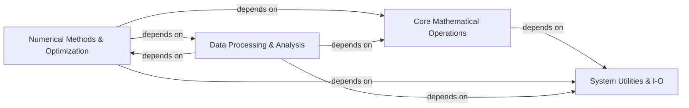

## Component Details

SciPy is a Python-based ecosystem of open-source software for mathematics, science, and engineering. It provides a comprehensive set of scientific computing tools, organized into core mathematical operations, numerical methods for solving complex problems, and data processing and analysis capabilities, all built upon a foundational layer of system utilities and input/output functionalities.

### Core Mathematical Operations
Provides fundamental mathematical capabilities including highly optimized linear algebra routines for dense and sparse matrices, a vast collection of mathematical special functions, and efficient Fast Fourier Transforms for signal analysis.

**Related Classes/Methods**:

- `scipy.scipy.linalg.blas` (full file reference)
- `scipy.scipy.linalg.lapack` (full file reference)
- `scipy.scipy.linalg._decomp_svd` (full file reference)
- `scipy.scipy.sparse._base` (full file reference)
- `scipy.scipy.sparse._csr` (full file reference)
- `scipy.scipy.special._basic` (full file reference)
- `scipy.scipy.special._ufuncs` (full file reference)
- `scipy.scipy.special._specfun` (full file reference)
- `scipy.scipy.fft._basic` (full file reference)
- `scipy.scipy.fft._helper` (full file reference)
- `scipy.scipy.fft._backend` (full file reference)

### Numerical Methods & Optimization
Offers a comprehensive suite of numerical algorithms for integration of differential equations, interpolation and data fitting, and a wide range of optimization techniques for finding minima, roots, and solving linear programming problems.

**Related Classes/Methods**:

- `scipy.scipy.integrate._quadpack_py` (full file reference)
- `scipy.scipy.integrate._ivp.ivp` (full file reference)
- `scipy.scipy.integrate._ode` (full file reference)
- `scipy.scipy.interpolate._interpolate` (full file reference)
- `scipy.scipy.interpolate._rbf` (full file reference)
- `scipy.scipy.interpolate._bsplines` (full file reference)
- `scipy.scipy.optimize._minimize` (full file reference)
- <a href="https://github.com/scipy/scipy/blob/master/scipy/optimize/_linprog_highs.py#L89-L422" target="_blank" rel="noopener noreferrer">`scipy.scipy.optimize._linprog_highs` (89:422)</a>
- `scipy.scipy.optimize._root` (full file reference)

### Data Processing & Analysis
Encompasses tools for statistical analysis, including probability distributions and hypothesis testing, alongside functionalities for N-dimensional image processing and general signal processing, such as filtering and spectral analysis, and spatial data structures and algorithms.

**Related Classes/Methods**:

- `scipy.scipy.stats._continuous_distns` (full file reference)
- `scipy.scipy.stats._hypotests` (full file reference)
- `scipy.scipy.stats._multivariate` (full file reference)
- `scipy.scipy.signal._signaltools` (full file reference)
- `scipy.scipy.signal._filter_design` (full file reference)
- `scipy.scipy.ndimage._filters` (full file reference)
- `scipy.scipy.ndimage._interpolation` (full file reference)
- `scipy.scipy.spatial.distance` (full file reference)
- `scipy.scipy.spatial._kdtree` (full file reference)
- `scipy.scipy.spatial.transform._rotation_groups` (full file reference)

### System Utilities & I-O
Provides foundational internal utility functions for array API compatibility, deprecation handling, and low-level C callbacks, as well as capabilities for reading and writing data in various file formats.

**Related Classes/Methods**:

- `scipy.scipy._lib._util` (full file reference)
- `scipy.scipy._lib.deprecation` (full file reference)
- `scipy.scipy._lib._array_api` (full file reference)
- `scipy.scipy.io._mmio` (full file reference)
- `scipy.scipy.io.wavfile` (full file reference)

### [FAQ](https://github.com/CodeBoarding/GeneratedOnBoardings/tree/main?tab=readme-ov-file#faq)