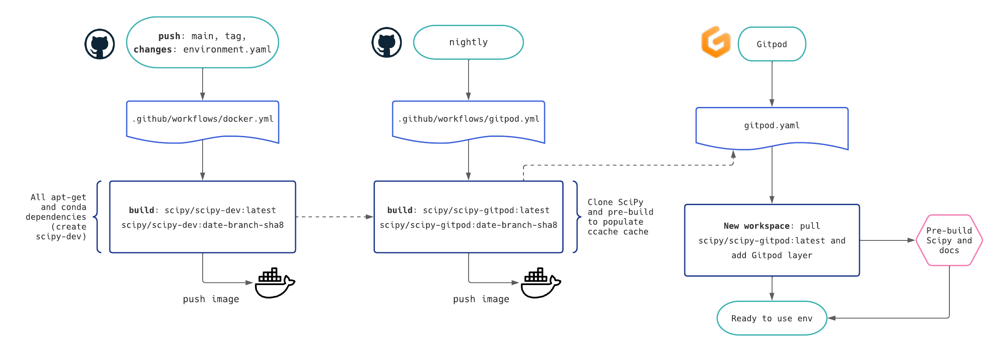

.. _continuous-integration:

======================
Continuous Integration
======================

Continuous integration (CI) is part of our development process and ensure that
every piece of code or documentation which is contributed to SciPy is working
and does not have unforeseen effects.

.. note:: Before submitting or updating your PR, please ensure that you tested
          your changes locally. See :ref:`pr-checklist` and :ref:`runtests`.

Workflows
=========

We run more than 20 different workflows with different versions of the
dependencies, different architectures, etc. A PR must pass all these checks
before it can be merged as to ensure a sustainable state of the project.

Apart from the unit tests, the documentation and examples in the docstrings are
also checked. These are common failing workflows as Sphinx and doctests have
very strict rules. These aspects are very important as documentation and
examples are user facing elements. Ensures that these elements are properly
rendered.

The logs can be long, but you will always find out why your build/test did not
pass a check. Simply click on ``Details`` to access the logs.

Following is a list of all the different workflows in use. They are grouped
by CI resources providers.

GitHub Actions
--------------
* ``Windows Tests``: test suite runs for Windows (``x86_64``)
* ``Linux Tests``: test suite runs for Linux (``x86_64``)
* ``macOS Tests``: test suite runs for macOS (``x86_64``)
* ``wheels``: builds wheels for SciPy releases as well as *nightly* builds.
* ``Check the rendered docs here!``: live preview of the documentation

The test suite runs on GitHub Actions and other platforms cover a range of
test/environment conditions: Python and NumPy versions
(lowest-supported to nightly builds), 32-bit vs. 64-bit, different compilers,
and more - for details, see the ``.yml`` configuration files.

Azure
-----
* ``Lint``: PEP8 and code style
* ``Windows Python``: test suite runs for Windows
* ``Linux_Python_xx_32bit_full``: 32-bit Linux
* ``wheel_optimized_gcc``: install the wheel, then run the test suite with
  `python -OO`
* ``source_distribution``: install via ``sdist``, then run the test suite
* ``refguide_asv_check``: doctests from examples and benchmarks
* ``prerelease_deps_coverage_64bit_blas``: use pre-released version of the
  dependencies and check coverage

CircleCI
--------
* ``build_docs``: build the documentation
* ``build_scipy``
* ``run_benchmarks``: verify how the changes impact performance

CirrusCI
--------
* ``Tests``: test suite for specific architecture like
  ``musllinux, arm, aarch``
* ``Wheels``: build and upload some wheels

Codecov
-------
* ``patch``: the impact on code coverage due to your changes
* ``project``: the coverage of the whole project

.. _skip-ci:

Skipping
========

Being an open-source project, we have access to a quota of CI resources.
Ultimately, resources are limited and we should use them with care. This is
why we ask you to verify your changes locally before pushing them.

Depending on the proposed change, you might want to skip part of the checks.
It will be at the discretion of a maintainer to re-run some tests before
integration.

Skipping CI can be achieved by adding a special text in the commit message:

* ``[skip azp]``: will skip Azure
* ``[skip actions]``: will skip GitHub Actions
* ``[skip circle]``: will skip CircleCI
* ``[skip cirrus]``: will skip CirrusCI
* ``[skip ci]``: will skip *all* CI

Of course, you can combine these to skip multiple workflows.

This skip information should be placed on a new line. In this example, we
just updated a ``.rst`` file in the documentation and ask to skip Azure and
GitHub Actions' workflows::

    DOC: improve QMCEngine examples.

    [skip azp] [skip actions] [skip cirrus]

Wheel builds
============

Wheels for SciPy releases and
`*nightly* <https://anaconda.org/scipy-wheels-nightly/scipy>`_ builds are built
using cibuildwheel in a
`Github Action <https://github.com/scipy/scipy/blob/main/.github/workflows/wheels.yml>`_.
The Action runs:

* when the commit message contains the text ``[wheel build]``
* on a scheduled basis once a week
* when it is started manually.
* when there is a push to the repository with a github reference starting with ``refs/tags/v`` (and not ending with ``dev0``)

The action does not run on forks of the main SciPy repository. The wheels that
are created are available as artifacts associated with a successful run of the
Action. When the Action runs on a schedule, or is manually started, the wheels
are uploaded to the
`*scipy-wheels-nightly* <https://anaconda.org/scipy-wheels-nightly/scipy>`_
repository.

It is not advised to use cibuildwheel to build scipy wheels on your own system
as it will automatically install gfortran compilers and various other
dependencies. Instead, one could use an isolated Docker container to build
Linux wheels.

Docker image builds
===================

Two Docker images are built in CI with GitHub Actions, and made available on
Docker Hub under the ``scipy`` organisation:

1. ``scipy/scipy-dev`` - contains all the dependencies needed for developing
   SciPy. This image is only rebuilt when ``environment.yml`` in the root of
   the repo is updated,
2. ``scipy/scipy-gitpod`` - builds on top of ``scipy-dev`` and contains a built
   development version of SciPy and the SciPy docs. It is the image pulled when
   `a user opens Gitpod <quickstart_gitpod.html>`_.

This diagram explains the CI setup, triggers, and flow of artifacts to Docker
Hub and Gitpod:

.. warning::
   These Docker images are intended for SciPy development *only*.
   These should not be used "as-is" for any production-level applications (they
   are not updated very frequently, and not audited for known security
   vulnerabilities for example).
