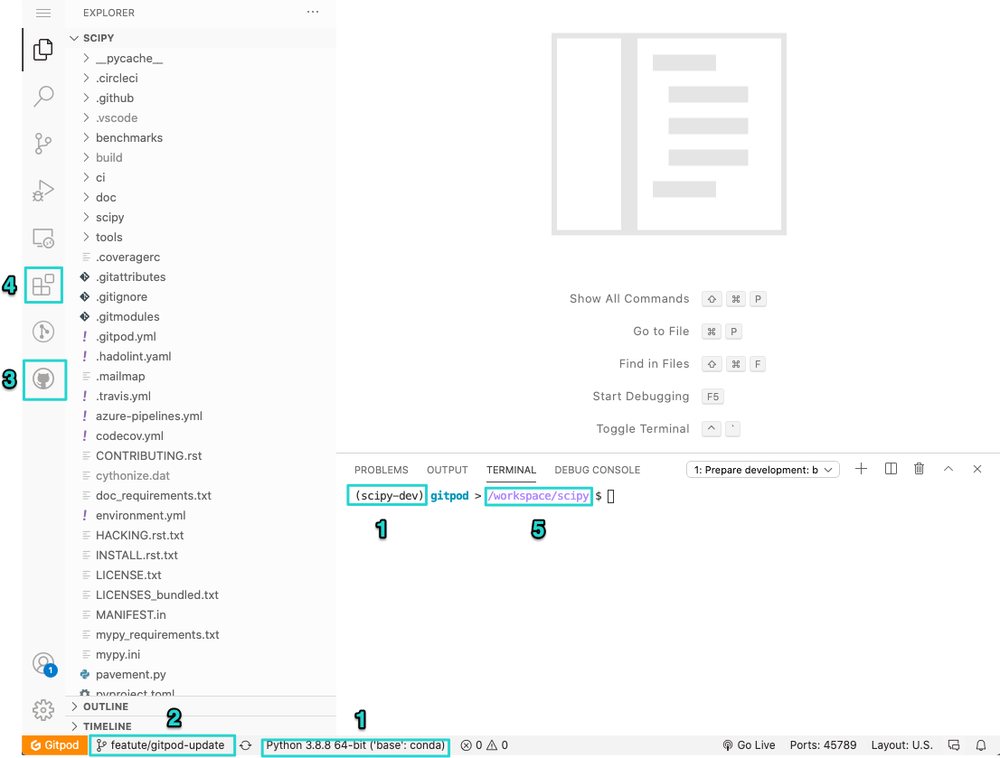
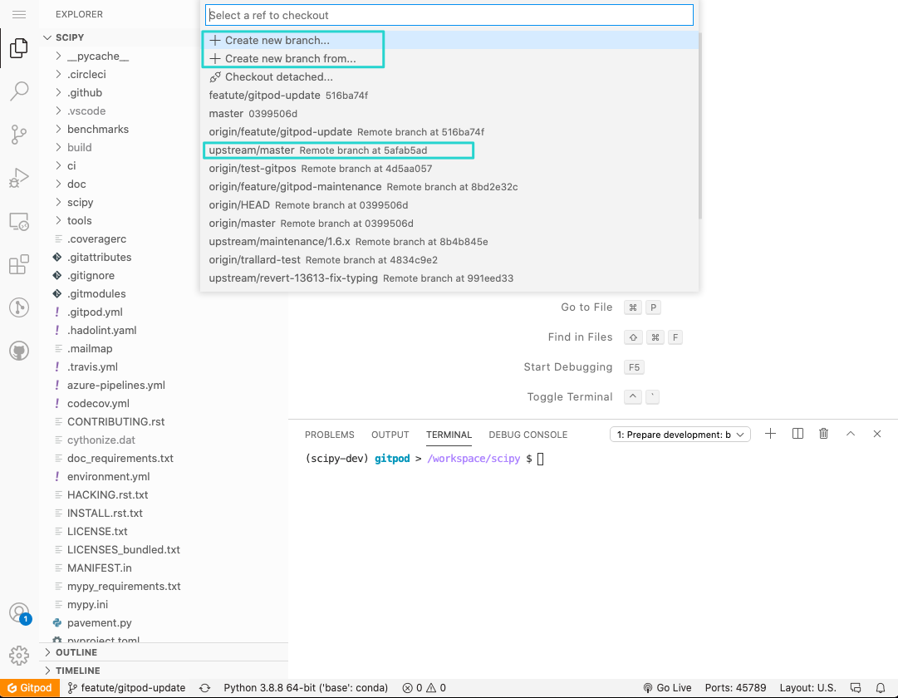

:orphan:

.. _quickstart-gitpod:

=======================================================
Development environment quickstart guide (Gitpod)
=======================================================

This quick start guide covers:

*  using GitPod for your SciPy development environment
*  creating a personal fork of the SciPy repository on GitHub
*  a quick tour of Gitpod and VSCode
*  working on the SciPy documentation in SciPy

Gitpod
-------

`Gitpod`_  is an open-source platform for automated and ready-to-code .
development environments. It enables developers to describe their dev 
environment as code and start instant and fresh development environments for each new task directly from your browser. This reduces the need to install local development environments and deal with incompatible dependencies.

To be able to use Gitpod you will need to login with your GitHub account, so if 
you do not have an account yet, you will need to create one first. 

Head over to the `Gitpod`_ website and click on the **Continue with GitHub** button. You will be redirected to GitHub authentication, which will allow you to use Gitpos with your GitHub repositories.

Forking the SciPy repository
-----------------------------

The best way to work on SciPy as a contributor is by making a fork of the repository first. 

#. Browse to the `SciPy repository on GitHub`_ and `create your own fork`_.

#. Browse to your fork. Your fork will have a URL like https://github.com/andyfaff/scipy, except with your GitHub username in place of "andyfaff".

Starting Gitpod
----------------
Once you have authenticated to Gitpod through GitHub you will see a **Gitpod** button next to the "Code" button on the repository.

#. Click the "Gitpod" button. This will open a new tab on your web browser and start building your development environment. Please note this can take a few minutes.

#. Once the build is complete, you will be directed to your workspace, which includes VSCode and all the dependencies you need to work on SciPy. The first time you start your  workspace, you will notice that there might be some actions running, this will ensure that you have a development version of SciPy installed and that the docs are prebuilt for you.

#. Once the build is complete you can test the build by entering::

        python runtests.py -v

    ``runtests.py`` is another script in the SciPy root directory. It runs a suite of tests that make sure SciPy is working as it should, and ``-v`` activates the ``–verbose`` option to show all the test output.

Quick workspace tour
---------------------

Your workspace will look similar to the image below:

We have marked some important sections in the editor:

#. Your current Python interpreter - by default the ``scipy-dev`` is marked as ``base`` on the status bar but it should be displayed as ``scipy-dev`` on your terminal. You do not need to activate the conda environment as this will always be activated for you.
#. Your current branch is always displayed in the status bar.
#. GitHub Pull Requests extension - you can use this to work with Pull Requests from your workspace.
#. Marketplace extensions - we have added some basic extensions to the SciPy Gitpod but you can also install other extensions or syntax highlighting themes for your user and these will be preserved
#. Your workspace directory - by default is is ``/workspace/scipy`` **do not change this** as this is the only directory that is preserved in Gitpod.

We have also pre installed a few tools and VSCode extensions to help with the development experience:

*  `GitHub CLI <https://cli.github.com/>`_
*  `VSCode rst extension <https://marketplace.visualstudio.com/items?itemName=lextudio.restructuredtext>`_
*  `VSCode Live server extension <https://marketplace.visualstudio.com/items?itemName=ritwickdey.LiveServer>`_
*  `VSCode Gitlens extension <https://marketplace.visualstudio.com/items?itemName=eamodio.gitlens>`_
*  `VSCode autodocstrings extension <https://marketplace.visualstudio.com/items?itemName=njpwerner.autodocstring>`_ 
*  vim

Development workflow
-----------------------
The :ref:`development-workflow` section of this documentation contains information regarding the SciPy development workflow. Make sure to check this before working on your contributions.

When using Gitpod note these main differences with the setup described in :ref:`development-workflow`.

#. You do not need to configure your git username and email as this should be done for you as you authenticated through GitHub. You can check the git configuration with the command ``git config --list`` in your terminal.

#. As you started your workspace from your own SciPy fork you will by default have both ``upstream`` and ``origin`` added as remotes. You can verify 
this by typing ``git remote`` on your terminal or by clicking on the 
**branch name** on the status bar (see image below).

Rendering the Scipy documentation
----------------------------------

.. _Gitpod: https://www.gitpod.io/
.. _Scipy repository on GitHub: https://github.com/scipy/scipy
.. _create your own fork: https://help.github.com/en/articles/fork-a-repo

.. |br| raw:: html

     