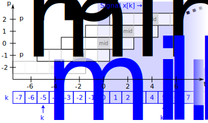
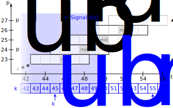

Signal Processing (`scipy.signal`)
==================================

.. sectionauthor:: Travis E. Oliphant

.. sectionauthor:: Pim Schellart

.. currentmodule:: scipy.signal

The signal processing toolbox currently contains some filtering
functions, a limited set of filter design tools, and a few B-spline
interpolation algorithms for 1- and 2-D data. While the
B-spline algorithms could technically be placed under the
interpolation category, they are included here because they only work
with equally-spaced data and make heavy use of filter-theory and
transfer-function formalism to provide a fast B-spline transform. To
understand this section, you will need to understand that a signal in
SciPy is an array of real or complex numbers.

.. _tutorial-signal-bsplines:

B-splines
---------

A B-spline is an approximation of a continuous function over a finite-
domain in terms of B-spline coefficients and knot points. If the knot-
points are equally spaced with spacing :math:`\Delta x`, then the B-spline
approximation to a 1-D function is the finite-basis expansion.

.. math::

    y\left(x\right)\approx\sum_{j}c_{j}\beta^{o}\left(\frac{x}{\Delta x}-j\right).

In two dimensions with knot-spacing :math:`\Delta x` and :math:`\Delta y`, the
function representation is

.. math::

    z\left(x,y\right)\approx\sum_{j}\sum_{k}c_{jk}\beta^{o}\left(\frac{x}{\Delta x}-j\right)\beta^{o}\left(\frac{y}{\Delta y}-k\right).

In these expressions, :math:`\beta^{o}\left(\cdot\right)` is the space-limited
B-spline basis function of order :math:`o`. The requirement of equally-spaced
knot-points and equally-spaced data points, allows the development of fast
(inverse-filtering) algorithms for determining the coefficients, :math:`c_{j}`,
from sample-values, :math:`y_{n}`. Unlike the general spline interpolation
algorithms, these algorithms can quickly find the spline coefficients for large
images.

The advantage of representing a set of samples via B-spline basis
functions is that continuous-domain operators (derivatives, re-
sampling, integral, etc.), which assume that the data samples are drawn
from an underlying continuous function, can be computed with relative
ease from the spline coefficients. For example, the second derivative
of a spline is

.. math::

    y{}^{\prime\prime}\left(x\right)=\frac{1}{\Delta x^{2}}\sum_{j}c_{j}\beta^{o\prime\prime}\left(\frac{x}{\Delta x}-j\right).

Using the property of B-splines that

.. math::

    \frac{d^{2}\beta^{o}\left(w\right)}{dw^{2}}=\beta^{o-2}\left(w+1\right)-2\beta^{o-2}\left(w\right)+\beta^{o-2}\left(w-1\right),

it can be seen that

.. math::

    y^{\prime\prime}\left(x\right)=\frac{1}{\Delta x^{2}}\sum_{j}c_{j}\left[\beta^{o-2}\left(\frac{x}{\Delta x}-j+1\right)-2\beta^{o-2}\left(\frac{x}{\Delta x}-j\right)+\beta^{o-2}\left(\frac{x}{\Delta x}-j-1\right)\right].

If :math:`o=3`, then at the sample points:

.. math::
   :nowrap:

    \begin{eqnarray*} \Delta x^{2}\left.y^{\prime}\left(x\right)\right|_{x=n\Delta x} & = & \sum_{j}c_{j}\delta_{n-j+1}-2c_{j}\delta_{n-j}+c_{j}\delta_{n-j-1},\\  & = & c_{n+1}-2c_{n}+c_{n-1}.\end{eqnarray*}

Thus, the second-derivative signal can be easily calculated from the spline
fit. If desired, smoothing splines can be found to make the second derivative
less sensitive to random errors.

The savvy reader will have already noticed that the data samples are related
to the knot coefficients via a convolution operator, so that simple
convolution with the sampled B-spline function recovers the original data from
the spline coefficients. The output of convolutions can change depending on
how the boundaries are handled (this becomes increasingly more important as the
number of dimensions in the dataset increases). The algorithms relating to
B-splines in the signal-processing subpackage assume mirror-symmetric
boundary conditions. Thus, spline coefficients are computed based on that
assumption, and data-samples can be recovered exactly from the spline
coefficients by assuming them to be mirror-symmetric also.

Currently the package provides functions for determining second- and third-
order cubic spline coefficients from equally-spaced samples in one and two
dimensions (:func:`qspline1d`, :func:`qspline2d`, :func:`cspline1d`,
:func:`cspline2d`). For large :math:`o`, the B-spline basis
function can be approximated well by a zero-mean Gaussian function with
standard-deviation equal to :math:`\sigma_{o}=\left(o+1\right)/12` :

.. math::

    \beta^{o}\left(x\right)\approx\frac{1}{\sqrt{2\pi\sigma_{o}^{2}}}\exp\left(-\frac{x^{2}}{2\sigma_{o}}\right).

A function to compute this Gaussian for arbitrary :math:`x` and :math:`o` is
also available ( :func:`gauss_spline` ). The following code and figure use
spline-filtering to compute an edge-image (the second derivative of a smoothed
spline) of a raccoon's face, which is an array returned by the command :func:`scipy.datasets.face`.
The command :func:`sepfir2d` was used to apply a separable 2-D FIR
filter with mirror-symmetric boundary conditions to the spline coefficients.
This function is ideally-suited for reconstructing samples from spline
coefficients and is faster than :func:`convolve2d`, which convolves arbitrary
2-D filters and allows for choosing mirror-symmetric boundary
conditions.

.. plot::
   :alt: "This code displays two plots. The first plot is a normal grayscale photo of a raccoon climbing on a palm plant. The second plot has the 2-D spline filter applied to the photo and is completely grey except the edges of the photo have been emphasized, especially on the raccoon fur and palm fronds."

   >>> import numpy as np
   >>> from scipy import signal, datasets
   >>> import matplotlib.pyplot as plt

   >>> image = datasets.face(gray=True).astype(np.float32)
   >>> derfilt = np.array([1.0, -2, 1.0], dtype=np.float32)
   >>> ck = signal.cspline2d(image, 8.0)
   >>> deriv = (signal.sepfir2d(ck, derfilt, [1]) +
   ...          signal.sepfir2d(ck, [1], derfilt))

   Alternatively, we could have done::

       laplacian = np.array([[0,1,0], [1,-4,1], [0,1,0]], dtype=np.float32)
       deriv2 = signal.convolve2d(ck,laplacian,mode='same',boundary='symm')

   >>> plt.figure()
   >>> plt.imshow(image)
   >>> plt.gray()
   >>> plt.title('Original image')
   >>> plt.show()

   >>> plt.figure()
   >>> plt.imshow(deriv)
   >>> plt.gray()
   >>> plt.title('Output of spline edge filter')
   >>> plt.show()

..   :caption: Example of using smoothing splines to filter images.

Filtering
---------

Filtering is a generic name for any system that modifies an input
signal in some way. In SciPy, a signal can be thought of as a NumPy
array. There are different kinds of filters for different kinds of
operations. There are two broad kinds of filtering operations: linear
and non-linear. Linear filters can always be reduced to multiplication
of the flattened NumPy array by an appropriate matrix resulting in
another flattened NumPy array. Of course, this is not usually the best
way to compute the filter, as the matrices and vectors involved may be
huge. For example, filtering a :math:`512 \times 512` image with this
method would require multiplication of a :math:`512^2 \times 512^2`
matrix with a :math:`512^2` vector. Just trying to store the
:math:`512^2 \times 512^2` matrix using a standard NumPy array would
require :math:`68,719,476,736` elements. At 4 bytes per element this
would require :math:`256\textrm{GB}` of memory. In most applications,
most of the elements of this matrix are zero and a different method
for computing the output of the filter is employed.

Convolution/Correlation
^^^^^^^^^^^^^^^^^^^^^^^

Many linear filters also have the property of shift-invariance. This
means that the filtering operation is the same at different locations
in the signal and it implies that the filtering matrix can be
constructed from knowledge of one row (or column) of the matrix alone.
In this case, the matrix multiplication can be accomplished using
Fourier transforms.

Let :math:`x\left[n\right]` define a 1-D signal indexed by the
integer :math:`n.` Full convolution of two 1-D signals can be
expressed as

.. math::

    y\left[n\right]=\sum_{k=-\infty}^{\infty}x\left[k\right]h\left[n-k\right].

This equation can only be implemented directly if we limit the
sequences to finite-support sequences that can be stored in a
computer, choose :math:`n=0` to be the starting point of both
sequences, let :math:`K+1` be that value for which
:math:`x\left[n\right]=0` for all :math:`n\geq K+1` and :math:`M+1` be
that value for which :math:`h\left[n\right]=0` for all :math:`n\geq M+1`,
then the discrete convolution expression is

.. math::

    y\left[n\right]=\sum_{k=\max\left(n-M,0\right)}^{\min\left(n,K\right)}x\left[k\right]h\left[n-k\right].

For convenience, assume :math:`K\geq M.` Then, more explicitly, the output of
this operation is

.. math::
   :nowrap:

    \begin{eqnarray*} y\left[0\right] & = & x\left[0\right]h\left[0\right]\\ y\left[1\right] & = & x\left[0\right]h\left[1\right]+x\left[1\right]h\left[0\right]\\ y\left[2\right] & = & x\left[0\right]h\left[2\right]+x\left[1\right]h\left[1\right]+x\left[2\right]h\left[0\right]\\ \vdots & \vdots & \vdots\\ y\left[M\right] & = & x\left[0\right]h\left[M\right]+x\left[1\right]h\left[M-1\right]+\cdots+x\left[M\right]h\left[0\right]\\ y\left[M+1\right] & = & x\left[1\right]h\left[M\right]+x\left[2\right]h\left[M-1\right]+\cdots+x\left[M+1\right]h\left[0\right]\\ \vdots & \vdots & \vdots\\ y\left[K\right] & = & x\left[K-M\right]h\left[M\right]+\cdots+x\left[K\right]h\left[0\right]\\ y\left[K+1\right] & = & x\left[K+1-M\right]h\left[M\right]+\cdots+x\left[K\right]h\left[1\right]\\ \vdots & \vdots & \vdots\\ y\left[K+M-1\right] & = & x\left[K-1\right]h\left[M\right]+x\left[K\right]h\left[M-1\right]\\ y\left[K+M\right] & = & x\left[K\right]h\left[M\right].\end{eqnarray*}

Thus, the full discrete convolution of two finite sequences of lengths
:math:`K+1` and :math:`M+1`, respectively, results in a finite sequence of length
:math:`K+M+1=\left(K+1\right)+\left(M+1\right)-1.`

1-D convolution is implemented in SciPy with the function
:func:`convolve`. This function takes as inputs the signals :math:`x,`
:math:`h`, and two optional flags 'mode' and 'method', and returns the signal
:math:`y.`

The first optional flag, 'mode', allows for the specification of which part of the
output signal to return. The default value of 'full' returns the entire signal.
If the flag has a value of 'same', then only the middle :math:`K` values are
returned, starting at :math:`y\left[\left\lfloor \frac{M-1}{2}\right\rfloor
\right]`, so that the output has the same length as the first input. If the flag
has a value of 'valid', then only the middle
:math:`K-M+1=\left(K+1\right)-\left(M+1\right)+1` output values are returned,
where :math:`z` depends on all of the values of the smallest input from
:math:`h\left[0\right]` to :math:`h\left[M\right].` In other words, only the
values :math:`y\left[M\right]` to :math:`y\left[K\right]` inclusive are
returned.

The second optional flag, 'method', determines how the convolution is computed,
either through the Fourier transform approach with :func:`fftconvolve` or
through the direct method. By default, it selects the expected faster method.
The Fourier transform method has order :math:`O(N\log N)`, while the direct
method has order :math:`O(N^2)`. Depending on the big O constant and the value
of :math:`N`, one of these two methods may be faster. The default value, 'auto',
performs a rough calculation and chooses the expected faster method, while the
values 'direct' and 'fft' force computation with the other two methods.

The code below shows a simple example for convolution of 2 sequences:

>>> x = np.array([1.0, 2.0, 3.0])
>>> h = np.array([0.0, 1.0, 0.0, 0.0, 0.0])
>>> signal.convolve(x, h)
array([ 0.,  1.,  2.,  3.,  0.,  0.,  0.])
>>> signal.convolve(x, h, 'same')
array([ 2.,  3.,  0.])

This same function :func:`convolve` can actually take N-D
arrays as inputs and will return the N-D convolution of the
two arrays, as is shown in the code example below. The same input flags are
available for that case as well.

>>> x = np.array([[1., 1., 0., 0.], [1., 1., 0., 0.], [0., 0., 0., 0.], [0., 0., 0., 0.]])
>>> h = np.array([[1., 0., 0., 0.], [0., 0., 0., 0.], [0., 0., 1., 0.], [0., 0., 0., 0.]])
>>> signal.convolve(x, h)
array([[ 1.,  1.,  0.,  0.,  0.,  0.,  0.],
       [ 1.,  1.,  0.,  0.,  0.,  0.,  0.],
       [ 0.,  0.,  1.,  1.,  0.,  0.,  0.],
       [ 0.,  0.,  1.,  1.,  0.,  0.,  0.],
       [ 0.,  0.,  0.,  0.,  0.,  0.,  0.],
       [ 0.,  0.,  0.,  0.,  0.,  0.,  0.],
       [ 0.,  0.,  0.,  0.,  0.,  0.,  0.]])

Correlation is very similar to convolution except that the minus sign
becomes a plus sign. Thus,

.. math::

    w\left[n\right]=\sum_{k=-\infty}^{\infty}y\left[k\right]x\left[n+k\right],

is the (cross) correlation of the signals :math:`y` and :math:`x.` For
finite-length signals with :math:`y\left[n\right]=0` outside of the range
:math:`\left[0,K\right]` and :math:`x\left[n\right]=0` outside of the range
:math:`\left[0,M\right],` the summation can simplify to

.. math::

    w\left[n\right]=\sum_{k=\max\left(0,-n\right)}^{\min\left(K,M-n\right)}y\left[k\right]x\left[n+k\right].

Assuming again that :math:`K\geq M`, this is

.. math::
   :nowrap:

    \begin{eqnarray*} w\left[-K\right] & = & y\left[K\right]x\left[0\right]\\ w\left[-K+1\right] & = & y\left[K-1\right]x\left[0\right]+y\left[K\right]x\left[1\right]\\ \vdots & \vdots & \vdots\\ w\left[M-K\right] & = & y\left[K-M\right]x\left[0\right]+y\left[K-M+1\right]x\left[1\right]+\cdots+y\left[K\right]x\left[M\right]\\ w\left[M-K+1\right] & = & y\left[K-M-1\right]x\left[0\right]+\cdots+y\left[K-1\right]x\left[M\right]\\ \vdots & \vdots & \vdots\\ w\left[-1\right] & = & y\left[1\right]x\left[0\right]+y\left[2\right]x\left[1\right]+\cdots+y\left[M+1\right]x\left[M\right]\\ w\left[0\right] & = & y\left[0\right]x\left[0\right]+y\left[1\right]x\left[1\right]+\cdots+y\left[M\right]x\left[M\right]\\ w\left[1\right] & = & y\left[0\right]x\left[1\right]+y\left[1\right]x\left[2\right]+\cdots+y\left[M-1\right]x\left[M\right]\\ w\left[2\right] & = & y\left[0\right]x\left[2\right]+y\left[1\right]x\left[3\right]+\cdots+y\left[M-2\right]x\left[M\right]\\ \vdots & \vdots & \vdots\\ w\left[M-1\right] & = & y\left[0\right]x\left[M-1\right]+y\left[1\right]x\left[M\right]\\ w\left[M\right] & = & y\left[0\right]x\left[M\right].\end{eqnarray*}

The SciPy function :func:`correlate` implements this operation. Equivalent
flags are available for this operation to return the full :math:`K+M+1` length
sequence ('full') or a sequence with the same size as the largest sequence
starting at :math:`w\left[-K+\left\lfloor \frac{M-1}{2}\right\rfloor \right]`
('same') or a sequence where the values depend on all the values of the
smallest sequence ('valid'). This final option returns the :math:`K-M+1`
values :math:`w\left[M-K\right]` to :math:`w\left[0\right]` inclusive.

The function :func:`correlate` can also take arbitrary N-D arrays as input
and return the N-D convolution of the two arrays on output.

When :math:`N=2,` :func:`correlate` and/or :func:`convolve` can be used
to construct arbitrary image filters to perform actions such as blurring,
enhancing, and edge-detection for an image.

.. plot::
   :alt: "This code displays two plots. The first plot is the familiar photo of a raccoon climbing on a palm. The second plot has the FIR filter applied and has the two copies of the photo superimposed due to the twin peaks manually set in the filter kernel definition."

   >>> import numpy as np
   >>> from scipy import signal, datasets
   >>> import matplotlib.pyplot as plt

   >>> image = datasets.face(gray=True)
   >>> w = np.zeros((50, 50))
   >>> w[0][0] = 1.0
   >>> w[49][25] = 1.0
   >>> image_new = signal.fftconvolve(image, w)

   >>> plt.figure()
   >>> plt.imshow(image)
   >>> plt.gray()
   >>> plt.title('Original image')
   >>> plt.show()

   >>> plt.figure()
   >>> plt.imshow(image_new)
   >>> plt.gray()
   >>> plt.title('Filtered image')
   >>> plt.show()

Calculating the convolution in the time domain as above is mainly used for
filtering when one of the signals is much smaller than the other ( :math:`K\gg
M` ), otherwise linear filtering is more efficiently calculated in the
frequency domain provided by the function :func:`fftconvolve`. By default,
:func:`convolve` estimates the fastest method using :func:`choose_conv_method`.

If the filter function :math:`w[n,m]` can be factored according to

.. math::

  h[n, m] = h_1[n] h_2[m],

convolution can be calculated by means of the function :func:`sepfir2d`. As an
example, we consider a Gaussian filter :func:`~scipy.signal.windows.gaussian`

.. math::

  h[n, m] \propto e^{-x^2-y^2} = e^{-x^2} e^{-y^2},

which is often used for blurring.

.. plot::
   :alt: "This code displays two plots. The first plot is a grayscale photo of two people climbing a wooden staircase taken from below. The second plot has the 2-D gaussian FIR window applied and appears very blurry. You can still tell it's a photo but the subject is ambiguous."

   >>> import numpy as np
   >>> from scipy import signal, datasets
   >>> import matplotlib.pyplot as plt

   >>> image = np.asarray(datasets.ascent(), np.float64)
   >>> w = signal.windows.gaussian(51, 10.0)
   >>> image_new = signal.sepfir2d(image, w, w)

   >>> plt.figure()
   >>> plt.imshow(image)
   >>> plt.gray()
   >>> plt.title('Original image')
   >>> plt.show()

   >>> plt.figure()
   >>> plt.imshow(image_new)
   >>> plt.gray()
   >>> plt.title('Filtered image')
   >>> plt.show()

Difference-equation filtering
^^^^^^^^^^^^^^^^^^^^^^^^^^^^^

A general class of linear 1-D filters (that includes convolution
filters) are filters described by the difference equation

.. math::

    \sum_{k=0}^{N}a_{k}y\left[n-k\right]=\sum_{k=0}^{M}b_{k}x\left[n-k\right],

where :math:`x\left[n\right]` is the input sequence and
:math:`y\left[n\right]` is the output sequence. If we assume initial rest so
that :math:`y\left[n\right]=0` for :math:`n<0`, then this kind of filter can
be implemented using convolution. However, the convolution filter sequence
:math:`h\left[n\right]` could be infinite if :math:`a_{k}\neq0` for
:math:`k\geq1.` In addition, this general class of linear filter allows
initial conditions to be placed on :math:`y\left[n\right]` for :math:`n<0`
resulting in a filter that cannot be expressed using convolution.

The difference equation filter can be thought of as finding
:math:`y\left[n\right]` recursively in terms of its previous values

.. math::

    a_{0}y\left[n\right]=-a_{1}y\left[n-1\right]-\cdots-a_{N}y\left[n-N\right]+\cdots+b_{0}x\left[n\right]+\cdots+b_{M}x\left[n-M\right].

Often, :math:`a_{0}=1` is chosen for normalization. The implementation in SciPy
of this general difference equation filter is a little more complicated than
would be implied by the previous equation. It is implemented so that only one
signal needs to be delayed. The actual implementation equations are (assuming
:math:`a_{0}=1` ):

.. math::
   :nowrap:

    \begin{eqnarray*} y\left[n\right] & = & b_{0}x\left[n\right]+z_{0}\left[n-1\right]\\ z_{0}\left[n\right] & = & b_{1}x\left[n\right]+z_{1}\left[n-1\right]-a_{1}y\left[n\right]\\ z_{1}\left[n\right] & = & b_{2}x\left[n\right]+z_{2}\left[n-1\right]-a_{2}y\left[n\right]\\ \vdots & \vdots & \vdots\\ z_{K-2}\left[n\right] & = & b_{K-1}x\left[n\right]+z_{K-1}\left[n-1\right]-a_{K-1}y\left[n\right]\\ z_{K-1}\left[n\right] & = & b_{K}x\left[n\right]-a_{K}y\left[n\right],\end{eqnarray*}

where :math:`K=\max\left(N,M\right).` Note that :math:`b_{K}=0` if :math:`K>M`
and :math:`a_{K}=0` if :math:`K>N.` In this way, the output at time :math:`n`
depends only on the input at time :math:`n` and the value of :math:`z_{0}` at
the previous time. This can always be calculated as long as the :math:`K`
values :math:`z_{0}\left[n-1\right]\ldots z_{K-1}\left[n-1\right]` are
computed and stored at each time step.

The difference-equation filter is called using the command :func:`lfilter` in
SciPy. This command takes as inputs the vector :math:`b,` the vector,
:math:`a,` a signal :math:`x` and returns the vector :math:`y` (the same
length as :math:`x` ) computed using the equation given above. If :math:`x` is
N-D, then the filter is computed along the axis provided.
If desired, initial conditions providing the values of
:math:`z_{0}\left[-1\right]` to :math:`z_{K-1}\left[-1\right]` can be provided
or else it will be assumed that they are all zero. If initial conditions are
provided, then the final conditions on the intermediate variables are also
returned. These could be used, for example, to restart the calculation in the
same state.

Sometimes, it is more convenient to express the initial conditions in terms of
the signals :math:`x\left[n\right]` and :math:`y\left[n\right].` In other
words, perhaps you have the values of :math:`x\left[-M\right]` to
:math:`x\left[-1\right]` and the values of :math:`y\left[-N\right]` to
:math:`y\left[-1\right]` and would like to determine what values of
:math:`z_{m}\left[-1\right]` should be delivered as initial conditions to the
difference-equation filter. It is not difficult to show that, for :math:`0\leq
m<K,`

.. math::

    z_{m}\left[n\right]=\sum_{p=0}^{K-m-1}\left(b_{m+p+1}x\left[n-p\right]-a_{m+p+1}y\left[n-p\right]\right).

Using this formula, we can find the initial-condition vector
:math:`z_{0}\left[-1\right]` to :math:`z_{K-1}\left[-1\right]` given initial
conditions on :math:`y` (and :math:`x` ). The command :func:`lfiltic` performs
this function.

As an example, consider the following system:

.. math::

  y[n] = \frac{1}{2} x[n] + \frac{1}{4} x[n-1] + \frac{1}{3} y[n-1]

The code calculates the signal :math:`y[n]` for a given signal :math:`x[n]`;
first for initial conditions :math:`y[-1] = 0` (default case), then for
:math:`y[-1] = 2` by means of :func:`lfiltic`.

>>> import numpy as np
>>> from scipy import signal

>>> x = np.array([1., 0., 0., 0.])
>>> b = np.array([1.0/2, 1.0/4])
>>> a = np.array([1.0, -1.0/3])
>>> signal.lfilter(b, a, x)
array([0.5, 0.41666667, 0.13888889, 0.0462963])
>>> zi = signal.lfiltic(b, a, y=[2.])
>>> signal.lfilter(b, a, x, zi=zi)
(array([ 1.16666667,  0.63888889,  0.21296296,  0.07098765]), array([0.02366]))

Note that the output signal :math:`y[n]` has the same length as the length as
the input signal :math:`x[n]`.

Analysis of Linear Systems
""""""""""""""""""""""""""

Linear system described a linear-difference equation can be fully described by
the coefficient vectors :math:`a` and :math:`b` as was done above; an alternative
representation is to provide a factor :math:`k`, :math:`N_z` zeros :math:`z_k`
and :math:`N_p` poles :math:`p_k`, respectively, to describe the system by
means of its transfer function :math:`H(z)`, according to

.. math::

   H(z) = k \frac{ (z-z_1)(z-z_2)...(z-z_{N_z})}{ (z-p_1)(z-p_2)...(z-p_{N_p})}.

This alternative representation can be obtained with the scipy function
:func:`tf2zpk`; the inverse is provided by :func:`zpk2tf`.

For the above example we have

>>> b = np.array([1.0/2, 1.0/4])
>>> a = np.array([1.0, -1.0/3])
>>> signal.tf2zpk(b, a)
(array([-0.5]), array([ 0.33333333]), 0.5)

i.e., the system has a zero at :math:`z=-1/2` and a pole at :math:`z=1/3`.

The scipy function :func:`freqz` allows calculation of the frequency response
of a system described by the coefficients :math:`a_k` and :math:`b_k`. See the
help of the :func:`freqz` function for a comprehensive example.

Filter Design
^^^^^^^^^^^^^

Time-discrete filters can be classified into finite response (FIR) filters and
infinite response (IIR) filters. FIR filters can provide a linear phase
response, whereas IIR filters cannot. SciPy provides functions
for designing both types of filters.

FIR Filter
""""""""""

The function :func:`firwin` designs filters according to the window method.
Depending on the provided arguments, the function returns different filter
types (e.g., low-pass, band-pass...).

The example below designs a low-pass and a band-stop filter, respectively.

.. plot::
   :alt: "This code displays an X-Y plot with the amplitude response on the Y axis vs frequency on the X axis. The first (low-pass) trace in blue starts with a pass-band at 0 dB and curves down around halfway through with some ripple in the stop-band about 80 dB down. The second (band-stop) trace in red starts and ends at 0 dB, but the middle third is down about 60 dB from the peak with some ripple where the filter would suppress a signal."

   >>> import numpy as np
   >>> import scipy.signal as signal
   >>> import matplotlib.pyplot as plt

   >>> b1 = signal.firwin(40, 0.5)
   >>> b2 = signal.firwin(41, [0.3, 0.8])
   >>> w1, h1 = signal.freqz(b1)
   >>> w2, h2 = signal.freqz(b2)

   >>> plt.title('Digital filter frequency response')
   >>> plt.plot(w1, 20*np.log10(np.abs(h1)), 'b')
   >>> plt.plot(w2, 20*np.log10(np.abs(h2)), 'r')
   >>> plt.ylabel('Amplitude Response (dB)')
   >>> plt.xlabel('Frequency (rad/sample)')
   >>> plt.grid()
   >>> plt.show()

Note that :func:`firwin` uses, per default, a normalized frequency defined such
that the value :math:`1` corresponds to the Nyquist frequency, whereas the
function :func:`freqz` is defined such that the value :math:`\pi` corresponds
to the Nyquist frequency.

The function :func:`firwin2` allows design of almost arbitrary frequency
responses by specifying an array of corner frequencies and corresponding
gains, respectively.

The example below designs a filter with such an arbitrary amplitude response.

.. plot::
   :alt: "This code displays an X-Y plot with amplitude response on the Y axis vs frequency on the X axis. A single trace forms a shape similar to a heartbeat signal."

   >>> import numpy as np
   >>> import scipy.signal as signal
   >>> import matplotlib.pyplot as plt

   >>> b = signal.firwin2(150, [0.0, 0.3, 0.6, 1.0], [1.0, 2.0, 0.5, 0.0])
   >>> w, h = signal.freqz(b)

   >>> plt.title('Digital filter frequency response')
   >>> plt.plot(w, np.abs(h))
   >>> plt.title('Digital filter frequency response')
   >>> plt.ylabel('Amplitude Response')
   >>> plt.xlabel('Frequency (rad/sample)')
   >>> plt.grid()
   >>> plt.show()

Note the linear scaling of the y-axis and the different definition of the
Nyquist frequency in :func:`firwin2` and :func:`freqz` (as explained above).

IIR Filter
""""""""""

SciPy provides two functions to directly design IIR :func:`iirdesign` and
:func:`iirfilter`, where the filter type (e.g., elliptic) is passed as an
argument and several more filter design functions for specific filter types,
e.g., :func:`ellip`.

The example below designs an elliptic low-pass filter with defined pass-band
and stop-band ripple, respectively. Note the much lower filter order (order 4)
compared with the FIR filters from the examples above in order to reach the same
stop-band attenuation of :math:`\approx 60` dB.

.. plot::
   :alt: "This code generates an X-Y plot with amplitude response on the Y axis vs Frequency on the X axis. A single trace shows a smooth low-pass filter with the left third passband near 0 dB. The right two-thirds are about 60 dB down with two sharp narrow valleys dipping down to -100 dB."

   >>> import numpy as np
   >>> import scipy.signal as signal
   >>> import matplotlib.pyplot as plt

   >>> b, a = signal.iirfilter(4, Wn=0.2, rp=5, rs=60, btype='lowpass', ftype='ellip')
   >>> w, h = signal.freqz(b, a)

   >>> plt.title('Digital filter frequency response')
   >>> plt.plot(w, 20*np.log10(np.abs(h)))
   >>> plt.title('Digital filter frequency response')
   >>> plt.ylabel('Amplitude Response [dB]')
   >>> plt.xlabel('Frequency (rad/sample)')
   >>> plt.grid()
   >>> plt.show()

Filter Coefficients
"""""""""""""""""""

Filter coefficients can be stored in several different formats:

* 'ba' or 'tf' = transfer function coefficients
* 'zpk' = zeros, poles, and overall gain
* 'ss' = state-space system representation
* 'sos' = transfer function coefficients of second-order sections

Functions, such as :func:`tf2zpk` and :func:`zpk2ss`, can convert between them.

Transfer function representation
********************************

The ``ba`` or ``tf`` format is a 2-tuple ``(b, a)`` representing a transfer
function, where `b` is a length ``M+1`` array of coefficients of the `M`-order
numerator polynomial, and `a` is a length ``N+1`` array of coefficients of the
`N`-order denominator, as positive, descending powers of the transfer function
variable. So the tuple of :math:`b = [b_0, b_1, ..., b_M]` and
:math:`a =[a_0, a_1, ..., a_N]` can represent an analog filter of the form:

.. math::

    H(s) = \frac
    {b_0 s^M + b_1 s^{(M-1)} + \cdots + b_M}
    {a_0 s^N + a_1 s^{(N-1)} + \cdots + a_N}
    = \frac
    {\sum_{i=0}^M b_i s^{(M-i)}}
    {\sum_{i=0}^N a_i s^{(N-i)}}

or a discrete-time filter of the form:

.. math::

    H(z) = \frac
    {b_0 z^M + b_1 z^{(M-1)} + \cdots + b_M}
    {a_0 z^N + a_1 z^{(N-1)} + \cdots + a_N}
    = \frac
    {\sum_{i=0}^M b_i z^{(M-i)}}
    {\sum_{i=0}^N a_i z^{(N-i)}}.

This "positive powers" form is found more commonly in controls
engineering.  If `M` and `N` are equal (which is true for all filters
generated by the bilinear transform), then this happens to be equivalent
to the "negative powers" discrete-time form preferred in DSP:

.. math::

    H(z) = \frac
    {b_0 + b_1 z^{-1} + \cdots + b_M z^{-M}}
    {a_0 + a_1 z^{-1} + \cdots + a_N z^{-N}}
    = \frac
    {\sum_{i=0}^M b_i z^{-i}}
    {\sum_{i=0}^N a_i z^{-i}}.

Although this is true for common filters, remember that this is not true
in the general case. If `M` and `N` are not equal, the discrete-time
transfer function coefficients must first be converted to the "positive
powers" form before finding the poles and zeros.

This representation suffers from numerical error at higher orders, so other
formats are preferred when possible.

Zeros and poles representation
******************************

The ``zpk`` format is a 3-tuple ``(z, p, k)``, where `z` is an `M`-length
array of the complex zeros of the transfer function
:math:`z = [z_0, z_1, ..., z_{M-1}]`, `p` is an `N`-length array of the
complex poles of the transfer function :math:`p = [p_0, p_1, ..., p_{N-1}]`,
and `k` is a scalar gain.  These represent the digital transfer function:

.. math::
    H(z) = k \cdot \frac
    {(z - z_0) (z - z_1) \cdots (z - z_{(M-1)})}
    {(z - p_0) (z - p_1) \cdots (z - p_{(N-1)})}
    = k \frac
    {\prod_{i=0}^{M-1} (z - z_i)}
    {\prod_{i=0}^{N-1} (z - p_i)}

or the analog transfer function:

.. math::
    H(s) = k \cdot \frac
    {(s - z_0) (s - z_1) \cdots (s - z_{(M-1)})}
    {(s - p_0) (s - p_1) \cdots (s - p_{(N-1)})}
    = k \frac
    {\prod_{i=0}^{M-1} (s - z_i)}
    {\prod_{i=0}^{N-1} (s - p_i)}.

Although the sets of roots are stored as ordered NumPy arrays, their ordering
does not matter: ``([-1, -2], [-3, -4], 1)`` is the same filter as
``([-2, -1], [-4, -3], 1)``.

State-space system representation
*********************************

The ``ss`` format is a 4-tuple of arrays ``(A, B, C, D)`` representing the
state-space of an `N`-order digital/discrete-time system of the form:

.. math::
    \mathbf{x}[k+1] = A \mathbf{x}[k] + B \mathbf{u}[k]\\
    \mathbf{y}[k] = C \mathbf{x}[k] + D \mathbf{u}[k]

or a continuous/analog system of the form:

.. math::
    \dot{\mathbf{x}}(t) = A \mathbf{x}(t) + B \mathbf{u}(t)\\
    \mathbf{y}(t) = C \mathbf{x}(t) + D \mathbf{u}(t),

with `P` inputs, `Q` outputs and `N` state variables, where:

- `x` is the state vector
- `y` is the output vector of length `Q`
- `u` is the input vector of length `P`
- `A` is the state matrix, with shape ``(N, N)``
- `B` is the input matrix with shape ``(N, P)``
- `C` is the output matrix with shape ``(Q, N)``
- `D` is the feedthrough or feedforward matrix with shape ``(Q, P)``.  (In
  cases where the system does not have a direct feedthrough, all values in
  `D` are zero.)

State-space is the most general representation and the only one that allows
for multiple-input, multiple-output (MIMO) systems. There are multiple
state-space representations for a given transfer function. Specifically, the
"controllable canonical form" and "observable canonical form" have the same
coefficients as the ``tf`` representation, and, therefore, suffer from the same
numerical errors.

Second-order sections representation
************************************

The ``sos`` format is a single 2-D array of shape ``(n_sections, 6)``,
representing a sequence of second-order transfer functions which, when
cascaded in series, realize a higher-order filter with minimal numerical
error. Each row corresponds to a second-order ``tf`` representation, with
the first three columns providing the numerator coefficients and the last
three providing the denominator coefficients:

.. math::
    [b_0, b_1, b_2, a_0, a_1, a_2]

The coefficients are typically normalized, such that :math:`a_0` is always 1.
The section order is usually not important with floating-point computation;
the filter output will be the same, regardless of the order.

Filter transformations
""""""""""""""""""""""

The IIR filter design functions first generate a prototype analog low-pass filter
with a normalized cutoff frequency of 1 rad/sec. This is then transformed into
other frequencies and band types using the following substitutions:

============= ====================================================================
Type                          Transformation
============= ====================================================================
:func:`lp2lp` :math:`s \rightarrow \frac{s}{\omega_0}`
:func:`lp2hp` :math:`s \rightarrow \frac{\omega_0}{s}`
:func:`lp2bp` :math:`s \rightarrow \frac{s^2 + {\omega_0}^2}{s \cdot \mathrm{BW}}`
:func:`lp2bs` :math:`s \rightarrow \frac{s \cdot \mathrm{BW}}{s^2 + {\omega_0}^2}`
============= ====================================================================

Here, :math:`\omega_0` is the new cutoff or center frequency, and
:math:`\mathrm{BW}` is the bandwidth.  These preserve symmetry on a logarithmic
frequency axis.

To convert the transformed analog filter into a digital filter, the
:func:`bilinear` transform is used, which makes the following substitution:

.. math::
    s \rightarrow \frac{2}{T} \frac{z - 1}{z + 1},

where T is the sampling time (the inverse of the sampling frequency).

Other filters
^^^^^^^^^^^^^

The signal processing package provides many more filters as well.

Median Filter
"""""""""""""

A median filter is commonly applied when noise is markedly non-Gaussian or
when it is desired to preserve edges. The median filter works by sorting all
of the array pixel values in a rectangular region surrounding the point of
interest. The sample median of this list of neighborhood pixel values is used
as the value for the output array. The sample median is the middle-array value
in a sorted list of neighborhood values. If there are an even number of
elements in the neighborhood, then the average of the middle two values is
used as the median. A general purpose median filter that works on
N-D arrays is :func:`medfilt`. A specialized version that works
only for 2-D arrays is available as :func:`medfilt2d`.

Order Filter
""""""""""""

A median filter is a specific example of a more general class of filters
called order filters. To compute the output at a particular pixel, all order
filters use the array values in a region surrounding that pixel. These array
values are sorted and then one of them is selected as the output value. For
the median filter, the sample median of the list of array values is used as
the output. A general-order filter allows the user to select which of the
sorted values will be used as the output. So, for example, one could choose to
pick the maximum in the list or the minimum. The order filter takes an
additional argument besides the input array and the region mask that specifies
which of the elements in the sorted list of neighbor array values should be
used as the output. The command to perform an order filter is
:func:`order_filter`.

Wiener filter
"""""""""""""

The Wiener filter is a simple deblurring filter for denoising images. This is
not the Wiener filter commonly described in image-reconstruction problems but,
instead, it is a simple, local-mean filter. Let :math:`x` be the input signal,
then the output is

.. math::

    y=\left\{ \begin{array}{cc} \frac{\sigma^{2}}{\sigma_{x}^{2}}m_{x}+\left(1-\frac{\sigma^{2}}{\sigma_{x}^{2}}\right)x & \sigma_{x}^{2}\geq\sigma^{2},\\ m_{x} & \sigma_{x}^{2}<\sigma^{2},\end{array}\right.

where :math:`m_{x}` is the local estimate of the mean and
:math:`\sigma_{x}^{2}` is the local estimate of the variance. The window for
these estimates is an optional input parameter (default is :math:`3\times3` ).
The parameter :math:`\sigma^{2}` is a threshold noise parameter. If
:math:`\sigma` is not given, then it is estimated as the average of the local
variances.

Hilbert filter
""""""""""""""

The Hilbert transform constructs the complex-valued analytic signal
from a real signal. For example, if :math:`x=\cos\omega n`, then
:math:`y=\textrm{hilbert}\left(x\right)` would return (except near the
edges) :math:`y=\exp\left(j\omega n\right).` In the frequency domain,
the hilbert transform performs

.. math::

    Y=X\cdot H,

where :math:`H` is :math:`2` for positive frequencies, :math:`0` for negative
frequencies, and :math:`1` for zero-frequencies.

Analog Filter Design
^^^^^^^^^^^^^^^^^^^^

The functions :func:`iirdesign`, :func:`iirfilter`, and the filter design
functions for specific filter types (e.g., :func:`ellip`) all have a flag
`analog`, which allows the design of analog filters as well.

The example below designs an analog (IIR) filter, obtains via :func:`tf2zpk`
the poles and zeros and plots them in the complex s-plane. The zeros at
:math:`\omega \approx 150` and :math:`\omega \approx 300` can be clearly seen
in the amplitude response.

.. plot::
   :alt: "This code displays two plots. The first plot is an IIR filter response as an X-Y plot with amplitude response on the Y axis vs frequency on the X axis. The low-pass filter shown has a passband from 0 to 100 Hz with 0 dB response and a stop-band from about 175 Hz to 1 KHz about 40 dB down. There are two sharp discontinuities in the filter near 175 Hz and 300 Hz. The second plot is an X-Y showing the transfer function in the complex plane. The Y axis is real-valued an the X axis is complex-valued. The filter has four zeros near [300+0j, 175+0j, -175+0j, -300+0j] shown as blue X markers. The filter also has four poles near [50-30j, -50-30j, 100-8j, -100-8j] shown as red dots."

   >>> import numpy as np
   >>> import scipy.signal as signal
   >>> import matplotlib.pyplot as plt

   >>> b, a = signal.iirdesign(wp=100, ws=200, gpass=2.0, gstop=40., analog=True)
   >>> w, h = signal.freqs(b, a)

   >>> plt.title('Analog filter frequency response')
   >>> plt.plot(w, 20*np.log10(np.abs(h)))
   >>> plt.ylabel('Amplitude Response [dB]')
   >>> plt.xlabel('Frequency')
   >>> plt.grid()
   >>> plt.show()

   >>> z, p, k = signal.tf2zpk(b, a)

   >>> plt.plot(np.real(z), np.imag(z), 'ob', markerfacecolor='none')
   >>> plt.plot(np.real(p), np.imag(p), 'xr')
   >>> plt.legend(['Zeros', 'Poles'], loc=2)

   >>> plt.title('Pole / Zero Plot')
   >>> plt.xlabel('Real')
   >>> plt.ylabel('Imaginary')
   >>> plt.grid()
   >>> plt.show()

.. math::
    % LaTeX Macros to make the LaTeX formulas more readable:
    \newcommand{\IC}{{\mathbb{C}}}  % set of complex numbers
    \newcommand{\IN}{{\mathbb{N}}}  % set of natural numbers
    \newcommand{\IR}{{\mathbb{R}}}  % set of real numbers
    \newcommand{\IZ}{{\mathbb{Z}}}  % set of integers
    \newcommand{\jj}{{\mathbb{j}}}  % imaginary unit
    \newcommand{\e}{\operatorname{e}}  % Euler's number
    \newcommand{\dd}{\operatorname{d}} % infinitesimal operator
    \newcommand{\abs}[1]{\left|#1\right|} % absolute value
    \newcommand{\conj}[1]{\overline{#1}} % complex conjugate
    \newcommand{\conjT}[1]{\overline{#1^T}} % transposed complex conjugate
    \newcommand{\inv}[1]{\left(#1\right)^{\!-1}} % inverse
    % Since the physics package is not loaded, we define the macros ourselves:
    \newcommand{\vb}[1]{\mathbf{#1}} % vectors and matrices are bold
    % new macros:
    \newcommand{\rect}{\operatorname{rect}}  % rect or boxcar function
    \newcommand{\sinc}{\operatorname{sinc}}  % sinc(t) := sin(pi*t) / (pi*t)

.. _tutorial_SpectralAnalysis:

Spectral Analysis
------------------
Spectral analysis refers to investigating the Fourier transform [#Wiki_FT]_ of a
signal. Depending on the context, various names, like spectrum, spectral density or
periodogram exist for the various spectral representations of the Fourier transform.
[#Wiki_SpectD]_ This section illustrates the most common representations by the example
of a continuous-time sine wave signal of fixed duration. Then the use of the discrete
Fourier transform [#Wiki_DFT]_ on a sampled version of that sine wave is discussed.

Separate subsections are devoted to the spectrum's phase, estimating the power spectral
density without (:func:`~scipy.signal.periodogram`) and with averaging
(:func:`~scipy.signal.welch`) as well for non-equally spaced signals
(:func:`~scipy.signal.lombscargle`).

Note that the concept of Fourier series is closely related but differs in a crucial
point: Fourier series have a spectrum made up of discrete-frequency harmonics, while in
this section the spectra are continuous in frequency.

Continuous-time Sine Signal
^^^^^^^^^^^^^^^^^^^^^^^^^^^
Consider a sine signal with amplitude :math:`a`, frequency :math:`f_x` and duration
:math:`\tau`, i.e.,

.. math::
    :label: eq_SpectA_sine

    x(t) = a \sin(2 \pi f_x t)\, \rect(\frac{t}{\tau}-\frac{1}{2})
         = \left(\frac{a}{2\jj}
              \e^{\jj 2 \pi f_x t} - \frac{a}{2\jj} \e^{-\jj 2 \pi f_x t}
           \right) \rect(\frac{t}{\tau}-\frac{1}{2})\ .

Since the :math:`\rect(t)` function is one for :math:`|t|<1/2` and zero for
:math:`|t|>1/2`, it limits :math:`x(t)` to the interval :math:`[0, \tau]`. Expressing
the sine by complex exponentials shows its two periodic components with frequencies
:math:`\pm f_x`. We assume :math:`x(t)` to be a voltage signal, so it has the unit
:math:`\text{V}`.

In signal processing the integral of the absolute square :math:`|x(t)|^2` is utilized
to define energy and power of a signal, i.e.,

.. math::
    :label: eq_SpectA_ContEnergy

    E_x :=  \int_0^\tau |x(t)|^2 \dd t\ = \frac{1}{2}|a|^2\tau\ , \qquad
    P_x := \frac{1}{\tau}E_x = \frac{1}{2}|a|^2\ .

The power :math:`P_x` can be interpreted as the energy :math:`E_x` per unit time
interval. Unit-wise, integrating over :math:`t` results in multiplication with seconds.
Hence, :math:`E_x` has unit :math:`\text{V}^2\text{s}` and :math:`P_x` has the unit
:math:`\text{V}^2`.

Applying the Fourier transform to :math:`x(t)`, i.e.,

.. math::
    :label: eq_SpectA_FT_sine

    X(f) = \int_{\IR} x(t)\, \e^{-2\jj\pi f t}\, \dd t
         = \frac{a \tau}{2\jj} \Big(
            \sinc\!\big(\tau (f-f_x)\big) - \sinc\!\big(\tau (f+f_x)\big)
           \Big)\e^{-\jj\pi\tau f}\ ,

results in two :math:`\sinc(f) := \sin(\pi f) /(\pi f)` functions centered at
:math:`\pm f_x`. The magnitude (absolute value) :math:`|X(f)|` has two maxima located
at :math:`\pm f_x` with value :math:`|a|\tau/2`. It can be seen in the plot below that
:math:`X(f)` is not concentrated around the main lobes at :math:`\pm f_x`, but contains
side lobes with heights decreasing proportional to :math:`1/(\tau f)`. This so-called
"spectral leakage" [#Wiki_SpectralLeakage]_ is caused by confining the sine to a finite
interval. Note that the shorter the signal duration :math:`\tau` is, the higher the
leakage. To be independent of the signal duration, the so-called "amplitude spectrum"
:math:`X(f)/\tau` can be used instead of the spectrum :math:`X(f)`. Its value at
:math:`f` corresponds to the amplitude of the complex exponential :math:`\exp(\jj2\pi f
t)`.

Due to Parseval's theorem, the energy can be calculated from its Fourier transform
:math:`X(f)` by

.. math::
    :label: eq_SpectA_FT_Energy

        E_X :=  \int_\IR \abs{X(f)}^2 \dd f = E_x

.. Sympy can be used to show that E_X = |a|² * tau/2 (assuming here f_x=0) by
   calculating the integral of the sinc function:

        In [1]: import sympy as sy

        In [2]: a = sy.Symbol('a')
           ...: tau = sy.Symbol("tau", positive=True)
           ...: f = sy.Symbol('f', real=True)

        In [3]: Z = a * sy.sin(sy.pi*tau*f) / (sy.pi*f)

        In [4]: sy.integrate(Z*Z.conjugate(), (f, -sy.oo, sy.oo))
        Out[4]: a*tau*conjugate(a)

as well. E.g., it can be shown by direct calculation that the energy of :math:`X(f)` of
Eq. :math:numref:`eq_SpectA_FT_Energy` is :math:`|a|^2\tau/2`. Hence, the signal's power
in a frequency band :math:`[f_a, f_b]` can be determined with

.. math::
    :label: eq_SpectA_FT_PowerI

    P_X^{a,b} =  \frac{1}{\tau} \int_{f_a}^{f_b} \abs{X(f)}^2 \dd f\ .

Thus the function :math:`|X(f)|^2` can be defined as the so-called "energy spectral
density and :math:`S_{xx}(f) := |X(f)|^2 / \tau` as "power spectral density" (PSD) of
:math:`x(t)`. Instead of the PSD, the so-called "amplitude spectral density"
:math:`X(f) / \sqrt{\tau}` is also used, which still contains the phase information.
Its absolute square is the PSD and thus it is closely related to the concept of the
root-mean-square (RMS) value :math:`\sqrt{P_x}` of a signal.

In summary, this subsection presented five ways to represent a spectrum:

.. list-table:: Comparison of Spectral Representations of sine signal :math:`x(t)`
                of Eq. :math:numref:`eq_SpectA_sine` with unit :math:`\text{V}`:
   :header-rows: 1

   * -
     - Spectrum
     - Amplitude Spectrum
     - Energy Spectral Density
     - Power Spectral Density (PSD)
     - Amplitude Spectral Density
   * - Definition:
     - :math:`X(f)`
     - :math:`X(f) / \tau`
     - :math:`|X(f)|^2`
     - :math:`|X(f)|^2 / \tau`
     - :math:`X(f) / \sqrt{\tau}`
   * - Magnitude at :math:`\pm f_x`:
     - :math:`\frac{1}{2}|a|\tau`
     - :math:`\frac{1}{2}|a|`
     - :math:`\frac{1}{4}|a|^2\tau^2`
     - :math:`\frac{1}{4}|a|^2\tau`
     - :math:`\frac{1}{2}|a|\sqrt{\tau}`
   * - Unit:
     - :math:`\text{V} / \text{Hz}`
     - :math:`\text{V}`
     - :math:`\text{V}^2\text{s} / \text{Hz}`
     - :math:`\text{V}^2 / \text{Hz}`
     - :math:`\text{V} / \sqrt{\text{Hz}}`

Note that the units presented in the table above are not unambiguous, e.g.,
:math:`\text{V}^2\text{s} / \text{Hz} = \text{V}^2\text{s}^2 = \text{V}^2/
\text{Hz}^2`. When using the absolute value of :math:`|X(f) / \tau|` of the amplitude
spectrum, it is called a magnitude spectrum. Furthermore, note that the naming scheme
of the representations is not consistent and varies in literature.

For real-valued signals the so-called "onesided" spectral representation is often utilized.
It only uses the non-negative frequencies (due to :math:`X(-f)= \conj{X}(f)` if
:math:`x(t)\in\IR`). Sometimes the values of the negative frequencies are added to their
positive counterparts. Then the amplitude spectrum allows to read off the full (not
half) amplitude sine  of :math:`x(t)` at :math:`f_z` and the area of an interval in
the PSD represents its full (not half) power. Note that for amplitude spectral
densities the positive values are not doubled but multiplied by :math:`\sqrt{2}`, since
it is the square root of the PSD. Furthermore, there is no canonical way for naming a
doubled spectrum.

The following plot shows three different spectral representations of four sine signals
:math:`x(t)` of Eq. :math:numref:`eq_SpectA_sine` with different amplitudes :math:`a`
and durations :math:`\tau`. For less clutter, the spectra are centered at :math:`f_z`
and being are plotted next to each other:

.. plot:: tutorial/examples/signal_SpectralAnalysis_ContinuousSpectralRepresentations.py

Note that depending on the representation, the height of the peaks vary. Only the
interpretation of the magnitude spectrum is straightforward: The peak at :math:`f_z` in
the second plot represents half the magnitude :math:`|a|` of the sine signal. For all other
representations the duration :math:`\tau` needs to be taken into account to extract
information about the signal's amplitude.

Sampled Sine Signal
^^^^^^^^^^^^^^^^^^^
In practice sampled signals are widely used. I.e., the signal is represented by :math:`n`
samples :math:`x_k := x(kT)`, :math:`k=0, \ldots, n-1`, where :math:`T` is the sampling
interval, :math:`\tau:=nT` the signal's duration and :math:`f_S := 1/T` the sampling
frequency. Note that the continuous signal needs to be band-limited to :math:`[-f_S/2,
f_S/2]` to avoid aliasing, with :math:`f_S/2` being called Nyquist frequency.
[#Wiki_NyqistShannon]_  Replacing the integral by a sum to calculate the signal's
energy and power, i.e.,

.. math::

    E_x = T\sum_{k=0}^{n-1} \abs{x_k}^2 = \frac{1}{2}|a|^2\tau\ , \qquad
    P_x = \frac{1}{\tau}E_x =  \frac{1}{2}|a|^2\ ,

delivers the identical result as in the continuous time case of Eq.
:math:numref:`eq_SpectA_ContEnergy`. The discrete Fourier transform (DFT) and its
inverse (as implemented using efficient FFT calculations in the :mod:`scipy.fft` module)
is given by

.. math::

    X_l := \sum_{k=0}^{n-1} x_k \e^{-2\jj\pi k l / n}\ ,\qquad
    x_k = \frac{1}{n} \sum_{l=0}^{n-1} X_l \e^{2\jj\pi k l / n}\ .

The DFT and can be interpreted as an unscaled sampled version of the continuous Fourier
transform of Eq. :math:numref:`eq_SpectA_FT_sine`, i.e.,

.. math::

    X(l\Delta f) = T X_l\ , \quad \Delta f := 1/\tau = 1/(nT)\ .

The following plot shows the magnitude spectrum of two sine signals with unit amplitude
and frequencies of 20 Hz and 20.5 Hz. The signal is made up of :math:`n=100` samples
with a sampling interval of :math:`T=10` ms resulting in a duration of :math:`\tau=1` s
and a sampling frequency of :math:`f_S=100` Hz.

.. plot:: tutorial/examples/signal_SpectralAnalysis_TwoSinesNoWindow.py

The interpretation of the 20 Hz signal seems straightforward: All values are zero
except at 20 Hz. There it is 0.5, which corresponds to half the amplitude of the input
signal in accordance with Eq. :math:numref:`eq_SpectA_sine`. The peak of the 20.5 Hz
signal on the other hand is dispersed along the frequency axis. Eq.
:math:numref:`eq_SpectA_FT_sine` shows that this difference is caused by the reason
that 20 Hz is a multiple of the bin width of 1 Hz whereas 20.5 Hz is not. The following
plot illustrates this by overlaying continuous spectrum over the sampled one:

.. plot:: tutorial/examples/signal_SpectralAnalysis_SampledContinuousSpectrum.py

That a slight variation in frequency produces significantly different looking magnitude
spectra is obviously undesirable behavior for many practical applications. The
following two common techniques can be utilized to improve a spectrum:

The so-called "zero-padding" decreases :math:`\Delta f` by appending zeros to the end
of the signal. To oversample the frequency `q` times, pass the parameter ``n=q*n_x`` to
the :func:`~scipy.fft.fft` / :func:`~scipy.fft.rfft` function with ``n_x`` being the
length of the input signal.

The second technique is called windowing, i.e., multiplying the input signal with a
suited function such that typically the secondary lobes are suppressed at the cost of
widening the main lobe. The windowed DFT can be expressed as

.. math::
    :label: eq_SpectA_WDFT

    X^w_l := \sum_{k=0}^{n-1} x_k w_k\e^{-2\jj\pi k l / n}\ ,

where :math:`w_k`, :math:`k=0,\ldots,n-1` is the sampled window function. To calculate
the sampled versions of the spectral representations given in the previous subsection,
the following normalization constants

.. math::

    c^\text{amp}:= \abs{\sum_{k=0}^{n-1} w_k}\ ,\qquad
    c^\text{den} := \sqrt{\sum_{k=0}^{n-1} \abs{w_k}^2}

need to be utilized. The first one ensures that a peak in the spectrum is consistent
with the signal's amplitude at that frequency. E.g., the magnitude spectrum can be
expressed by :math:`|X^w_l / c^\text{amp}|`. The second constant guarantees that the
power of a frequency interval as defined in Eq. :math:numref:`eq_SpectA_FT_PowerI` is
consistent. The absolute values are needed since complex-valued windows are not
forbidden.

The following plot shows the result of applying a :func:`~scipy.signal.windows.hann`
window and three times over-sampling to :math:`x(t)`:

.. plot:: tutorial/examples/signal_SpectralAnalysis_MagnitudeSpectrum_Hann_3x.py

Now both lobes look almost identical and the side lobes are well suppressed. The
maximum of the 20.5 Hz spectrum is also very close to the expected height of one half.

Spectral energy and spectral power can be calculated analogously to Eq.
:math:numref:`eq_SpectA_FT_Energy`, yielding in identical results, i.e.,

.. math::

    E^w_X = T\sum_{k=0}^{n-1} \abs{\frac{X^w_k}{c^\text{den}}}^2
          = E_x\ ,\qquad
    P^w_X = \frac{1}{\tau} E^w_X
          = \frac{1}{n} \sum_{k=0}^{n-1} \abs{\frac{X^w_k}{c^\text{den}}}^2
          = P_x\ .

.. Consult ``TestSampledSpectralRepresentations.test_reference_signal`` in
   file `signal/test/test_spectral.py` for a plausibility test.

This formulation is not to be confused with the special case of a rectangular window
(or no window), i.e., :math:`w_k = 1`, :math:`X^w_l=X_l`,
:math:`c^\text{den}=\sqrt{n}`, which results in

.. math::

    E_X = \frac{T}{n}\sum_{k=0}^{n-1} \abs{X_k}^2\ ,\qquad
    P_X  = \frac{1}{n^2} \sum_{k=0}^{n-1} \abs{X_k}^2\ .

The windowed frequency-discrete power spectral density

.. math::

    S^w_{xx} := \frac{1}{f_S}\abs{\frac{X^w_l}{c^\text{den}}}^2
              = T \abs{\frac{X^w_l}{c^\text{den}}}^2

is defined over the frequency range :math:`[0, f_S)` and can be interpreted as power
per frequency interval :math:`\Delta f`. Integrating  over a frequency band
:math:`[l_a\Delta f, l_b\Delta f)`, like in Eq. :math:numref:`eq_SpectA_FT_PowerI`,
becomes the sum

.. math::

    P_X^{a,b} = \Delta f\sum_{k=l_a}^{l_b-1} S^w_{xx}
              = \frac{1}{nT}\sum_{k=l_a}^{l_b-1} S^w_{xx}\ .

The windowed frequency-discrete energy spectral density :math:`\tau S^w_{xx}` can be
defined analogously.

The discussion above shows that sampled versions of the spectral representations as in
the continuous-time case can be defined. The following tables summarizes these:

.. list-table:: Comparison of Spectral Representations of a windowed DFT
                :math:`X^w_l` of Eq. :math:numref:`eq_SpectA_WDFT` for a
                sampled signal with unit :math:`\text{V}`:
   :header-rows: 1

   * -
     - Spectrum
     - Amplitude Spectrum
     - Energy Spectral Density
     - Power Spectral Density (PSD)
     - Amplitude Spectral Density
   * - Definition:
     - :math:`\tau X^w_l / c^\text{amp}`
     - :math:`X^w_l / c^\text{amp}`
     - :math:`\tau T |X^w_l / c^\text{den}|^2`
     - :math:`T |X^w_l / c^\text{den}|^2`
     - :math:`\sqrt{T} X^w_l / c^\text{den}`
   * - Unit:
     - :math:`\text{V} / \text{Hz}`
     - :math:`\text{V}`
     - :math:`\text{V}^2\text{s} / \text{Hz}`
     - :math:`\text{V}^2 / \text{Hz}`
     - :math:`\text{V} / \sqrt{\text{Hz}}`

.. Consult ``TestSampledSpectralRepresentations.test_windowed_DFT`` in file
   `signal/test/test_spectral.py` for plausibility tests of amplitude and spectral
   power/energy relations.

Note that for the densities, the magnitude values at :math:`\pm f_x` differ to the
continuous time case due the change from integration to summation for determining
spectral energy/power.

Though the hann window is the most common window function used in spectral analysis,
other windows exist. The following plot shows the magnitude spectrum of various window
functions of the :mod:`~scipy.signal.windows` submodule. It may be interpreted as the
lobe shape of a single frequency input signal. Note that only the right half is shown
and the :math:`y`-axis is in decibel, i.e., it is logarithmically scaled.

.. plot:: tutorial/examples/signal_SpectralAnalysis_SpectralLeakageWindows.py

This plot shows that the choice of window function is typically a trade-off between
width of the main lobes and the height of the side lobes. Note that the
:func:`~scipy.signal.windows.boxcar` window corresponds to a :math:`\rect` function,
i.e., to no windowing. Furthermore, many of the depicted windows are more frequently
used in filter design than in spectral analysis.

Phase of Spectrum
^^^^^^^^^^^^^^^^^
The phase (i.e., :func:`~numpy.angle()`) of the Fourier transform is typically utilized
for investigating the time delay of the spectral components of a signal passing through
a system like a filter. In the following example the standard test signal, an impulse
with unit power, is passed through a simple filter, which delays the input by three
samples. The input consists of :math:`n=50` samples with sampling interval :math:`T =
1` s. The plot shows magnitude and phase over frequency of the input and the output
signal:

.. plot:: tutorial/examples/signal_SpectralAnalysis_SpectrumPhaseDelay.py

The input has a unit magnitude and zero-phase Fourier transform, which is the reason
for the use as a test signal. The output has also unit magnitude but a linearly falling
phase with a slope of :math:`-6\pi`. This is expected, since delaying a signal
:math:`x(t)` by :math:`\Delta t` produces an additional linear phase term in its
Fourier transform, i.e.,

.. math::

        \int_\IR x(t-\Delta t) \e^{-\jj2\pi f t}\dd t =
        X(f)\,  e^{-\jj2\pi \Delta t f}\ .

Note that in the plot the phase is not limited to the interval :math:`(+\pi, \pi]`
(output of :func:`~numpy.angle`) and hence does not have any discontinuities. This is
achieved by utilizing the :func:`numpy.unwrap` function. If the transfer function of
the filter is known, :func:`~scipy.signal.freqz` can be used to determine the spectral
response of a filter directly.

Spectra with Averaging
^^^^^^^^^^^^^^^^^^^^^^
The :func:`~scipy.signal.periodogram` function calculates a power spectral density
(``scaling='density'``) or a squared magnitude spectrum (``scaling='spectrum'``). To
obtain a smoothed periodogram, the :func:`~scipy.signal.welch` function can be used. It
does the smoothing by dividing the input signal into overlapping segments, to then
calculate the windowed DFT of each segment. The result is to the average of those DFTs.

.. Consult ``TestSampledSpectralRepresentations.test_windowed_DFT`` in file
   `signal/test/test_spectral.py` for plausibility tests that the scalings of
   ``periodogram`` and ``welch`` are consistent.

The example below shows the squared magnitude spectrum and the power spectral density
of a signal made up of a :math:`1.27\,\text{kHz}` sine signal with amplitude
:math:`\sqrt{2}\,\text{V}` and additive gaussian noise having a spectral power density
with mean of :math:`10^{-3}\,\text{V}^2/\text{Hz}`.

.. plot:: tutorial/examples/signal_SpectralAnalysis_PeriodogramWelch.py

The plots shows that the :func:`~scipy.signal.welch` function produces a much smoother
noise floor at the expense of the frequency resolution. Due to the smoothing the height
of sine's lobe is wider and not as high as in the periodogram. The left plot can be
used to read the height of the lobe, i.e., half sine's squared magnitude of
:math:`1\,\text{V}^2`. The right plot can be used to determine the noise floor of
:math:`10^{-3}\,\text{V}^2/\text{Hz}`. Note that the lobe height of the averaged
squared magnitude spectrum is not exactly one due to limited frequency resolution.
Either zero-padding (e.g., passing ``nfft=4*len(x)`` to :func:`~scipy.signal.welch`) or
reducing the number of segments by increasing the segment length (setting parameter
``nperseg``) could be utilized to increase the number of frequency bins.

Lomb-Scargle Periodograms (:func:`lombscargle`)
^^^^^^^^^^^^^^^^^^^^^^^^^^^^^^^^^^^^^^^^^^^^^^^

Least-squares spectral analysis (LSSA) [#Lomb1976]_ [#Scargle1982]_ is a method of
estimating a frequency spectrum, based on a least-squares fit of sinusoids to data
samples, similar to Fourier analysis. Fourier analysis, the most used spectral method in
science, generally boosts long-periodic noise in long-gapped records; LSSA
mitigates such problems.

The Lomb-Scargle method performs spectral analysis on unevenly-sampled data and
is known to be a powerful way to find, and test the significance of, weak
periodic signals.

For a time series comprising :math:`N_{t}` measurements :math:`X_{j}\equiv
X(t_{j})` sampled at times :math:`t_{j}`, where :math:`(j = 1, \ldots, N_{t})`,
assumed to have been scaled and shifted, such that its mean is zero and its
variance is unity, the normalized Lomb-Scargle periodogram at frequency
:math:`f` is

.. math::

    P_{n}(f) = \frac{1}{2}\left\{\frac{\left[\sum_{j}^{N_{t}}X_{j}\cos\omega(t_{j}-\tau)\right]^{2}}{\sum_{j}^{N_{t}}\cos^{2}\omega(t_{j}-\tau)}+\frac{\left[\sum_{j}^{N_{t}}X_{j}\sin\omega(t_{j}-\tau)\right]^{2}}{\sum_{j}^{N_{t}}\sin^{2}\omega(t_{j}-\tau)}\right\}.

Here, :math:`\omega \equiv 2\pi f` is the angular frequency. The frequency-dependent
time offset :math:`\tau` is given by

.. math::

    \tan 2\omega\tau = \frac{\sum_{j}^{N_{t}}\sin 2\omega t_{j}}{\sum_{j}^{N_{t}}\cos 2\omega t_{j}}.

The :func:`lombscargle` function calculates the periodogram using a slightly
modified algorithm due to Townsend [#Townsend2010]_, which allows the periodogram to be
calculated using only a single pass through the input arrays for each
frequency.

The equation is refactored as:

.. math::

    P_{n}(f) = \frac{1}{2}\left[\frac{(c_{\tau}XC + s_{\tau}XS)^{2}}{c_{\tau}^{2}CC + 2c_{\tau}s_{\tau}CS + s_{\tau}^{2}SS} + \frac{(c_{\tau}XS - s_{\tau}XC)^{2}}{c_{\tau}^{2}SS - 2c_{\tau}s_{\tau}CS + s_{\tau}^{2}CC}\right]

and

.. math::

    \tan 2\omega\tau = \frac{2CS}{CC-SS}.

Here,

.. math::

    c_{\tau} = \cos\omega\tau,\qquad s_{\tau} = \sin\omega\tau,

while the sums are

.. math::

    XC &= \sum_{j}^{N_{t}} X_{j}\cos\omega t_{j}\\
    XS &= \sum_{j}^{N_{t}} X_{j}\sin\omega t_{j}\\
    CC &= \sum_{j}^{N_{t}} \cos^{2}\omega t_{j}\\
    SS &= \sum_{j}^{N_{t}} \sin^{2}\omega t_{j}\\
    CS &= \sum_{j}^{N_{t}} \cos\omega t_{j}\sin\omega t_{j}.

This requires :math:`N_{f}(2N_{t}+3)` trigonometric function evaluations
giving a factor of :math:`\sim 2` speed increase over the straightforward
implementation.

.. currentmodule:: scipy.signal.ShortTimeFFT

.. shorthands to make the source more legible:
.. |ShortTimeFFT| replace:: :class:`ShortTimeFFT <scipy.signal.ShortTimeFFT>`
.. |old_stft| replace:: `stft <scipy.signal.stft>`
.. |old_istft| replace:: `istft <scipy.signal.istft>`
.. |old_spectrogram| replace:: `spectrogram <scipy.signal.spectrogram>`

.. _tutorial_stft:

Short-Time Fourier Transform
----------------------------
This section gives some background information on using the |ShortTimeFFT|
class: The short-time Fourier transform (STFT) can be utilized to analyze the
spectral properties of signals over time. It divides a signal into overlapping
chunks by utilizing a sliding window and calculates the Fourier transform
of each chunk. For a continuous-time complex-valued signal :math:`x(t)` the
STFT is defined [#Groechenig2001]_ as

.. math::

    S(f, t) := \int_\IR x(\xi)\, \conj{w(\xi-t)}\,\e^{-\jj2\pi f \xi}\dd\xi\ ,

where :math:`w(t)` is a complex-valued window function with its complex
conjugate being :math:`\conj{w(t)}`. It can be interpreted as determining the
scalar product of :math:`x` with the window :math:`w` which is translated by
the time :math:`t` and then modulated (i.e., frequency-shifted) by the
frequency :math:`f`.
For working with sampled signals :math:`x[k] := x(kT)`, :math:`k\in\IZ`, with
sampling interval :math:`T` (being the inverse of the sampling frequency `fs`),
the discrete version, i.e., only evaluating the STFT at discrete grid points
:math:`S[q, p] := S(q \Delta f, p\Delta t)`, :math:`q,p\in\IZ`, needs to be
used. It can be formulated as

.. math::
    :label: eq_dSTFT

    S[q,p] = \sum_{k=0}^{N-1} x[k]\,\conj{w[k-p h]}\, \e^{-\jj2\pi q k / N}\ ,
              \quad q,p\in\IZ\ ,

with `p` representing the time index of :math:`S` with time interval
:math:`\Delta t := h T`, :math:`h\in\IN` (see `delta_t`), which can be
expressed as the `hop` size of :math:`h` samples. :math:`q` represents the
frequency index of :math:`S` with step size :math:`\Delta f := 1 / (N T)`
(see `delta_f`), which makes it FFT compatible. :math:`w[m] := w(mT)`,
:math:`m\in\IZ` is the sampled window function.

To be more aligned to the implementation of |ShortTimeFFT|, it makes sense to
reformulate Eq. :math:numref:`eq_dSTFT` as a two-step process:

#. Extract the :math:`p`-th slice by windowing with the window :math:`w[m]`
   made up of :math:`M` samples (see `m_num`) centered
   at :math:`t[p] :=  p \Delta t = h T` (see `delta_t`),
   i.e.,

   .. math::
       :label: eq_STFT_windowing

       x_p[m] = x\!\big[m - \lfloor M/2\rfloor + h p\big]\, \conj{w[m]}\ ,
                \quad m = 0, \ldots M-1\ ,

   where the integer :math:`\lfloor M/2\rfloor` represents ``M//2``, i.e, it is
   the mid point of the window (`m_num_mid`). For notational convenience,
   :math:`x[k]:=0` for :math:`k\not\in\{0, 1, \ldots, N-1\}` is assumed. In the
   subsection :ref:`tutorial_stft_sliding_win` the indexing of the slices is
   discussed in more detail.
#. Then perform a discrete Fourier transform (i.e., an
   :ref:`FFT <tutorial_FFT>`) of :math:`x_p[m]`.

   .. math::
        :label: eq_STFT_DFT

        S[q, p] = \sum_{m=0}^{M-1} x_p[m] \exp\!\big\{%
                                         -2\jj\pi (q + \phi_m)\, m / M\big\}\ .

   Note that a linear phase :math:`\phi_m` (see `phase_shift`) can be
   specified, which corresponds to shifting the input by :math:`\phi_m`
   samples. The default is :math:`\phi_m = \lfloor M/2\rfloor` (corresponds per
   definition to ``phase_shift = 0``), which suppresses linear phase components
   for unshifted signals.
   Furthermore, the FFT may be oversampled by padding :math:`w[m]` with zeros.
   This can be achieved by specifying `mfft` to be larger than the window
   length `m_num`---this sets :math:`M` to `mfft` (implying that also
   :math:`w[m]:=0` for :math:`m\not\in\{0, 1, \ldots, M-1\}` holds).

The inverse short-time Fourier transform (`istft`) is implemented by reversing
these two steps:

#. Perform the inverse discrete Fourier transform, i.e.,

   .. math::

      x_p[m] = \frac{1}{M}\sum_{q=0}^M S[q, p]\, \exp\!\big\{
                                          2\jj\pi (q + \phi_m)\, m / M\big\}\ .

#. Sum the shifted slices weighted by :math:`w_d[m]` to reconstruct the
   original signal, i.e.,

   .. math::

        x[k] = \sum_p x_p\!\big[\mu_p(k)\big]\, w_d\!\big[\mu_p(k)\big]\ ,\quad
               \mu_p(k) = k + \lfloor M/2\rfloor - h p

   for :math:`k \in [0, \ldots, n-1]`. :math:`w_d[m]` is the so-called
   canonical dual window of :math:`w[m]` and is also made up of :math:`M`
   samples.

Note that an inverse STFT does not necessarily exist for all windows and hop sizes. For a given
window :math:`w[m]` the hop size :math:`h` must be small enough to ensure that
every sample of :math:`x[k]` is touched by a non-zero value of at least one
window slice. This is sometimes referred as the "non-zero overlap condition"
(see :func:`~scipy.signal.check_NOLA`). Some more details are
given in the subsection :ref:`tutorial_stft_dual_win`.

.. _tutorial_stft_sliding_win:

Sliding Windows
^^^^^^^^^^^^^^^
This subsection discusses how the sliding window is indexed in the
|ShortTimeFFT| by means of an example: Consider a window of length 6 with a
`hop` interval of two and a sampling interval `T` of one, e.g., ``ShortTimeFFT
(np.ones(6), 2, fs=1)``. The following image schematically depicts the first
four window positions also named time slices:

.. When editing the SVGs with Inkscape, convert all arrows from "Stroke" to
   "Path" (See "Path" menu). This circumvents the problem of the arrow tips
   not being displayed in the browser (as with Firefox 105 and Inkscape 1.2).
   The online tool https://www.svgminify.com/ was used to reduce the file size
   of the SVGs which were drawn with inkscape.

The x-axis denotes the time :math:`t`, which corresponds to the sample index
`k` indicated by the bottom row of blue boxes. The y-axis denotes the time
slice index :math:`p`. The signal :math:`x[k]` starts at index :math:`k=0` and
is marked by a light blue background. Per definition the zeroth slice
(:math:`p=0`) is centered at :math:`t=0`. The center of each slice
(`m_num_mid`), here being the sample ``6//2=3``, is marked by the text "mid".
By default the `stft` calculates all slices which have some overlap with the
signal. Hence the first slice is at `p_min` = -1 with the lowest sample index
being `k_min` = -5. The first sample index unaffected by a slice not sticking
out to the left of the signal is :math:`p_{lb} = 2` and the first sample index
unaffected by border effects is :math:`k_{lb} = 5`. The property
`lower_border_end` returns the tuple :math:`(k_{lb}, p_{lb})`.

The behavior at the end of the signal is depicted for a signal with
:math:`n=50` samples below, as indicated by the blue background:

Here the last slice has index :math:`p=26`.  Hence, following Python
convention of the end index being outside the range, `p_max` = 27 indicates the
first slice not touching the signal. The corresponding sample index is
`k_max` = 55. The first slice, which sticks out to the right is
:math:`p_{ub} = 24` with its first sample at :math:`k_{ub}=45`. The function
`upper_border_begin` returns the tuple :math:`(k_{ub}, p_{ub})`.

.. The unit test ``test_short_time_fft.test_tutorial_stft_sliding_win``verifies
   that the shown indexes are correct.

.. _tutorial_stft_dual_win:

Inverse STFT and Dual Windows
^^^^^^^^^^^^^^^^^^^^^^^^^^^^^
The term dual window stems from frame theory [#Christensen2016]_ where a frame is a
series expansion which can represent any function in a given Hilbert space. There the
expansions :math:`\{g_k\}` and :math:`\{h_k\}` are dual frames if for all
functions :math:`f` in the given Hilbert space :math:`\mathcal{H}`

.. math::

  f  = \sum_{k\in\IN} \langle f, g_k\rangle h_k
     =  \sum_{k\in\IN} \langle f, h_k\rangle g_k\ , \quad f \in \mathcal{H}\ ,

holds, where :math:`\langle ., .\rangle` denotes the scalar product of
:math:`\mathcal{H}`. All frames have dual frames [#Christensen2016]_.

An STFT evaluated only at discrete grid
points :math:`S(q \Delta f, p\Delta t)` is called  a "Gabor frame" in
literature [#Groechenig2001]_ [#Christensen2016]_.
Since the support of the window :math:`w[m]` is limited to a finite interval,
the |ShortTimeFFT| falls into the class of the so-called "painless
non-orthogonal expansions" [#Groechenig2001]_. In this case the dual windows always
have the same support and can be calculated by means of inverting a diagonal matrix. A
rough derivation only requiring some understanding of manipulating matrices
will be sketched out in the following:

Since the STFT given in Eq. :math:numref:`eq_dSTFT` is a linear mapping in
:math:`x[k]`, it can be expressed in vector-matrix notation. This allows us to
express the inverse via the formal solution of the linear least squares method
(as in :func:`~scipy.linalg.lstsq`), which leads to a beautiful and simple result.

We begin by reformulating the windowing of Eq. :math:numref:`eq_STFT_windowing`

.. math::
    :label: eq_STFT_WinMatrix

      \vb{x}_p  = \vb{W}_{\!p}\,\vb{x} =
      \begin{bmatrix}
        \cdots & 0 & w[0]   & 0 & \cdots&&&\\
        & \cdots  & 0 & w[1] & 0 & \cdots&&\\
        &   &   &         & \ddots&&&\\
        &&\cdots & 0 & 0 & w[M-1] & 0 & \cdots
      \end{bmatrix}\begin{bmatrix}
        x[0]\\ x[1]\\ \vdots\\ x[N-1]
      \end{bmatrix}\ ,

where the :math:`M\times N` matrix :math:`\vb{W}_{\!p}` has only non-zeros
entries on the :math:`(ph)`-th minor diagonal, i.e.,

.. math::
    :label: eq_STFT_WinMatrix1

        W_p[m,k] = w[m]\, \delta_{m+ph,k}\ ,\quad
       \delta_{k,l} &= \begin{cases} 1 & \text{ for } k=l\ ,\\
                                    0 & \text{ elsewhere ,} \end{cases}

with :math:`\delta_{k,l}` being the Kronecker Delta.
Eq. :math:numref:`eq_STFT_DFT` can be expressed as

.. math::

    \vb{s}_p = \vb{F}\,\vb{x}_p \quad\text{with}\quad
    F[q,m] =\exp\!\big\{-2\jj\pi (q + \phi_m)\, m / M\big\}\ ,

which allows the STFT of the :math:`p`-th slice to be written as

.. math::
    :label: eq_STFT_Slice_p

    \vb{s}_p = \vb{F}\vb{W}_{\!p}\,\vb{x} =: \vb{G}_p\,\vb{x}
    \quad\text{with}\quad s_p[q] = S[p,q]\ .

Note that :math:`\vb{F}` is unitary, i.e., the inverse equals its conjugate
transpose meaning :math:`\conjT{\vb{F}}\vb{F} = \vb{I}`.

To obtain a single vector-matrix equation for the STFT, the slices are stacked
into one vector, i.e.,

.. math::

    \vb{s} := \begin{bmatrix}
               \vb{s}_0\\ \vb{s}_1\\ \vdots\\ \vb{s}_{P-1}
              \end{bmatrix}
          = \begin{bmatrix}
               \vb{G}_0\\ \vb{G}_1\\ \vdots\\ \vb{G}_{P-1}
            \end{bmatrix}\, \vb{x}
          =:  \vb{G}\, \vb{x}\ ,

where :math:`P` is the number of columns of the resulting STFT. To invert this
equation the Moore-Penrose inverse :math:`\vb{G}^\dagger` can be utilized

.. math::
    :label: eq_STFT_MoorePenrose

    \vb{x} = \inv{\conjT{\vb{G}}\vb{G}}\, \conjT{\vb{G}} \vb{s}
           =: \vb{G}^\dagger \vb{s}\ ,

which exists if

.. math::

    \vb{D} := \conjT{\vb{G}}\vb{G} =
        \begin{bmatrix}
            \conjT{\vb{G}_0}& \conjT{\vb{G}_1}& \cdots &  \conjT{\vb{G}_{P-1}}
        \end{bmatrix}^T \begin{bmatrix}
            \vb{G}_0\\ \vb{G}_1\\ \vdots\\ \vb{G}_{P-1}
        \end{bmatrix}
      = \sum_{p=0}^{P-1} \conjT{\vb{G}_p}\vb{G}_p \ .

is invertible. Then :math:`\vb{x} = \vb{G}^\dagger\vb{G}\,\vb{x} =
\inv{\conjT{\vb{G}}\vb{G}}\,\conjT{\vb{G}}\vb{G}\,\vb{x}` obviously holds.
:math:`\vb{D}` is always a diagonal matrix with non-negative diagonal entries.
This becomes clear, when simplifying :math:`\vb{D}` further to

.. math::
    :label: eq_STFT_DiagM2

    \vb{D} = \sum_{p=0}^{P-1} \conjT{\vb{G}_p}\vb{G}_p
           = \sum_{p=0}^{P-1} \conjT{(\vb{F}\,\vb{W}_{\!p})}\,
                              \vb{F}\,\vb{W}_{\!p}
           = \sum_{p=0}^{P-1} \conjT{\vb{W}_{\!p}}\vb{W}_{\!p}
           =: \sum_{p=0}^{P-1} \vb{D}_p

due to :math:`\vb{F}` being unitary. Furthermore

.. math::
    :label: eq_STFT_DiagM3

    D_p[r,s] &= \sum_{m=0}^{M-1} \conj{W_p^T[r,m]}\,W_p[m,s]
              = \sum_{m=0}^{M-1} \left(\conj{w[m]}\, \delta_{m+ph,r}\right)
                                 \left(w[m]\, \delta_{m+ph,s}\right)\\
             &= \sum_{m=0}^{M-1} \big|w[m]\big|^2\,
                                 \delta_{r,s}\, \delta_{r,m+ph}\ .

shows that :math:`\vb{D}_p` is a diagonal matrix with non-negative entries.
Hence, summing :math:`\vb{D}_p` preserves that property. This allows to
simplify Eq. :math:numref:`eq_STFT_MoorePenrose` further, i.e,

.. math::
    :label: eq_STFT_istftM

    \vb{x} &= \vb{D}^{-1} \conjT{\vb{G}}\vb{s}
            = \sum_{p=0}^{P-1} \vb{D}^{-1}\conjT{\vb{W}_{\!p}}\,
                               \conjT{\vb{F}}\vb{s}_p
            =  \sum_{p=0}^{P-1} (\conj{\vb{W}_{\!p}\vb{D}^{-1}})^T\,
                                \conjT{\vb{F}}\vb{s}_p\\
           &=: \sum_{p=0}^{P-1}\conjT{\vb{U}_p}\,\conjT{\vb{F}}\vb{s}_p\ .

Utilizing Eq. :math:numref:`eq_STFT_WinMatrix1`, :math:numref:`eq_STFT_DiagM2`,
:math:numref:`eq_STFT_DiagM3`, :math:`\vb{U}_p=\vb{W}_{\!p}\vb{D}^{-1}` can be
expressed as

.. math::
    :label: eq_STFT_DualWinM

    U_p[m, k] &= W[m,k]\, D^{-1}[k,k]
               = \left(w[m] \delta_{m+ph,k}\right)
                 \inv{\sum_{\eta=0}^{P-1}  \vb{D}_\eta[k,k]} \delta_{m+ph,k}\\
               &= w[m] \inv{\sum_{\eta=0}^{P-1}\sum_{\mu=0}^{M-1}
                                 \big|w[\mu]\big|^2\,\delta_{m+ph, \mu+\eta h}}
                       \delta_{m+ph,k}\\
                &= w[m] \inv{\sum_{\eta=0}^{P-1} \big|w[m+(p-\eta)h]\big|^2}
                       \delta_{m+ph,k} \ .

This shows :math:`\vb{U}_p` has the identical structure as :math:`\vb{W}_p`
in Eq. :math:numref:`eq_STFT_WinMatrix1`, i.e., having only non-zero
entries on the :math:`(ph)`-th minor diagonal. The sum term in the inverse can
be interpreted as sliding :math:`|w[\mu]|^2` over :math:`w[m]` (with an
incorporated inversion), so only components overlapping with :math:`w[m]` have
an effect. Hence, all :math:`U_p[m, k]` far enough from the border are
identical windows. To circumvent border effects, :math:`x[k]` is padded with
zeros, enlarging :math:`\vb{U}` so all slices which touch :math:`x[k]` contain
the identical dual window

.. math::

    w_d[m] = w[m] \inv{\sum_{\eta\in\IZ} \big|w[m + \eta\, h]\big|^2}\ .

Since :math:`w[m] = 0` holds for :math:`m \not\in\{0, \ldots, M-1\}`, it is
only required to sum over the indexes :math:`\eta` fulfilling
:math:`|\eta| < M/h`. The name dual window can be justified by inserting Eq.
:math:numref:`eq_STFT_Slice_p` into Eq. :math:numref:`eq_STFT_istftM`, i.e.,

.. math::

    \vb{x} = \sum_{p=0}^{P-1} \conjT{\vb{U}_p}\,\conjT{\vb{F}}\,
                                                 \vb{F}\,\vb{W}_{\!p}\,\vb{x}
        = \left(\sum_{p=0}^{P-1} \conjT{\vb{U}_p}\,\vb{W}_{\!p}\right)\vb{x}\ ,

showing that :math:`\vb{U}_p` and :math:`\vb{W}_{\!p}` are interchangeable.
Hence, :math:`w_d[m]` is also a valid window with dual window :math:`w[m]`.
Note that :math:`w_d[m]` is not a unique dual window, due to :math:`\vb{s}`
typically having more entries than :math:`\vb{x}`. It can be shown, that
:math:`w_d[m]` has the minimal energy (or :math:`L_2` norm) [#Groechenig2001]_,
which is the reason for being named the  "canonical dual window".

.. _tutorial_stft_legacy_stft:

Comparison with Legacy Implementation
^^^^^^^^^^^^^^^^^^^^^^^^^^^^^^^^^^^^^
The functions |old_stft|, |old_istft|, and the |old_spectrogram| predate the
|ShortTimeFFT| implementation. This section discusses the key differences
between the older "legacy" and the newer |ShortTimeFFT| implementations. The
main motivation for a rewrite was the insight that integrating :ref:`dual
windows <tutorial_stft_dual_win>` could not be done in a sane way without
breaking compatibility. This opened the opportunity for rethinking the code
structure and the parametrization, thus making some implicit behavior more
explicit.

The following example compares the two STFTs of a complex valued chirp signal
with a negative slope:

.. plot::

    >>> import matplotlib.pyplot as plt
    >>> import numpy as np
    >>> from scipy.fft import fftshift
    >>> from scipy.signal import stft, istft, spectrogram, ShortTimeFFT
    ...
    >>> fs, N = 200, 1001  # 200 Hz sampling rate for 5 s signal
    >>> t_z = np.arange(N) / fs  # time indexes for signal
    >>> z = np.exp(2j*np.pi*70 * (t_z - 0.2*t_z**2))  # complex-valued chirp
    ...
    >>> nperseg, noverlap = 50, 40
    >>> win = ('gaussian', 1e-2 * fs)  # Gaussian with 0.01 s standard dev.
    ...
    >>> # Legacy STFT:
    >>> f0_u, t0, Sz0_u = stft(z, fs, win, nperseg, noverlap,
    ...                        return_onesided=False, scaling='spectrum')
    >>> f0, Sz0 = fftshift(f0_u), fftshift(Sz0_u, axes=0)
    ...
    >>> # New STFT:
    >>> SFT = ShortTimeFFT.from_window(win, fs, nperseg, noverlap, fft_mode='centered',
    ...                                scale_to='magnitude', phase_shift=None)
    >>> Sz1 = SFT.stft(z)
    ...
    >>> # Plot results:
    >>> fig1, axx = plt.subplots(2, 1, sharex='all', sharey='all',
    ...                          figsize=(6., 5.))  # enlarge figure a bit
    >>> t_lo, t_hi, f_lo, f_hi = SFT.extent(N, center_bins=True)
    >>> axx[0].set_title(r"Legacy stft() produces $%d\times%d$ points" % Sz0.T.shape)
    >>> axx[0].set_xlim(t_lo, t_hi)
    >>> axx[0].set_ylim(f_lo, f_hi)
    >>> axx[1].set_title(r"ShortTimeFFT produces $%d\times%d$ points" % Sz1.T.shape)
    >>> axx[1].set_xlabel(rf"Time $t$ in seconds ($\Delta t= {SFT.delta_t:g}\,$s)")
    ...
    >>> # Calculate extent of plot with centered bins since
    >>> # imshow does not interpolate by default:
    >>> dt2 = (nperseg-noverlap) / fs / 2  # equals SFT.delta_t / 2
    >>> df2 = fs / nperseg / 2  # equals SFT.delta_f / 2
    >>> extent0 = (-dt2, t0[-1] + dt2, f0[0] - df2, f0[-1] - df2)
    >>> extent1 = SFT.extent(N, center_bins=True)
    ...
    >>> kw = dict(origin='lower', aspect='auto', cmap='viridis')
    >>> im1a = axx[0].imshow(abs(Sz0), extent=extent0, **kw)
    >>> im1b = axx[1].imshow(abs(Sz1), extent=extent1, **kw)
    >>> fig1.colorbar(im1b, ax=axx, label="Magnitude $|S_z(t, f)|$")
    >>> _ = fig1.supylabel(r"Frequency $f$ in Hertz ($\Delta f = %g\,$Hz)" %
    ...                    SFT.delta_f, x=0.08, y=0.5, fontsize='medium')
    >>> plt.show()

That the |ShortTimeFFT| produces 3 more time slices than the legacy version is
the main difference. As laid out in the :ref:`tutorial_stft_sliding_win`
section, all slices which touch the signal are incorporated in the new version.
This has the advantage that the STFT can be sliced and reassembled as shown in
the |ShortTimeFFT| code example. Furthermore, using all touching slices makes
the ISTFT more robust in the case of windows that are zero somewhere.

Note that the slices with identical time stamps produce equal results
(up to numerical accuracy), i.e.:

    >>> np.allclose(Sz0, Sz1[:, 2:-1])
    True

Generally, those additional slices contain non-zero values. Due to the
large overlap in our example, they are quite small. E.g.:

    >>> abs(Sz1[:, 1]).min(), abs(Sz1[:, 1]).max()
    (6.925060911593139e-07, 8.00271269218721e-07)

The ISTFT can be utilized to reconstruct the original signal:

    >>> t0_r, z0_r = istft(Sz0_u, fs, win, nperseg, noverlap,
    ...                    input_onesided=False, scaling='spectrum')
    >>> z1_r = SFT.istft(Sz1, k1=N)
    ...
    >>> len(z0_r), len(z)
    (1010, 1001)
    >>> np.allclose(z0_r[:N], z)
    True
    >>> np.allclose(z1_r, z)
    True

Note that the legacy implementation returns a signal which is longer than the
original. On the other hand, the new `istft` allows to explicitly specify the
start index `k0` and the end index `k1` of the reconstructed signal. The length
discrepancy in the old implementation is caused by the fact that the signal
length is not a multiple of the slices.

Further differences between the new and legacy versions in this example are:

* The parameter ``fft_mode='centered'`` ensures that the zero frequency is
  vertically centered for two-sided FFTs in the plot. With the legacy
  implementation, `fftshift <scipy.fft.fftshift>` needs to be utilized.
  ``fft_mode='twosided'`` produces the same behavior as the old version.
* The parameter ``phase_shift=None`` ensures identical phases of the two
  versions. |ShortTimeFFT|'s default value of ``0`` produces STFT slices
  with an additional linear phase term.

.. The unit test ``test_short_time_fft.test_tutorial_stft_legacy_stft``
   verifies that all calculated values in this subsection are correct.

A spectrogram is defined as the absolute square of the STFT [#Groechenig2001]_. The
`spectrogram` provided by the |ShortTimeFFT| sticks to that definition, i.e.:

    >>> np.allclose(SFT.spectrogram(z), abs(Sz1)**2)
    True

On the other hand, the legacy |old_spectrogram| provides another STFT
implementation with the key difference being the different handling of the
signal borders. The following example shows how to use the |ShortTimeFFT| to
obtain an identical SFT as produced with the legacy |old_spectrogram|:

    >>> # Legacy spectrogram (detrending for complex signals not useful):
    >>> f2_u, t2, Sz2_u = spectrogram(z, fs, win, nperseg, noverlap,
    ...                               detrend=None, return_onesided=False,
    ...                               scaling='spectrum', mode='complex')
    >>> f2, Sz2 = fftshift(f2_u), fftshift(Sz2_u, axes=0)
    ...
    >>> # New STFT:
    ... SFT = ShortTimeFFT.from_window(win, fs, nperseg, noverlap,
    ...                                fft_mode='centered',
    ...                                scale_to='magnitude', phase_shift=None)
    >>> Sz3 = SFT.stft(z, p0=0, p1=(N-noverlap)//SFT.hop, k_offset=nperseg//2)
    >>> t3 = SFT.t(N, p0=0, p1=(N-noverlap)//SFT.hop, k_offset=nperseg//2)
    ...
    >>> np.allclose(t2, t3)
    True
    >>> np.allclose(f2, SFT.f)
    True
    >>> np.allclose(Sz2, Sz3)
    True

The difference from the other STFTs is that the time slices do not start at 0 but
at ``nperseg//2``, i.e.:

    >>> t2
    array([0.125, 0.175, 0.225, 0.275, 0.325, 0.375, 0.425, 0.475, 0.525,
           ...
           4.625, 4.675, 4.725, 4.775, 4.825, 4.875])

Furthermore, only slices which do not stick out to the right are returned,
centering the last slice at 4.875 s, which makes it shorter than with the default
`stft` parametrization.

Using the ``mode`` parameter, the legacy |old_spectrogram| can also return the
'angle', 'phase', 'psd' or the 'magnitude'. The `scaling` behavior of the
legacy |old_spectrogram| is not straightforward, since it depends on the
parameters ``mode``, ``scaling`` and ``return_onesided``. There is no direct
correspondence for all combinations in the |ShortTimeFFT|, since it provides
only 'magnitude', 'psd' or no `scaling` of the window at all. The following
table shows those correspondences:

.. table::
   :class: table-sm

   +-----------+----------+-----------------++------------+-----------+
   |   Legacy |old_spectrogram|             || |ShortTimeFFT|         |
   +-----------+----------+-----------------++------------+-----------+
   | mode      | scaling  | return_onesided || `fft_mode` | `scaling` |
   +===========+==========+=================++============+===========+
   | psd       | density  |       True      || onesided2X | psd       |
   +-----------+----------+-----------------++------------+-----------+
   | psd       | density  |       False     || twosided   | psd       |
   +-----------+----------+-----------------++------------+-----------+
   | magnitude | spectrum |       True      || onesided   | magnitude |
   +-----------+----------+-----------------++------------+-----------+
   | magnitude | spectrum |       False     || twosided   | magnitude |
   +-----------+----------+-----------------++------------+-----------+
   | complex   | spectrum |       True      || onesided   | magnitude |
   +-----------+----------+-----------------++------------+-----------+
   | complex   | spectrum |       False     || twosided   | magnitude |
   +-----------+----------+-----------------++------------+-----------+
   | psd       | spectrum |       True      || ---        | ---       |
   +-----------+----------+-----------------++------------+-----------+
   | psd       | spectrum |       False     || ---        | ---       |
   +-----------+----------+-----------------++------------+-----------+
   | complex   | density  |       True      || ---        | ---       |
   +-----------+----------+-----------------++------------+-----------+
   | complex   | density  |       False     || ---        | ---       |
   +-----------+----------+-----------------++------------+-----------+
   | magnitude | density  |       True      || ---        | ---       |
   +-----------+----------+-----------------++------------+-----------+
   | magnitude | density  |       False     || ---        | ---       |
   +-----------+----------+-----------------++------------+-----------+
   | ---       | ---      |       ---       || ``*``      | ``None``  |
   +-----------+----------+-----------------++------------+-----------+

When using ``onesided`` output on complex-valued input signals, the old
|old_spectrogram| switches to ``two-sided`` mode. The |ShortTimeFFT| raises
a :exc:`TypeError`, since the utilized `~scipy.fft.rfft` function only accepts
real-valued inputs. Consult the :ref:`tutorial_SpectralAnalysis` section above for a
discussion on the various spectral representations which are induced by the various
parameterizations.

..
.. Filter design
.. -------------
..
..
.. Finite-impulse response design
.. ^^^^^^^^^^^^^^^^^^^^^^^^^^^^^^
..
..
.. Infinite-impulse response design
.. ^^^^^^^^^^^^^^^^^^^^^^^^^^^^^^^^^
..
..
.. Analog filter frequency response
.. ^^^^^^^^^^^^^^^^^^^^^^^^^^^^^^^^
..
..
.. Digital filter frequency response
.. ^^^^^^^^^^^^^^^^^^^^^^^^^^^^^^^^^
..
..
.. Linear Time-Invariant Systems
.. -----------------------------
..
..
.. LTI Object
.. ^^^^^^^^^^
..
..
.. Continuous-Time Simulation
.. ^^^^^^^^^^^^^^^^^^^^^^^^^^
..
..
.. Step response
.. ^^^^^^^^^^^^^
..
..
.. Impulse response
.. ^^^^^^^^^^^^^^^^
..
..
.. Input/Output
.. ============
..
..
.. Binary
.. ------
..
..
.. Arbitrary binary input and output (fopen)
.. ^^^^^^^^^^^^^^^^^^^^^^^^^^^^^^^^^^^^^^^^^
..
..
.. Read and write Matlab .mat files
.. ^^^^^^^^^^^^^^^^^^^^^^^^^^^^^^^^
..
..
.. Saving workspace
.. ^^^^^^^^^^^^^^^^
..
..
.. Text-file
.. ---------
..
..
.. Read text-files (read_array)
.. ^^^^^^^^^^^^^^^^^^^^^^^^^^^^
..
..
.. Write a text-file (write_array)
.. ^^^^^^^^^^^^^^^^^^^^^^^^^^^^^^^
..
..
.. Fourier Transforms
.. ==================
..
..
.. 1-D
.. ---------------
..
..
.. 2-D
.. ---------------
..
..
.. N-D
.. -------------
..
..
.. Shifting
.. --------
..
..
.. Sample frequencies
.. ------------------
..
..
.. Hilbert transform
.. -----------------
..
..
.. Tilbert transform
.. -----------------

.. rubric:: References

Some further reading and related software:

.. [#Wiki_FT] "Fourier transform", Wikipedia,
    https://en.wikipedia.org/wiki/Fourier_transform

.. [#Wiki_SpectD] "Spectral density", Wikipedia,
    https://en.wikipedia.org/wiki/Spectral_density

.. [#Wiki_DFT] "Discrete Fourier transform", Wikipedia,
    https://en.wikipedia.org/wiki/Discrete_Fourier_transform

.. [#Wiki_SpectralLeakage] "Spectral Leakage", Wikipedia,
    https://en.wikipedia.org/wiki/Spectral_leakage

.. [#Wiki_NyqistShannon] "Nyquist–Shannon sampling theorem",  Wikipedia,
    https://en.wikipedia.org/wiki/Nyquist-Shannon_sampling_theorem

.. [#Lomb1976] N.R. Lomb "Least-squares frequency analysis of unequally spaced
       data", Astrophysics and Space Science, vol 39, pp. 447-462, 1976

.. [#Scargle1982] J.D. Scargle "Studies in astronomical time series analysis. II -
       Statistical aspects of spectral analysis of unevenly spaced data",
       The Astrophysical Journal, vol 263, pp. 835-853, 1982

.. [#Townsend2010] R.H.D. Townsend, "Fast calculation of the Lomb-Scargle
       periodogram using graphics processing units.", The Astrophysical
       Journal Supplement Series, vol 191, pp. 247-253, 2010

.. [#Groechenig2001] Karlheinz Gröchenig: "Foundations of Time-Frequency Analysis",
       Birkhäuser Boston 2001, :doi:`10.1007/978-1-4612-0003-1`

.. [#Christensen2016] Ole Christensen: "An Introduction to Frames and Riesz Bases",
       Birkhäuser Boston 2016, :doi:`10.1007/978-3-319-25613-9`
