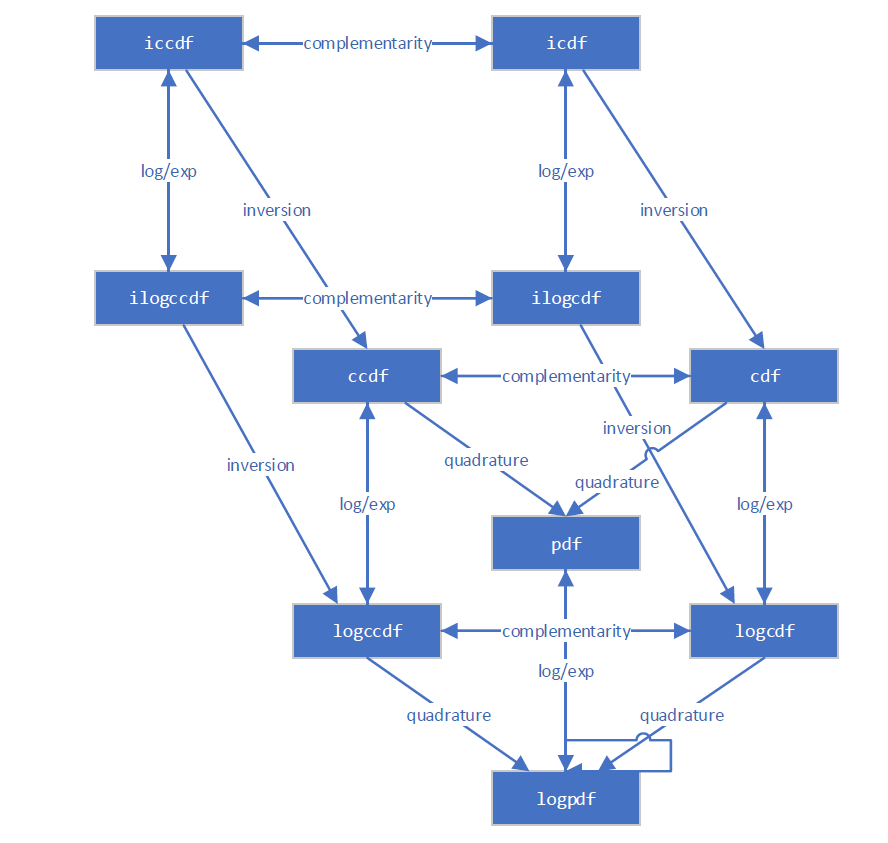
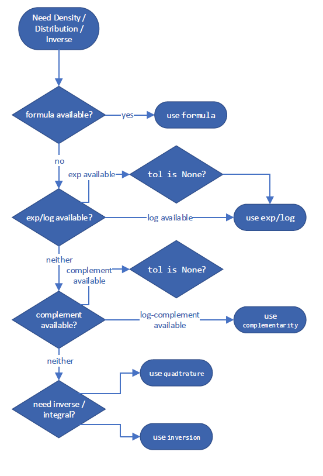
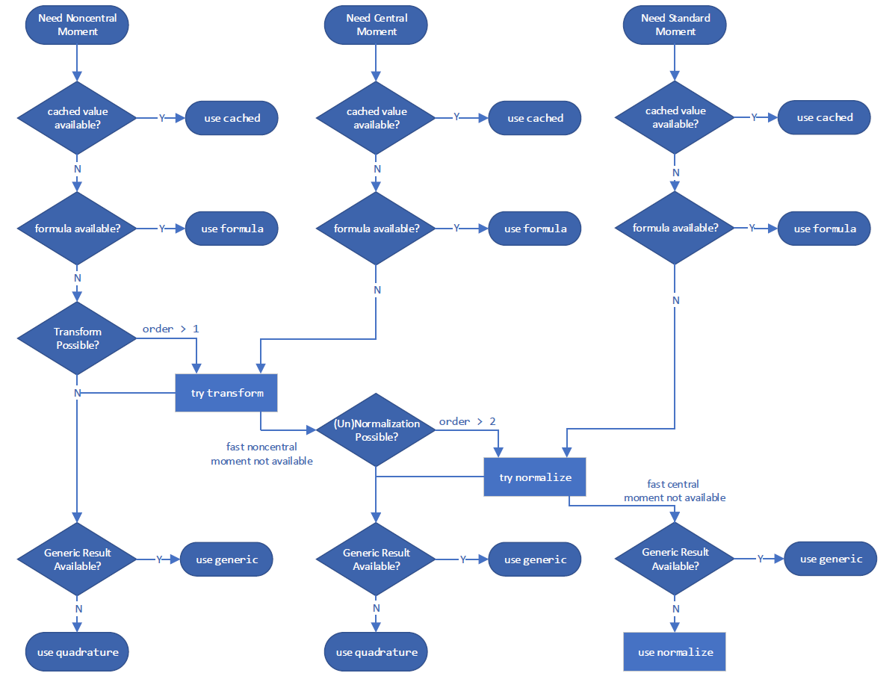

---
jupytext:
  text_representation:
    extension: .md
    format_name: myst
    format_version: 0.13
    jupytext_version: 1.16.4
kernelspec:
  display_name: Python 3 (ipykernel)
  language: python
  name: python3
---

+++ {"tags": ["jupyterlite_sphinx_strip"]}

```{eval-rst}
.. notebooklite:: rv_infrastructure.md
   :new_tab: True
```

(rv_infrastructure)=

+++

# Random Variable Transition Guide

+++

## Background

+++

Prior to SciPy 1.15, all of SciPy's continuous probability distributions (e.g. `scipy.stats.norm`) have been instances of subclasses of `scipy.stats.rv_continuous`.

```{code-cell} ipython3
from scipy import stats
dist = stats.norm
type(dist)
```

```{code-cell} ipython3
isinstance(dist, stats.rv_continuous)
```

There were two obvious ways to work these objects.

According to the more common way, both "arguments" (e.g. `x`) and "distribution parameters" (e.g. `loc`, `scale`) were provided as inputs to methods of the object.

```{code-cell} ipython3
x, loc, scale = 1., 0., 1.
dist.pdf(x, loc, scale)
```

The less common approach was to invoke the `__call__` method of the distribution object, which returned an instance of `rv_continuous_frozen`, regardless of the original class.

```{code-cell} ipython3
frozen = stats.norm()
type(frozen)
```

Methods of this new object accept only arguments, not the distribution parameters.

```{code-cell} ipython3
frozen.pdf(x)
```

In a sense, the instances of `rv_continuous` like `norm` represented "distribution families", which require parameters to identify a particular probability distribution, and an instance of `rv_continuous_frozen` was akin to a "random variable" - a mathematical object that follows a particular probability distribution.

Both approaches are valid and have advantages in certain situations. For instance, `stats.norm.pdf(x)` appears more natural than `stats.norm().pdf(x)` for such a simple invocation or when methods are viewed as functions of distribution parameters rather than the usual arguments (e.g., likelihood). However, the former approach has a few inherent disadvantages; e.g., all of SciPy's 125 continuous distributions have to be instantiated at import time, distribution parameters must be validated every time a method is called, and documentation of methods must either a) be generated separately for every method of every distribution or b) omit the shape parameters that are unique for each distribution.
To address these and other shortcomings, [gh-15928](https://github.com/scipy/scipy/issues/15928) proposed a new, separate infrastructure based on the latter (random variable) approach. This transition guide documents how users of `rv_continuous` and `rv_continuous_frozen` can migrate to the new infrastructure.

*Note: The new infrastructure may not yet be as convenient for some use cases, especially fitting distribution parameters to data. Users are welcome to continue to use the old infrastructure if it suits their needs; it is not deprecated at this time.*

+++

## Basics

+++

In the new infrastructure, distributions families are classes named according to `CamelCase` conventions. They must be instantiated before use, with parameters passed as keyword-only arguments.
*Instances* of the distribution family classes can be thought of as random variables, which are commonly denoted in mathematics using capital letters.

```{code-cell} ipython3
from scipy import stats
mu, sigma = 0, 1
X = stats.Normal(mu=mu, sigma=sigma)
X
```

Once instantiated, shape parameters can be read (but not written) as attributes.

```{code-cell} ipython3
X.mu, X.sigma
```

The documentation of [`scipy.stats.Normal`](https://scipy.github.io/devdocs/reference/generated/scipy.stats.Normal.html#scipy.stats.Normal) contains links to detailed documentation of each of its methods. (Compare, for instance, against the documentation of [`scipy.stats.norm`](https://docs.scipy.org/doc/scipy/reference/generated/scipy.stats.norm.html).)

*Note: Although only [`Normal`](https://scipy.github.io/devdocs/reference/generated/scipy.stats.Normal.html) and [`Uniform`](https://scipy.github.io/devdocs/reference/generated/scipy.stats.Uniform.html) have rendered documentation and can be imported directly from `stats` as of SciPy 1.15, almost all other old distributions can be used with the new interface via [`make_distribution`](https://scipy.github.io/devdocs/reference/generated/scipy.stats.make_distribution.html) (discussed shortly).*

Methods are then called by passing only the argument(s), if there are any, not distribution parameters.

```{code-cell} ipython3
X.mean()
```

```{code-cell} ipython3
X.pdf(x)
```

For simple calls like this (e.g. the argument is a valid float), calls to methods of the new random variables will typically be faster than comparable calls to the old distribution methods.

```{code-cell} ipython3
%timeit X.pdf(x)
```

```{code-cell} ipython3
%timeit frozen.pdf(x)
```

```{code-cell} ipython3
%timeit dist.pdf(x, loc=mu, scale=sigma)
```

Note that the way `X.pdf` and `frozen.pdf` are called is identical, and the call to `dist.pdf` is very similar - the only difference is that the call to `dist.pdf` includes the shape parameters, whereas in the new infrastructure, shape parameters are only provided when the random variable is instantiated.

Besides `pdf` and `mean`, several other methods of the new infrastructure are essentially the same as the old methods.

+++

- `logpdf` (logarithm of probability density function)
- `cdf` (cumulative distribution function)
- `logcdf` (logarithm of cumulative distribution function)
- `entropy` (differential entropy)
- `median`
- `support`

+++

Others methods have new names, but are otherwise drop-in replacements.
- `sf` (survival function) $\rightarrow$ `ccdf` (complementary cumulative distribution function)
- `logsf` $\rightarrow$ `logccdf`
- `ppf` (percent point function) $\rightarrow$ `icdf` (inverse cumulative distribution function)
- `isf` (inverse survive function) $\rightarrow$ `iccdf` (inverse complementary cumulative distribution function)
- `std` $\rightarrow$ `standard_deviation`
- `var` $\rightarrow$ `variance`

+++

The new infrastructure has several *new* methods in the same vein as those above.

- `ilogcdf` (inverse of the logarithm of the cumulative distribution function)
- `ilogccdf` (inverse of the logarithm of the complementary cumulative distribution function)
- `logentropy` (logarithm of the entropy)
- `mode` (mode of the distribution)
- `skewness`
- `kurtosis` (*non-excess* kurtosis; see "Standardized Moments" below)

+++

And it has a new `plot` method for convenience

```{code-cell} ipython3
import matplotlib.pyplot as plt
X.plot()
plt.show()
```

Most of the remaining methods of the old infrastructure (`rvs`, `moment`, `stats`, `interval`, `fit`, `nnlf`, `fit_loc_scale`, and `expect`) have analogous functionality, but some care is required. Before describing the replacements, we briefly mention how to work with random variables that are not normally distributed: almost all old distribution objects can be converted into a new distribution class with `scipy.stats.make_distribution`, and the new distribution class can be instantiated by passing the shape parameters as keyword arguments. For instance, consider the [Weibull distribution](https://docs.scipy.org/doc/scipy/reference/generated/scipy.stats.weibull_min.html#scipy.stats.weibull_min). We can create a new class that is an abstraction of the distribution family like:

```{code-cell} ipython3
Weibull = stats.make_distribution(stats.weibull_min)
print(Weibull.__doc__[:288])  # help(Weibull) prints this and (too much) more
```

According to the documentation of [`weibull_min`](https://docs.scipy.org/doc/scipy/reference/generated/scipy.stats.weibull_min.html#scipy.stats.weibull_min), the shape parameter is denoted `c`, so we can instantiate a random variable by passing `c` as a keyword argument to the new `Weibull` class.

```{code-cell} ipython3
c = 2.
X = Weibull(c=c)
X.plot()
plt.show()
```

Previously, all distributions inherited `loc` and `scale` distribution parameters.
*These are no longer accepted.* Instead, random variables can be shifted and scaled with arithmetic operators.

```{code-cell} ipython3
Y = 2*X + 1
Y.plot()  # note the change in the abscissae
plt.show()
```

A separate distribution, `weibull_max`, was provided as the reflection of `weibull_min` about the origin. Now, this is just `-X`.

```{code-cell} ipython3
Y = -X
Y.plot()
plt.show()
```

### Moments

+++

The old infrastructure offers a `moments` method for raw moments. When only the order is specified, the new `moment` method is a drop-in replacement.

```{code-cell} ipython3
stats.weibull_min.moment(1, c), X.moment(1)  # first raw moment of the Weibull distribution with shape c
```

However, the old infrastructure also has a `stats` method, which provided various statistics of the distribution. The following statistics were associated with the indicated characters.

+++

- Mean (first raw moment about the origin, `'m'`)
- Variance (second central moment, `'v'`)
- Skewness (third standarized moment, `'s'`)
- Excess kurtosis (fourh standarized moment minus 3, `'k'`)

For example:

```{code-cell} ipython3
stats.weibull_min.stats(c, moments='mvsk')
```

Now, moments of any `order` and `kind` (raw, central, and standardized) can be computed by passing the appropriate arguments to the new `moment` method.

```{code-cell} ipython3
(X.moment(order=1, kind='raw'), 
 X.moment(order=2, kind='central'), 
 X.moment(order=3, kind='standardized'), 
 X.moment(order=4, kind='standardized'))
```

Note the difference in definition of [kurtosis](https://en.wikipedia.org/wiki/Kurtosis). Previously, the "excess" (AKA "Fisher's") kurtosis was provided. As a matter of convention (rather than the natural mathematical definition), this is the standardized fourth moment shifted by a constant value (`3`) to give a value of `0.0` for the normal distribution.

```{code-cell} ipython3
stats.norm.stats(moments='k')
```

The new `moment` and `kurtosis` methods do not observe this convention by default; they report the standardized fourth moment according to the mathematical definition. This is also known as the "non-excess" (or "Pearson's") kurtosis, and for the standard normal, it has a value of `3.0`.

```{code-cell} ipython3
stats.Normal().moment(4, kind='standardized') 
```

For convenience, the `kurtosis` method offers a `convention` argument to select between the two.

```{code-cell} ipython3
stats.Normal().kurtosis(convention='excess'), stats.Normal().kurtosis(convention='non-excess')
```

### Random Variates

+++

The old infrastructure's `rvs` method has been replaced with `sample`, but there are a two differences that should be noted when either 1) control of the random state is required or 2) arrays are used for shape, location, or scale parameters.

First, argument `random_state` is replaced by `rng` per [SPEC 7](https://scientific-python.org/specs/spec-0007/). A pattern to control the random state in the past has been to use `numpy.random.seed` or to pass integer seeds to the `random_state` argument. The integer seeds were converted to instances of `numpy.random.RandomState`, so behavior for a given integer seed would be identical in these two cases:

```{code-cell} ipython3
import numpy as np
np.random.seed(1)
dist = stats.norm
dist.rvs(), dist.rvs(random_state=1)
```

In the new infrastructure, pass instances of `numpy.Generator` to the `rng` argument of `sample` to control the random state. Note that integer seeds are now converted to instances of `numpy.random.Generator`, not instances of `numpy.random.RandomState`.

```{code-cell} ipython3
X = stats.Normal()
rng = np.random.default_rng(1)  # instantiate a numpy.random.Generator
X.sample(rng=rng), X.sample(rng=1)
```

Second, the argument `shape` replaces argument `size`.

```{code-cell} ipython3
dist.rvs(size=(3, 4))
```

```{code-cell} ipython3
X.sample(shape=(3, 4))
```

Besides the difference in name, there is a difference in behavior when array shape parameters are involved. Previously, the shape of distribution parameter arrays had to be included in `size`.

```{code-cell} ipython3
dist.rvs(size=(3, 4, 2), loc=[0, 1]).shape  # `loc` has shape (2,)
```

Now, the shape of the parameter arrays is considered to be a property of the random variable object itself. Specifying the shape of array shape parameters would be redundant, so it is not included when specifying the `shape` of the sample.

```{code-cell} ipython3
Y = stats.Normal(mu = [0, 1])
Y.sample(shape=(3, 4)).shape  # the sample has shape (3, 4); each element is of shape (2,)
```

### Probability Mass (AKA "Confidence") Intervals

+++

The old infrastructure offered an `interval` method which, by default, would return a symmetric (about the median) interval containing a specified percentage of the distribution's probability mass.

```{code-cell} ipython3
a = 0.95
dist.interval(confidence=a)
```

Now, call the inverse CDF and complementary CDF methods with the desired probability mass in each tail.

```{code-cell} ipython3
p = 1 - a
X.icdf(p/2), X.iccdf(p/2)
```

#### Likelihood Function

+++

The old infrastructure offers a function to compute the **n**egative **l**og-[**l**ikelihood **f**unction](https://en.wikipedia.org/wiki/Likelihood_function), erroneously named `nnlf` (instead of `nllf`). It accepts the parameters of the distribution as a tuple and observations as an array.

```{code-cell} ipython3
mu = 0
sigma = 1
data = stats.norm.rvs(size=100, loc=mu, scale=sigma)
stats.norm.nnlf((mu, sigma), data)
```

Now, simply compute the negative log-likehood according to its mathematical definition.

```{code-cell} ipython3
X = stats.Normal(mu=mu, sigma=sigma)
-X.logpdf(data).sum()
```

### Expected Values

+++

The `expect` method of the old infrastructure estimates a definite integral of an arbitrary function weighted by the PDF of the distribution. For instance, the fourth moment of the distribution is given by:

```{code-cell} ipython3
def f(x): return x**4
stats.norm.expect(f, lb=-np.inf, ub=np.inf)
```

This provides little added convencience over what the source code does: use `scipy.integrate.quad` to perform the integration numerically.

```{code-cell} ipython3
from scipy import integrate
def f(x): return x**4 * stats.norm.pdf(x)
integrate.quad(f, a=-np.inf, b=np.inf)  # integral estimate, estimate of the error
```

Of course, this can just as easily be done with the new infrastructure.

```{code-cell} ipython3
def f(x): return x**4 * X.pdf(x)
integrate.quad(f, a=-np.inf, b=np.inf)  # integral estimate, estimate of the error
```

The `conditional` argument simply scales the result by inverse of the probability mass contained within the interval.

```{code-cell} ipython3
a, b = -1, 3
def f(x): return x**4
stats.norm.expect(f, lb=a, ub=b, conditional=True)
```

Using `quad` directly, that is:

```{code-cell} ipython3
def f(x): return x**4 * stats.norm.pdf(x)
prob = stats.norm.cdf(b) - stats.norm.cdf(a)
integrate.quad(f, a=a, b=b)[0] / prob
```

And with the new random variables:

```{code-cell} ipython3
integrate.quad(f, a=a, b=b)[0] / X.cdf(a, b)
```

Note that the `cdf` method of the new random variables accepts two arguments to compute the probability mass within the specified interval. In many cases, this can avoid subtractive error ("catastrophic cancellation") when the probability mass is very small.

+++

### Fitting

+++

#### Location / Scale Estimation
The old infrastructure offered a function to estimate location and scale parameters of the distribution from data.

```{code-cell} ipython3
rng = np.random.default_rng(91392794601852341588152500276639671056)
dist = stats.weibull_min
c, loc, scale = 0.5, 0, 4.
data = dist.rvs(size=100, c=c, loc=loc, scale=scale, random_state=rng)
dist.fit_loc_scale(data, c)
# compare against 0 (default location) and 4 (specified scale)
```

Based on the source code, it is easy to replicate the method.

```{code-cell} ipython3
X = Weibull(c=c)
def fit_loc_scale(X, data):
    m, v = X.mean(), X.variance()
    m_, v_ = data.mean(), data.var()
    scale = np.sqrt(v_ / v)
    loc = m_ - scale*m
    return loc, scale

fit_loc_scale(X, data)
```

Note that the estimates are quite poor in this example, and poor performance of the heuristic factored into the decision not to provide a replacement.

#### Maximum Likelihood Estimation

The last method of the old infrastructure is `fit`, which estimates the location, scale, and shape parameters of an underlying distribution given a sample from the distribution.

```{code-cell} ipython3
c_, loc_, scale_ = stats.weibull_min.fit(data)
c_, loc_, scale_
```

The convenience of this method is a blessing and a curse. 

When it works, the simplicity is much appreciated. For some distributions, analytical expressions for the [maximum likelihood estimates](https://en.wikipedia.org/wiki/Maximum_likelihood_estimation) (MLE) of the parameters have been programmed manually, and for these distributions, the `fit` method is quite reliable. 

For most distributions, however, fitting is performed by numerical minimization of the negative log-likelihood function. This is not guaranteed to be successful - both because of inherent limitations of MLE and the state of the art of numerical optimization - and in these cases, the user of `fit` is stuck. However, a modicum of understanding goes a long way toward ensuring success, so here we present a mini-tutorial of fitting using the new infrastructure. 

First, note that MLE is one of several potential strategies for fitting distributions to data. It does nothing more than find the values of the distribution parameters for which the negative log-likelihood (NLLF) is minimized. Note that for the distribution from which the data were generated, the NLLF is:

```{code-cell} ipython3
stats.weibull_min.nnlf((c, loc, scale), data)
```

The NLLF of the parameters estimated using `fit` are lower:

```{code-cell} ipython3
stats.weibull_min.nnlf((c_, loc_, scale_), data)
```

Therefore, `fit` considers its job done, whether or not this satisfies the user's notions of a "good fit" or whether the parameters are within reasonable bounds. Besides allowing the user to specify a guess for distribution parameters, it gives little control over the process. (*Note: technically, the `optimizer` argument can be used for greater control, but this is not well documented, and its use negates any convenience offered by the `fit` method.*)

+++

Another problem is that MLE is inherently poorly behaved for some distributions. In this example, for instance, we can make the NLLF as low as we please simply by setting the location to the minimum of the data - even for bogus values of the shape and scale parameters.

```{code-cell} ipython3
stats.weibull_min.nnlf((0.1, np.min(data), 10), data)
```

Compounding with these issues is that `fit` estimates all distribution parameters by default, including the location. In the example above, we are probably only interested in the more common two-parameter Weibull distribution because the actual location is zero. `fit` *can* accommodate this by specifing that the location is fixed parameter.

```{code-cell} ipython3
# c_, loc_, scale_ = stats.weibull_min.fit(data, loc=0)  # careful! this provides loc=0 as a *guess*
c_, loc_, scale_ = stats.weibull_min.fit(data, floc=0)
c_, loc_, scale_
```

```{code-cell} ipython3
stats.weibull_min.nnlf((c_, loc_, scale_), data)
```

But by providing a `fit` method that purportedly "just works", users are encouraged to neglect some of these important details.

Instead, we suggest that it is almost as simple to fit distributions to data using the generic optimization tools provided by SciPy. However, this allows the user to perform the fit according to their preferred objective function, provides options when things don't work as expected, and helps the user to avoid the most common pitfalls.

For instance, suppose our desired objective function is indeed the negative log likelihood. It is simple to define as a function of the shape parameter `c` and scale only, leaving the location at its default of zero.

```{code-cell} ipython3
def nllf(x):
    c, scale = x  # pass (only) `c` and `scale` as elements of `x`
    X = Weibull(c=c) * scale
    return -X.logpdf(data).sum()

nllf((c_, scale_))
```

To perform the minimization, we can use `scipy.optimize.minimize`.

```{code-cell} ipython3
from scipy import optimize
eps = 1e-10  # numerical tolerance to avoid invalid parameters
lb = [eps, eps]  # lower bound on `c` and `scale`
ub = [10, 10]  # upper bound on `c` and `scale`
x0 = [1, 1]  # guess to get optimization started
bounds = optimize.Bounds(lb, ub)
res_mle = optimize.minimize(nllf, x0, bounds=bounds)
res_mle
```

The value of the objective function is essentially identical, and the PDFs are indistinguishable.

```{code-cell} ipython3
import matplotlib.pyplot as plt
x = np.linspace(eps, 15, 300)

c_, scale_ = res_mle.x
X = Weibull(c=c_)*scale_
plt.plot(x, X.pdf(x), '-', label='numerical optimization')

c_, _, scale_ = stats.weibull_min.fit(data, floc=0)
Y = Weibull(c=c_)*scale_
plt.plot(x, Y.pdf(x), '--', label='`weibull_min.fit`')

plt.hist(data, bins=np.linspace(0, 20, 30), density=True, alpha=0.1)
plt.xlabel('x')
plt.ylabel('pdf(x)')
plt.legend()
plt.ylim(0, 0.5)
plt.show()
```

However, with this approach, it is trivial to make changes to the fitting procedure to suit our needs, enabling estimation procedures other than those provided by [`rv_continuous.fit`](https://docs.scipy.org/doc/scipy/reference/generated/scipy.stats.rv_continuous.fit.html#scipy.stats.rv_continuous.fit). For instance, we can perform [maximum spacing estimation](https://en.wikipedia.org/wiki/Maximum_spacing_estimation) (MSE) by changing the objective function to the **n**egative **l**og **p**roduct **s**pacing as follows.

```{code-cell} ipython3
def nlps(x):
    c, scale = x
    X = Weibull(c=c) * scale
    x = np.sort(np.concatenate((data, X.support())))  # Append the endpoints of the support to the data
    return -X.logcdf(x[:-1], x[1:]).sum().real  # Minimize the sum of the logs the probability mass between points

res_mps = optimize.minimize(nlps, x0, bounds=bounds)
res_mps.x
```

For method of [L-moments](https://en.wikipedia.org/wiki/L-moment) (which attempts to match the distribution and sample L-moments):

```{code-cell} ipython3
def lmoment_residual(x):
    c, scale = x
    X = Weibull(c=c) * scale
    E11 = stats.order_statistic(X, r=1, n=1).mean()
    E12, E22 = stats.order_statistic(X, r=[1, 2], n=2).mean()
    lmoments_X = [E11, 0.5*(E22 - E12)]  # the first two l-moments of the distribution
    lmoments_x = stats.lmoment(data, order=[1, 2])  # first two l-moments of the data
    return np.linalg.norm(lmoments_x - lmoments_X)  # Minimize the norm of the difference

x0 = [0.4, 3]  # This method is a bit sensitive to the initial guess
res_lmom = optimize.minimize(lmoment_residual, x0, bounds=bounds)
res_lmom.x, res_lmom.fun  # residual should be ~0
```

The plots for all three methods look similar and seem to describe the data, giving us some confidence that we have a good fit.

```{code-cell} ipython3
import matplotlib.pyplot as plt
x = np.linspace(eps, 10, 300)

for res, label in [(res_mle, "MLE"), (res_mps, "MPS"), (res_lmom, "L-moments")]:
    c_, scale_ = res.x
    X = Weibull(c=c_)*scale_
    plt.plot(x, X.pdf(x), '-', label=label)

plt.hist(data, bins=np.linspace(0, 10, 30), density=True, alpha=0.1)
plt.xlabel('x')
plt.ylabel('pdf(x)')
plt.legend()
plt.ylim(0, 0.3)
plt.show()
```

Estimation does not always involve fitting distributions to data. For instance, in [gh-12134](https://github.com/scipy/scipy/issues/12134), a user needed to calculate the shape and scale parameters of the Weibull distribution to achieve a given mean and standard deviation. This fits easily into the same framework.

```{code-cell} ipython3
moments_0 = np.asarray([8, 20])  # desired mean and standard deviation
def f(x):
    c, scale = x
    X = Weibull(c=c) * scale
    moments_X = X.mean(), X.standard_deviation()
    return np.linalg.norm(moments_X - moments_0)

bounds.lb = np.asarray([0.1, 0.1])  # the Weibull distribution is problematic for very small c
res = optimize.minimize(f, x0, bounds=bounds, method='slsqp')  # easily change the minimization method
res
```

## New and Advanced Features

+++

<a id='Transformations'></a>
### Transformations

Mathematical transformations can be applied to random variables. For instance, many elementary arithmetic operations (`+`, `-`, `*`, `/`, `**`) between random variables and scalars work.

For instance, we can see that the reciprocal of a Weibull-distributed RV is distributed according to `scipy.stats.invweibull`. (An "inverse" distribution is typically the distribution underlying the reciprocal of a random variable.)

```{code-cell} ipython3
c = 10.6

X = Weibull(c=10.6)  
Y = 1 / X  # compare to `invweibull`
Y.plot()

x = np.linspace(0.8, 2.05, 300)
plt.plot(x, stats.invweibull(c=c).pdf(x), '--')
plt.legend(['`1 / X`', '`invweibull`'])
plt.title("Inverse Weibull PDF")
plt.show()
```

`scipy.stats.chi2` describes a sum of the squares of normally-distributed random variables.

```{code-cell} ipython3
X = stats.Normal()
Y = X**2  # compare to chi2
Y.plot(t=('x', eps, 5));

x = np.linspace(eps, 5, 300)
plt.plot(x, stats.chi2(df=1).pdf(x), '--')
plt.ylim(0, 3)
plt.legend(['`X**2`', '`chi2`'])
plt.title("Chi-squared PDF")
plt.show()
```

`scipy.stats.foldcauchy` describes the absolute value of a Cauchy-distributed random variable. (A "folded" distribution is the distribution underlying the absolute value of a random variable.)

```{code-cell} ipython3
Cauchy = stats.make_distribution(stats.cauchy)
c = 4.72

X = Cauchy() + c  
Y = abs(X)  # compare to `foldcauchy`
Y.plot(t=('x', 0, 60))

x = np.linspace(0, 60, 300)
plt.plot(x, stats.foldcauchy(c=c).pdf(x), '--')
plt.legend(['`abs(X)`', '`foldcauchy`'])
plt.title("Folded Cauchy PDF")
plt.show()
```

`scipy.stats.lognormal` describes the exponential of a normally distributed random variable. It is so-named because the logarithm of the resulting random variable is normally distributed. (In general, a "log" distribution is typically the distribution underlying the *exponential* of a random variable.)

```{code-cell} ipython3
u, s = 1, 0.5

X = stats.Normal()*s + u
Y = stats.exp(X)  # compare to `lognorm`
Y.plot(t=('x', eps, 9))

x = np.linspace(eps, 9, 300)
plt.plot(x, stats.lognorm(s=s, scale=np.exp(u)).pdf(x), '--')
plt.legend(['`exp(X)`', '`lognorm`'])
plt.title("Log-Normal PDF")
plt.show()
```

`scipy.stats.loggamma` describes the logarithm of of a Gamma-distributed random variable. Note that according to typical conventions, the appropriate name of this distribution would be [exp-gamma](https://reference.wolfram.com/language/ref/ExpGammaDistribution.html.en#:~:text=The%20term%20exp%2Dgamma%20is,of%20qualitatively%20similar%20probability%20distributions.) because the exponential of the RV is gamma-distributed.

```{code-cell} ipython3
Gamma = stats.make_distribution(stats.gamma)
a = 0.414

X = Gamma(a=a)  
Y = stats.log(X)  # compare to `loggamma`
Y.plot()

x = np.linspace(-17.5, 2, 300)
plt.plot(x, stats.loggamma(c=a).pdf(x), '--')
plt.legend(['`log(X)`', '`loggamma`'])
plt.title("Exp-Gamma PDF")
plt.show()
```

`scipy.stats.truncnorm` is the distribution underlying a truncated normal random variable. Note that the truncation transformation can be applied either before or after shifting and scaling the normally-distributed random variable, which can make it much easier to achieve the desired result than `scipy.stats.truncnorm` (which inherently shifts and scales *after* truncation).

```{code-cell} ipython3
a, b = 0.1, 2

X = stats.Normal()  
Y = stats.truncate(X, a, b)  # compare to `truncnorm`
Y.plot()

x = np.linspace(a, b, 300)
plt.plot(x, stats.truncnorm(a, b).pdf(x), '--')
plt.legend(['`truncate(X, a, b)`', '`truncnorm`'])
plt.title("Truncated Normal PDF")
plt.show()
```

`scipy.stats.dgamma` is a mixture of two gamma-distributed RVs, one of which is reflected about the origin. (Typically, a "double" distribution is the distribution underlying a mixture of RVs, one of which is reflected.)

```{code-cell} ipython3
a = 1.1
X = Gamma(a=a)
Y = stats.Mixture((X, -X), weights=[0.5, 0.5])
# plot method not available for mixtures

x = np.linspace(-4, 4, 300)
plt.plot(x, Y.pdf(x))
plt.plot(x, stats.dgamma(a=a).pdf(x), '--')
plt.legend(['`Mixture(X, -X)`', '`dgamma`'])
plt.title("Double Gammma PDF")
plt.show()
```

#### Limitations

While most arithmetic transformations between random variables and Python scalars or NumPy arrays are supported, there are a few restrictions.

- Raising a random variable to the power of an argument is only implemented when the argument is a positive integer.
- Raising an argument to the power of a random variable is only implemented when the argument is a positive scalar other than 1.
- Division by a random variable is only implemented when the support is either entirely non-negative or non-positive.
- The logarithm of a random variable is only implemented when the support is non-negative. (The logarithm of negative values is imaginary.)

Arithmetic operations between two random variables are *not* yet supported. Note that such operations are much more complex mathematically; for instance, the PDF of the sum of the two random variables involves convolution of the two PDFs.

Also, while transformations are composable, a) truncation and b) shifting/scaling can each be done only once. For instance, `Y = 2 * stats.exp(X + 1)` will raise an error because this would require shifting before exponentiation and scaling after exponentiation; this is treated as "shifting/scaling" twice. However, a mathematical simplification is possible here (and in many cases) to avoid the problem: `Y = (2*math.exp(2)) * stats.exp(X)` is equivalent and requires only one scaling operation.

Although the transformations are fairly robust, they all rely on generic implementations which may cause numerical difficulties. If you are concerned about the accuracy of the results of a transformation, consider comparing the resulting PDF against a histogram of a random sample.

```{code-cell} ipython3
X = stats.Normal()
Y = X**3
x = np.linspace(-5, 5, 300)
plt.plot(x, Y.pdf(x), label='pdf')
plt.hist(X.sample(100000)**3, density=True, bins=np.linspace(-5, 5, 100), alpha=0.5);
plt.ylim(0, 2)
plt.show()
```

### Quasi-Monte Carlo Sampling

+++

Random variables enable generation of quasi-random, low-discrepancy samples from statistical distributions.

```{code-cell} ipython3
import numpy as np
import matplotlib.pyplot as plt
from scipy import stats
X = stats.Normal()

rng = np.random.default_rng(7824387278234)
qrng = stats.qmc.Sobol(1, rng=rng)  # instantiate a QMCEngine

bins = np.linspace(-3.5, 3.5, 31)
plt.hist(X.sample(512, rng=qrng), bins, alpha=0.5, label='quasi-random')
plt.hist(X.sample(512, rng=rng), bins, alpha=0.5, label='pseudo-random')
plt.title('Histogram of normally-distributed sample')
plt.legend()
plt.show()
```

Note that when generating multiple samples (e.g. `len(shape) > 1`),  each slice along the zeroth axis is an independent, low-discrepancy sequency. The following generates two independent QMC samples, each of length 512.

```{code-cell} ipython3
samples = X.sample((512, 2), rng=qrng)
plt.hist(samples[:, 0], bins, alpha=0.5, label='sample 0')
plt.hist(samples[:, 1], bins, alpha=0.5, label='sample 1')
plt.title('Histograms of normally-distributed samples')
plt.legend()
plt.show()
```

The result is quite different if we generate 512 independent QMC sequences, each of length 2.

```{code-cell} ipython3
samples = X.sample((2, 512), rng=qrng)
plt.hist(samples[0], bins, alpha=0.5, label='sample 0')
plt.hist(samples[1], bins, alpha=0.5, label='sample 1')
plt.title('Histograms of normally-distributed samples')
plt.legend()
plt.show()
```

### Accuracy

+++

For some distributions, like `scipy.stats.norm`, almost all methods of the distribution are customized to ensure accurate computation. For others, like `scipy.stats.gausshyper`, little more than the PDF is defined, and the other methods must be computed numerically based on the PDF. For example, the survival function (complementary CDF) of the Gauss hypergeometric distribution is calculated by numerically integrating the PDF from `0` (the left end of the support) to `x` to get the CDF, then the complement is taken.

```{code-cell} ipython3
a, b, c, z = 1.5, 2.5, 2, 0
x = 0.5
frozen = stats.gausshyper(a=a, b=b, c=c, z=z)
frozen.sf(x)
```

```{code-cell} ipython3
frozen.sf(x) == 1 - integrate.quad(frozen.pdf, 0, x)[0]
```

However, another aproach would be to numerically integrate the PDF from `x` to `1` (the right end of the support).

```{code-cell} ipython3
integrate.quad(frozen.pdf, x, 1)[0]
```

These are distinct but equally valid approaches, so assuming the PDF is accurate, it is unlikely that the two results are inaccurate in the same way. Therefore, we can estimate the accuracy of the results by comparing them.

```{code-cell} ipython3
res1 = frozen.sf(x)
res2 = integrate.quad(frozen.pdf, x, 1)[0]
abs((res1 - res2) / res1)
```

The new infrastructure is aware of several different ways for computing most quantities. For example, this diagram illustrates the relationships between various distribution functions.



It follows a decision tree to choose what is expected to be the most accurate way of estimating the quantity. These specific decision trees for the "best" method are subject to change between versions of SciPy, but an example for computing the complementary CDF might look something like:



and for calculating a moment:



However, you can override the method it uses with the `method` argument.

```{code-cell} ipython3
GaussHyper = stats.make_distribution(stats.gausshyper)
X = GaussHyper(a=a, b=b, c=c, z=z)
```

For `ccdf`, `method='quadrature'` integrates the PDF in right tail.

```{code-cell} ipython3
X.ccdf(x, method='quadrature') == integrate.tanhsinh(X.pdf, x, 1).integral
```

`method='complement'` takes the complement of the CDF.

```{code-cell} ipython3
X.ccdf(x, method='complement') == (1 - integrate.tanhsinh(X.pdf, 0, x).integral)
```

`method='logexp'` takes the exponential of the logarithm of the CCDF.

```{code-cell} ipython3
X.ccdf(x, method='logexp') == np.exp(integrate.tanhsinh(lambda x: X.logpdf(x), x, 1, log=True).integral)
```

When in doubt, consider trying different `method`s to compute a given quantity.

+++

### Performance

+++

Consider the performance of calculations involving the Gauss hypergeometric distribution. For scalar shapes and argument, performance of the new and old infrastructures are comparable. The new infrastructure is not expected to be much faster; although it reduces the "overhead" of parameter validation, it is not significantly faster at numerical integration of scalar quantities, and the latter dominates the execution time here.

```{code-cell} ipython3
%timeit X.cdf(x)  # new infrastructure
```

```{code-cell} ipython3
%timeit stats.gausshyper.cdf(x, a, b, c, z)  # old infrastructure
```

```{code-cell} ipython3
np.isclose(X.cdf(x), stats.gausshyper.cdf(x, a, b, c, z))
```

But the new infrastructure is much faster when arrays are involved. This is because the underlying integrator ([`scipy.integrate.tanhsinh`](https://scipy.github.io/devdocs/reference/generated/scipy.integrate.tanhsinh.html#scipy.integrate.tanhsinh)) and root finder ([`scipy.optimize.elementwise.find_root`](https://scipy.github.io/devdocs/reference/generated/scipy.optimize.elementwise.find_root.html)) developed for the new infrastructure are natively vectorized, whereas the legacy routines used by the old infrastructure (`scipy.integrate.quad` and `scipy.optimize.brentq`) are not.

```{code-cell} ipython3
x = np.linspace(0, 1, 1000)
```

```{code-cell} ipython3
%timeit X.cdf(x)  # new infrastructure
```

```{code-cell} ipython3
%timeit stats.gausshyper.cdf(x, a, b, c, z)  # old infrastructure
```

Comparable performance improvements can be expected for array calculations whenever the underlying functions are computed by either numerical quadrature or inversion (root-finding).

+++

### Visualization

We can readily visualize functions of the distribution underlying random variables using the convenience method, `plot`.

```{code-cell} ipython3
import matplotlib.pyplot as plt
ax = X.plot()
plt.show()
```

```{code-cell} ipython3
X.plot(y='cdf')
plt.show()
```

The `plot` method is quite flexible, with a signature inspired by [The Grammar of Graphics](https://books.google.com/books?id=_kRX4LoFfGQC&printsec=frontcover&source=gbs_ge_summary_r&cad=0#v=onepage&q&f=false). For instance, with the argument $x$ on $[-10, 10]$, plot the PDF against the CDF.

```{code-cell} ipython3
X.plot('cdf', 'pdf', t=('x', -10, 10))
plt.show()
```

### Order Statistics
As seen in the "Fit" section above, there is now support for distributions of [order statistics](https://en.wikipedia.org/wiki/Order_statistic) of random samples from distribution. For example, we can plot the probability density functions of the order statistics of a normal distribution with sample size 4.

```{code-cell} ipython3
n = 4
r = np.arange(1, n+1)
X = stats.Normal()
Y = stats.order_statistic(X, r=r, n=n)
Y.plot()
plt.show()
```

Compute the expected values of these order statistics:

```{code-cell} ipython3
Y.mean()
```

## Conclusion

+++

Although change can be uncomfortable, the new infrastructure paves the road to an improved experience for users of SciPy's probability distributions. 
It is not complete, of course! At the time this guide was written, the following features are planned for future releases:
- Additional built-in distributions (besides `Normal` and `Uniform`)
- Discrete distributions
- Circular distributions, including the ability to wrap arbitrary continuous distributions around the circle
- Support for other Python Array API Compatible backends beyond NumPy (e.g. CuPy, PyTorch, JAX)

As always, development of SciPy is done for the SciPy community *by* the SciPy community. Suggestions for other features and help implementing them are always appreciated.

We hope this guide motivates the advantages of trying the new infrastructure and simplifies the process.
