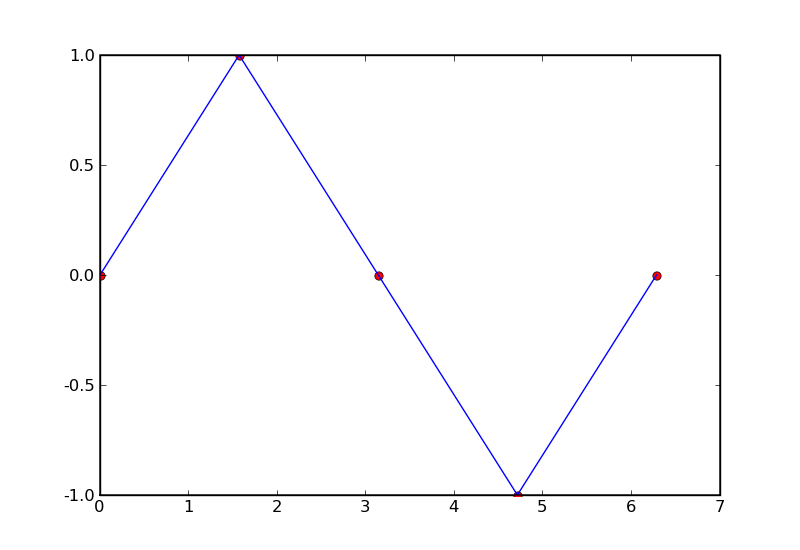
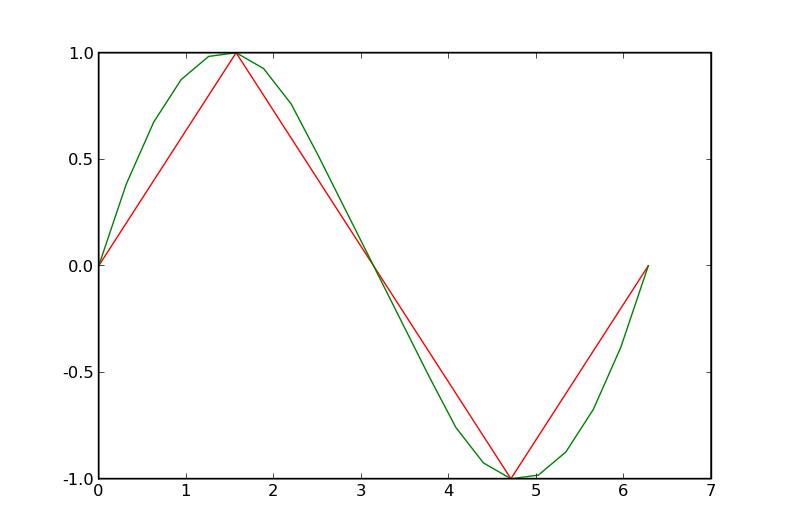

==================
Overview
==================

Interpolation is the process of using known data to guess the value of unknown data.  It turns
a sample of a function into an approximation of that function for every value, and is one of
the most basic mathematical tools available to a researcher.

The interpolate package provides tools for interpolating and extrapolating new data points from a known set of data points.  
Interpolate provides both a functional interface that is flexible and easy to use as well as an object oriented interface that 
can be more efficient and flexible for some cases.  It is able to interpolate and extrapolate in 1D, 2D, and even N 
dimensions. *[FIXME : 1D only right now]*

For 1D interpolation, it handles linear and spline(cubic, quadratic, and quintic) for both uniformly and non-uniformly spaced 
data points "out of the box."  Users can choose the behavior when new values fall outside the range of known data, and
with a little more work, they can incorporate interpolation methods that are specially tailored to their needs.

For 2D interpolation, *[FIXME : include this]*

This tutorial covers how to use the interpolate module, provides some basic examples, and shows
them at work in realistic sample sessions.  These sessions demonstrate how to use the 
interpolate module, but also highlight some of the uses of interpolation techniques.

================================================
1D Interpolation with the Functional Interface
================================================

-------------
Basic Usage
-------------

For most users, the primary feature of interpolate is the function 'interp1d'.  It takes
in known data points and the points at which to interpolate values, and returns
estimates that will suffice for most purposes.  Optional keyword arguments put
a variety of other sophisticated methods one string away from the user, and users
can define and pass in their own custom-tailored interpolation methods.

The following example uses the 'interp1d' function to linearly interpolate a sin 
curve from a sparse set of values. ::
    
    # start up ipython for our examples.
    $ ipython -pylab
    
    In []: from interpolate import interp1d
    
    # Create our "known" set of 5 points with the x values in one array and the y values in another.
    In []: x = linspace(0, 2*pi, 5)
    In []: y = sin(x)
    
    # If we only want a value at a single point, we can pass in a scalar and interp1d
    # will return a scalar
    In []: interp1d(x, y, 1.2)
    Out []: 0.76394372684109768
    
    # 0-dimensional arrays are also treated as scalars
    In []: interp1d(x, y, array(1.2) )
    Out []: 0.76394372684109768
    
    # To interpolate from these x,y values at multiple points, possibly to get a more dense set
    # of new_x, new_y values to approximate the function, pass a numpy array to interp1d, 
    # and the return type will also be a numpy array.
    In []: new_x = linspace(0, 2*pi, 21)
    In []: new_y = interp1d(x, y, new_x)
    
    # Plot the results using matplotlib. [note examples assume you are running in ipython -pylab]
    In []: plot(x, y, 'ro', new_x, new_y, 'b-')
        

::

    # Alternatively, x, y and new_x can also be lists (they are internally converted into arrays
    # before processing)
    In []: interp1d( [1.0, 2.0], [1.0, 2.0], [1.3] )
    Out []: array([ 1.3 ])

What happens if we pass in a new_x with values outside the range of x?  By default, new_y will be
NaN at all such points: ::

    # If we attempt to extrapolate values outside the interpolation range, interp1d defaults
    # to returning NaN
    In []: interp1d(x, y, array([-2, -1, 1, 2]))
    Out []: array([        NaN,     NaN,     0.63661977,   0.72676046])

If we want a type of interpolation other than linear, there is a range of options which we can specify 
with the keyword argument "kind", which is usually a string.  Continuing from the previous example,::

    # If we want quadratic (2nd order) spline interpolation, we can use the string 'quadratic'
    In []: new_y_quadratic = interp1d(x, y, new_x, kind = 'quadratic')
    In []: plot(x, y, 'r', new_x, new_y_quadratic, 'g')
    

There is a large selection of strings which specify a range of interpolation methods.  The list includes:

#. 'linear' : linear interpolation, same as the default
#. 'block' : "round new_x down" to the nearest values where we know y.
#. 'nearest' : take the y value of the nearest point
#. 'logarithmic' : logarithmic interpolation (linear in log(y) )
#. 'spline' : spline interpolation of default order (currently 3)
#. 'cubic' : 3rd order spline interpolation
#. 'quartic' : 4th order spline interpolation
#. 'quintic' : 5th order spline interpolation

The same flexibility is afforded for extrapolation by the keywords low and high, which
specify how to treat values below and above the range of known data: ::

    In []: z = array([ 1.0, 2.0 ])
    In []: interp1d(z, z, array([-5.0, 5.0]), low = 'linear', high = 'linear') # -5 and 5 both out of range
    Out []: array([-5.0, 5.0])

If a string is passed which is not recognized, an error will be raised.

Finally, kind, low, and high can be set to default return values (just make sure that
the return values are not callable and are not strings): ::

    In []: interp1d(x, y, array([ -5.0, 1.1, 100 ]), kind = 8.2, low = 7.2, high = 9.2)
    Out []: array([ 7.2, 8.2, 9.2 ])

In fact, under-the-hood, interpolation, low extrapolation and high extrapolation
are handled the same way; it's just that kind has a default value of 'linear', whereas
low and high both default to NaN.

It is also possible, though slightly trickier, to define your own interpolation methods and pass them
in to kind, low, and high.  For more information, see "User-defined Interpolation Methods"
below.

-----------------------------
Removal of Bad Datapoints
-----------------------------

Many datasets have missing or corrupt data which we want to ignore when interpolating,
and to this end, interp1d has the keyword argument bad_data.

bad_data defaults to being None.  But if it is a list, all "bad" points (x[i], y[i]) will be removed
before any interpolation is performed.  A point is "bad" if
1) either x[i] or y[i] is in bad_data, or
2) either x[i] or y[i] is NaN

Note that bad_data must be either None or a list of numbers.  Including NaN or None in the list,
for example, is not supported and will cause errors. 

The following example demonstrates using this keyword argument ::

    # data will be linear, except for artificial bad points
    In []: x = arange(10.); y = arange(10.)
    In []: x[1] = NaN # bad data
    In []: y[6] = 55   # bad data
    In []: new_x = arange(0, 9., .1)
    In []: new_y_bad = interp1d(x, y, new_x)
    In []: new_y_no_bad = interp1d(x, y, new_x, bad_data=[55])
    In []: plot(new_x, new_y_bad, 'ro', new_x, new_y_no_bad, 'b+')
    
.. image :: with_and_without_bad_data.png

The plot with the bad data still in is visually marred by the bad value,
the NaN in x[1] makes all extrapolated values that depend on X[1]
become NaN as well, and NaN does not show up on a graph.  In contrast,
using bad_data removed both those points, so the entire range of x is linearly
interpolated.

--------------------------------------
User-defined Interpolation Methods
--------------------------------------

The string interface is designed to conveniently take care of most things a user would want
to do in a way that is easy and, when something goes wrong, informative and helpful.
If, however, you want more direct control than is afforded by the string interface, that is also possible.
If you define your own types, you must be very careful to have correct
format; failure to do so can cause a range of errors which won't necessarily result in
informative error messages.

To specify your own interpolation type, set kind (or low or high) to a function, a callable 
class, or an instance of a callable class.  The function or class instance will be stored (if you
pass a class, an instance will be stored) by Interpolate1d and used on the appropriate part
of new_x whenever Interpolate1d is called.  interp1d creates and calls an instance of Interpolate1d
all in one shot.

If a function is passed, it is assumed to have the form ::

        newy = kind(x, y, newx)
        
where x, y, newx, and newy are all 1D numpy arrays.
            
If a class is passed, it is assumed to have one of two formats.
If there is a "init_xy" or "set_xy" method, the class is instantiated
with no argument, then the relevant method is called to initialize 
x and y, and the class is later called with a 1D array as an argument.::

        instance = kind().
        instance.set_xy(x, y)
        new_y = instance(new_x)

If the class does not have an init_xy or set_xy method, the class
is instantiated with x and y as arguments, and passed a 1D array
during interpolation. ::

            instance = kind(x, y)
            new_y = instance(new_x)
            
You can also pass an instance of acallable class, rather than the class
itself.  This is useful if the class has other parameters besides x, y, and
new_x (perhaps smoothing coefficients, orders for polynomials, etc).

If the instance has a method "init_xy" or "set_xy", 
that method will be used to set x and y, and the instance will be
called later: ::

        kind.set_xy(x, y)
        new_y = kind(new_x)
                
If the instance has no "init_xy" or "set_xy" method, it will be called like ::

        new_y = kind(x, y, new_x)
        
Failure to follow these guidelines (say, by having kind require other keyword
arguments, having a method "initialize_xy" rather than "init_xy", etc) can result
in cryptic errors, so be careful.  Here is a demo of how to properly use these features:

::

    In []: def dummy(x, y, newx):
                # Note that dummy has acceptable form
                return array([ 5.7 ])
    In []: class Phony:
                def __init__(self, val = 4.0):
                    self.val = val
                def init_xy(self, x, y):
                    pass
                def __call__(self, newx):
                    # must return an array
                    return array([ self.val ])
    In []: x = arange(5.0)
    In []: y = arange(5.0)
    In []: new_x = np.array([ -1, 2.4, 7 ])
    In []: new_y = interp1d(x, y, new_x,
                            kind = Phony, 
                            low = dummy,
                            high = dummy
                            )
    In []: new_y
    Out []: array([ 5.7, 4.0, 5.7 ])

================================================
1D Interpolation with the Object Interface
================================================

interp1d is built as a wrapper around the class Interpolate1d.  If you want to
interpolate multiple times from the same dataset, it can be more efficient
to do it directly through Interpolate1d rather calling interp1d multiple times.
This is because many interpolation methods (splines, for example) involve
preprocessing steps which need only be performed once when Interpolate1d
is instantiated, but are performed every time interp1d is called.

Interpolate1d has almost the same interface as interp1d.  The class is
instantiated using exactly the same arguments as are passed to interp1d,
EXCEPT that new_x is missing.  The instance of Interpolate1d is then called
with new_x as the only argument. ::

    # The default behavior is virtually the same
    In []: x = linspace(0, 2*pi, 5)
    In []: y = sin(x)
    In []: new_x = linspace(0, 2*pi, 21)
    In []: new_y1 = interp1d(x, y, new_x)
    In []: interp_obj1 = Interpolate1d(x, y)
    In []: new_Y1 = interp_obj1(new_x)
    In []: new_y1 == new_Y1
    Out []: True
    
    # interp1d's keyword arguments are passed in when Interpolate1d
    # is instantiated, not when it is called.
    In []: new_y2 = interp1d(x, y, new_x, kind='spline', low=None, high=5.7)
    In []: interp_obj2 = Interpolate1d(x, y, kind='spline', low=None, high=5.7)
    In []: new_Y2 = interp_obj2(new_x)
    In []: new_y2 == new_Y2
    Out []: True
    
==================================================
Sample Data Analysis Sessions Using Interpolate
==================================================

Below are several sample sessions or code pieces from various applications
showing uses for interpolation and how it can be done using the
interpolate module.

-----------------------------------------------------
Estimating Function Statistics and Displaying Data
-----------------------------------------------------

In this session, the geologist
has a data set of data indicating the temperature at various
depths in the ground.  He wants to 1) get a visual feel for the data, 
and 2) estimate the average temperature.
::

    In []: data_array = loadtxt('dataset1.txt')
    In []: shape(data_array)
    Out []: (12, 2)
    In []: depth = data_array[:,0]
    In []: temp = data_array[:,1]
    
    In []: max(depth)
    Out []: 20
    In []: plot(depth, temp)
    
    # He realizes that many of the temperatures are 1000, indicating
    # a measurement error, which makes it look terrible.
    # And what is there doesn't look smooth
    
    In []: import interpolate as I
    In []: plot( I.interp1d(depth, temp, linspace(0,20,100), bad_data = [1000])
    # much better, but he wants to see it smoother too
    In []: plot( I.interp1d(depth, temp, linspace(0,20,100), kind='cubic', bad_data = [1000])
    
    # To find the average temp he can't average the data points because the samples
    # are not necessarily uniform, but it is easy to uniformly sample the interpolated function
    In []: average_temp = average( I.interp1d(depth, temp, linspace(0,20,100), 'cubic', bad_data=[1000]) )
    
---------------------------------
Modeling from a small dataset
---------------------------------

This computational biologist wants to model the growth rate of 
cancer cells in tissue.  For several levels of blood glucose, he has measurements 
of the CO2 output of the cancer cells. For several different levels of CO2 ouput,
he also has measurements of the growth rate of these cells.  Each data point represents 
a week's work on the part of experimentalists, so though there isn't much 
data he'll have to make due.  Now, his full simulation takes up hundreds of lines of
code, so we only show the module estimate_growth_rate.py which is used by
the simulation to estimate the growth rate of the cells at various point in time.
::

    """ Contains callable class EstimateGrowthRate, which accepts blood glucose level as
        an argument and returns interpolated growth rate of cells.
    """
    import numpy as np
    import interpolate as I
    
    metabolism_filename = "metabolism.txt"
    growth_filename = "growth.txt"
    
    class EstimateGrowthRate:
        """ This class should be instantiated once at the beginning of the simulation, and then
            called many times while it is running.  Internally, the spline coefficients are
            only calculated once, at instantiation, so this is much more time efficient than
            using interp1d multiple times.
        """
        
        def __init__(self, metab_file = metabolism_filename, grow_file = growth_filename):
            metab_array = loadtxt(metab_file)
            metab_glucose = metab_array[:,0]
            metab_CO2 = metab_array[:,1]
            self.glucose_to_CO2 = I.interpolate1d(metab_glucose, metab_CO2, 'cubic')
            
            grow_array = loadtxt(grow_file)
            grow_CO2 = grow_array[:,0]
            grow_growth = grow_array[:,1]
            self.CO2_to_growth = I.interpolate1d(grow_CO2, grow_growth, 'cubic')
            
        def __call__(self, glucose_level):
            return self.CO2_to_growth( self.glucose_to_CO2( glucose_level ))

--------------
Optimization
--------------

This engineer is developing a piece of hardware, and needs to find the optimal
thickness for a thin film it contains.  Because performance (by some metric) is at a premium,
she needs to pick a very good thickness.  But building a separate prototype for every
possible thickness is impractical, so she needs to make educated guesses for each
thickness she implements.

An ideal approach is to measure performance for several thicknesses, interpolate
a function from them, guess a good thickness based on that function, make that
prototype, and repeat.  If she does this, she can "zoom in" on the optimal thickness.  
::

    In []: data_array = loadtxt('data.dat')
    In []: thickness = data_array[:,0]
    In []: performance = data_array[:,1]
    In []: new_thick = linspace( min(thickness), max(thickness), 200 )
    
    # she uses a very high-order spline because, though it's
    # somewhat expensive, making prototypes is much more so
    In []: new_perf = interp1d(thickness, performance, new_thick, kind = 'quintic')
    In []: guess_perf = max(new_perf)
    In []: guess_thick = new_thick( find( new_perf == best_perf ) )
    In []: len(guess_thick)
    Out []: 1 # make sure she only got one answer.
    
    # At this point she builds the prototype and calculates its performance.
    # She wants to re-insert it into the array and interpolate again
    In []: measured_perf = 10.7 #the measured performance
    In []: where_to_insert = max( find(thickness < guess_thick) ) +1
    In []: thickness = insert(thickness, where_to_insert, guess_thick)
    In []: peformance = insert(performance, where_to_insert, measured_perf)
    
More sophisticated optimization tools are also available from the scipy.optimize
module.

===================
The Spline Class
===================

Interpolate1d, with the string arguments 'spline', 'cubic', 'quad', 'quintic', etc, is
actually a wrapper around the Spline class, which contains fast and powerful Fortran
code for working with splines.  However, Interpolate1d only wraps a part of this functionality.
For some tasks, it is good to be able to directly access this power.

This section describes the operation of the Spline class.

----------------
Intro to Splines
----------------

Splines are a class of functions which 
#) are easy and quick to evaluate, 
#) can be fitted to any 1D data, and 
#) are quite smooth
#) do not show the pathological Runge's phenomenon which mares polynomial fits
Thus, they are ideal for interpolation if we need something smoother than
a simple linear fit.  This is the barest of mathematical primers on splines;
more information is readily available on the internet.

Mathematically, a spline function S of order k is defined relative to a sequence of "knots", x1, x2, ..., xn. On
every interval [xi, x_{i-1}], S is a polynomial of order at most k (it is from this that the ease and speed
of splines arises).  At a knot, where two of the polynomials meet, they are required to agree in the first
k-1 derivatives (ie all but the last).  A spline is specified by the locations of its knots and the coefficients
of its polynomial in each interval.

For interpolation purposes, the knots are typically chosen to be the known data points. It
is also common for splines to include smoothing of data, so that the curve does not pass
through all the data points but is smoother than it would be if it had to. k=3 is the most 
common order of spline used in interpolation, and is often called a cubic spline.

-------------
Basic Usage
-------------

At instantiation, the user passes in x, y, and possibly the spline order k (which defaults to 3).
Calls are then made with the new_x array. ::

    In []: from interpolate import Spline
    In []: x = linspace(0, 2*pi, 5)
    In []: y = sin(x)
    In []: interp = Spline(x, y, k=3)
    In []: new_x = linspace(0, 2*pi, 40)
    In []: plot(x, y, 'r', new_x, interp(new_x), 'g')

..image :: spline_of_sin.png

Notice that the resulting curve is extremely smooth.  It is this smoothness that makes splines
in general (and cubic splines in particular) so sought after.
::

    # There is also an init_xy method
    In []: interp2 = Spline(k=2)
    In []: interp2.init_xy(x, y)

---------------------
Optional Arguments
---------------------

At instantiation:

#) bbox
    This is a 2-element list specifying the endpoints of the approximation interval.
    It default to [x[0],x[-1]]
    
#) w
    a 1D sequence of weights which defaults to all ones.

#) s 
    If s is zero, the interpolation is exact.  If s is not 0, the curve is smoothe subject to
    the constraint that sum((w[i]*( y[i]-s(x[i]) ))**2,axis=0) <= s
    
    BEWARE : in the current implementation of the code, if s is small but not zero,
            instantiating Spline can become painfully slow.

At calling:

#) nu
    Spline returns, not the spline function S, but the (nu)th derivative of S.  nu defaults
    to 0, so Spline usually returns the zeroth derivative of S, ie S.

-----------------
Special Methods
-----------------

#) set_smoothing_factor(s)
#) get_knots
    returns the positions of the knots of the spline
#) get_coeffs
    returns the coefficients of the 
#) get_residual
    returns the weighted sum of the errors (due to smoothing) at the data points
    sum((w[i]*( y[i]-s(x[i]) ))**2,axis=0)
#) integral(a, b)
    returns the integral from a to b
#) derivatives(x)
    returns all the derivatives of the spline at point x
#) roots
    This only works for cubic splines.  But it returns the places where the spline
    is identically zero.
